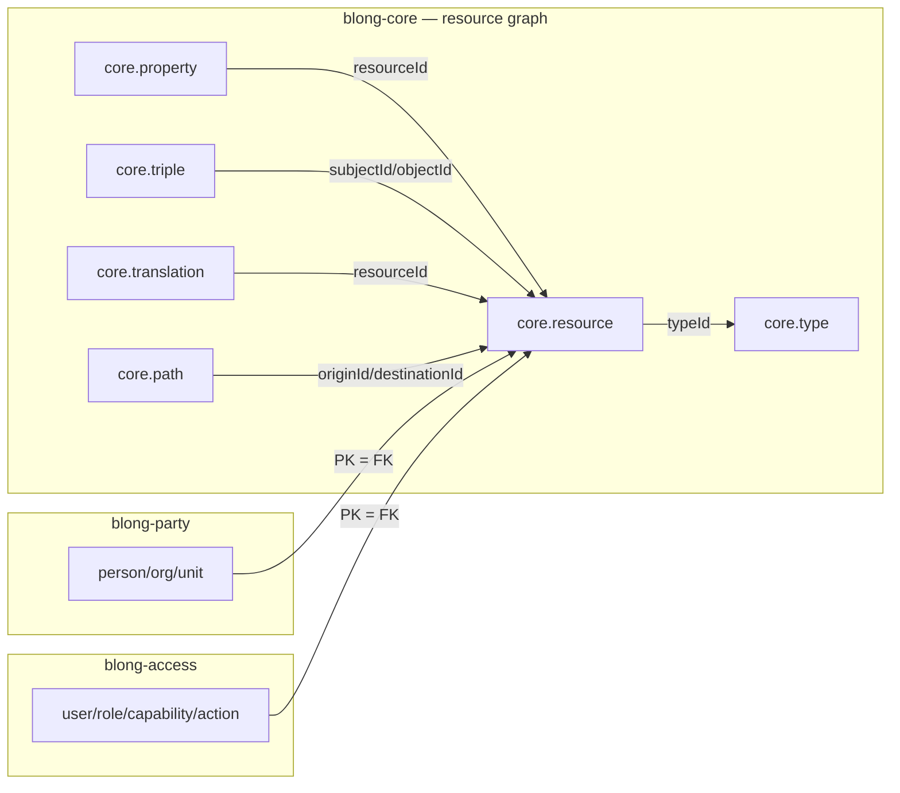
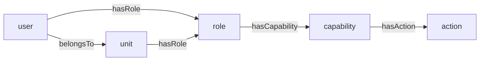

# blong-core — Resource graph, Party & Access realms

## Overview

Three realms in the Blong framework work together as the **foundation layer** that most
business features are built on:

| Realm | What it is | What it gives you |
| ----- | ---------- | ----------------- |
| **`blong-core`** (`@feasibleone/blong-core`) | The generic **resource graph** — a universal entity registry plus a relationship graph | `core.resource`, `core.type`, `core.property`, `core.triple`, `core.translation`, `core.path` tables. Any entity that needs to be referenced, related, tagged, translated, or reached through a relationship chain lives here. |
| **`blong-party`** (`@feasibleone/blong-party`) | **Party management** — people and organizations | `person`, `organization`, `unit` (as resources) + `contact`, `address`, `identifier` (as FK sub-tables). Org hierarchies and memberships are stored in the graph (`belongsTo`, `isPartOf`). |
| **`blong-access`** (`@feasibleone/blong-access`) | **RBAC** — authentication and authorization | `user`, `credential`, `role`, `capability`, `action`, plus `policy`, `flow`, `access`, `session`, `audit`. Roles → capabilities → actions resolved through the graph; authorization enforced at the gateway via JWT `permissionMap`. |

The relationship between them:



**The core idea:** every *named* entity in party and access is not just a row — its primary key is
also a foreign key to `core.resource.resourceId`, and its human-readable name lives in
`core.resource.resourceName`. Relationships between entities are stored as edges in `core.triple`,
not as join tables or FK columns. This is what lets RBAC, org hierarchies, and arbitrary
relationships all share one uniform query surface.

---

## When to use this skill

Reach for this skill when a task touches any of these:

- **Extending `blong-core`** — adding a new core-level table/entity to the resource graph.
- **Building a new realm on top of core** — any entity that should be a "resource" (referencable,
  relatable, translatable) should follow the shared-PK pattern.
- **Working with parties** — persons, organizations, org units, their contacts, addresses,
  identifiers; adding a new party type; querying who belongs to what.
- **Working with RBAC / access** — users, credentials, roles, capabilities, actions, policies,
  login flows; assigning a role to a user; adding a new action; protecting an endpoint.
- **Querying the graph** — "who can do X?", "what is Y related to?", "is A part of B?",
  reachability questions that go multiple hops deep.
- **Wiring auth into a suite** — `login.token.create` + `gateway.authorize` + `permissionMap`.

Do **not** use this skill for generic schema/table work that doesn't involve resources, parties, or
RBAC — that's `blong-schema`. Do not use it to build new handler logic in general — that's
`blong-handler` / `blong-orchestrator`. This skill is about the *domain model* these three realms
provide and the *extension points* they expose.

---

## The core data model (`blong-core`)

`blong-core` is intentionally **just schema** — it defines tables and seeds type aliases, and ships
**no handlers** of its own. CRUD is auto-provided by the runtime (see next section).

| Table | Purpose |
| ----- | ------- |
| `core.resource` | Universal entity registry. `resourceId` (UUID), `resourceName` (stable logical name, indexed — the lookup key), `typeId` (→ `core.type`). |
| `core.type` | Discriminator catalog. `typeId` (auto-increment), unique `typeAlias` (e.g. `party.person`, `access.role`). |
| `core.property` | Generic key/value attributes per resource: `(resourceId, propertyName, propertyValue)`. Arbitrary extension without schema changes. |
| `core.triple` | The relationship graph. `(subjectId, predicateName, objectId)` — both endpoints FK to `core.resource`. |
| `core.translation` | i18n display names per resource: `(resourceId, languageCode, translatedName)`. |
| `core.path` | **Materialized reachability**: `(originId, destinationId, pathType, pathDepth)`. Precomputed "can X reach Y through predicate-chain P" — makes deep RBAC lookups fast (no recursive traversal at query time). |

Type aliases are seeded via `meta/db/0-coreTypeMerge.yaml`:

```yaml
# core/blong-core/meta/db/0-coreTypeMerge.yaml
key: typeAlias
type:
  - typeAlias: core.currency
  - typeAlias: core.language
  - typeAlias: core.country
  - typeAlias: core.city
```

---

## Core runtime behaviors (critical to understand)

Two framework behaviors in the knex adapter (`blong-gogo`) do most of the heavy lifting. They are
**automatic** — do not write handlers to replicate them.

1. **`add` on a resource-backed table auto-creates the `core_resource` row.** When a PK column uses
   `type.uuid()` *and* its FK is `core.resource.resourceId`, the runtime generates a UUID, looks up
   the `core.type` row whose alias is `` `${subject}.${object}` ``, inserts the `core_resource` row
   (`resourceName` = `` `${subject}.${object}.${columnName}` ``), then inserts the entity row.

   ```typescript
   // The runtime does this for you — you do NOT write it.
   const typeAlias = `${subject}.${object}`;      // e.g. 'party.person'
   const typeRow = await qb('core_type').where({typeAlias}).first('typeId');
   if (typeRow) {
       await qb('core_resource').insert({
           resourceId: strToBinary(uuidStr),
           resourceName: `${subject}.${object}.${colName}`,
           typeId: typeRow.typeId,
       }).onConflict().ignore();
   }
   ```

2. **`merge` with a `resourceType` param resolves/creates `core_resource` rows by `name`.**
   When you seed or merge rows and pass `resourceType`, the runtime looks up (or creates) the
   `core_resource` row for each entity's `name` property and uses its `resourceId` as the entity PK.

**Implication:** your realm never calls a `resourceResourceAdd`-style handler — that doesn't exist.
You define the schema correctly (PK = `type.uuid()` + FK to `core.resource.resourceId`), register the
table and the type alias, and the framework keeps `core_resource` in sync for you.

---

## Building a resource-based entity (the shared-PK pattern)

This is the canonical extension path, used identically by party, access, and any future realm.

### 1. Define the entity in `meta/type/schema.ts`

```typescript
// myrealm/meta/type/schema.ts
import {schema} from '@feasibleone/blong';

export default schema(async ({lib: {type}}) => ({
    item: type.Object(
        {
            itemId: type.uuid(),                    // ← PK, auto-generates a UUID
            itemName: type.stringNotNull(),
            description: type.stringNull(),
        },
        {
            constraints: {
                primaryKey: 'itemId',
                foreign: {
                    itemId: 'core.resource.resourceId',  // ← makes it a resource
                },
            },
        },
    ),
}));
```

Use `type.uuid()` for the PK (stable identity across systems) and the FK constraint to
`core.resource.resourceId`. `type.increment()`/`type.ulid()` PKs do **not** get the auto
`core_resource` behavior unless you add it yourself.

### 2. Register the table in `meta/db/db.ts`

```typescript
// myrealm/meta/db/db.ts
import {handler} from '@feasibleone/blong';

export default handler(() => ({
    config: {
        schema: {
            dbTest: true,
            tables: {
                // Order > core's tables (core.* uses order 1) so core exists first.
                'myrealm.item': 400,
            },
        },
    },
}));
```

### 3. Seed the type alias (`meta/db/0-myrealmTypeMerge.yaml`)

The `0-` prefix ensures the alias exists before anything references it (files process in
alphabetical order):

```yaml
# myrealm/meta/db/0-myrealmTypeMerge.yaml
key: typeAlias
type:
  - typeAlias: myrealm.item
```

### 4. Seed instances with `resourceType` + `name`

Every seed row needs a `name` — it is the merge key that maps to `core_resource.resourceName` and
makes the merge idempotent:

```yaml
# myrealm/meta/db/myrealmItemMerge.yaml
resourceType: myrealm.item
key: itemId
item:
  - name: Widget
    description: A basic widget
  - name: Gadget
    description: An advanced gadget
```

Test seeds go in `meta/dbTest/` (loaded only in `dev`/`integration` when `schema.dbTest: true`).

**Then** the auto-bound CRUD works: `myrealm.item.add`, `myrealm.item.find`, `myrealm.item.merge`,
etc., with `core_resource` maintained automatically. You typically need **no handler files** for
basic CRUD — only for custom logic (e.g. access's authorization merge).

---

## Party realm (`blong-party`)

### What it provides

| Table | PK | Notes |
| ----- | -- | ----- |
| `party.person` | `personId` → core.resource | firstName / middleName / lastName / birthDate / gender / maritalStatus / nationality / occupation |
| `party.organization` | `organizationId` → core.resource | legalName / tradingName / registrationNumber / taxId / industry / website |
| `party.unit` | `unitId` → core.resource | unitName / unitType (department, branch, division, team) |
| `party.contact` | `partyContactId` (increment) | FK `partyResourceId` → core.resource; contactType + contactValue + isPrimary |
| `party.address` | `partyAddressId` (increment) | FK `partyResourceId`; addressType / streetAddress / city / stateProvince / postalCode / countryId |
| `party.identifier` | `partyIdentifierId` (increment) | FK `partyResourceId`; identifierType / value / issuingAuthority / issue & expiry dates |

### Hierarchy lives in the graph, not in columns

Party has **no** `organizationId`/`parentUnitId` FK columns and no member join tables. All hierarchy
and membership relationships are `core.triple` edges:

| Predicate | Meaning |
| --------- | ------- |
| `belongsTo` | `unit → organization` (unit belongs to an org); `person → unit` (person is a member) |
| `isPartOf`  | `unit → parent unit` (tree hierarchy — child under parent) |

This is deliberate: because access's RBAC traversal already understands `belongsTo` on
`core_triple`, a person's unit membership feeds straight into role/action resolution
(`user → unit → role → capability → action`).

### Extending party

- **New party type** (e.g. `party.vendor`): follow the shared-PK pattern above — add the entity with
  PK = `type.uuid()` + FK to `core.resource.resourceId`, register the table (order > 300), seed the
  alias in `0-coreTypeMerge.yaml`, and (optionally) seed instances with `resourceType`.
- **New sub-entity** (like contact/address/identifier — details attached to a party): plain table
  with an auto-increment PK and an FK column (`partyResourceId`) to `core.resource.resourceId`. These
  are **not** resources themselves — they hang off a party resource.
- **Browser models**: party ships models (`partyPersonModel`, `partyOrganizationModel`,
  `partyUnitModel` in `meta/model/`) that drive the model system's Browse/New/Open pages. If you add
  a party entity, add a matching `{subject}{Object}Model` for the UI. See the `blong-model` skill.
- **Validation mock wiring** (party-specific): the party suite registers model validation schemas via
  `srv.subject.validation.mock` in `index.ts` — `partyPersonModel: true`, etc. These register
  validation schemas only; they do **not** generate handler implementations (party uses real DB
  tables, not mocks).

### Using party

- CRUD: `party.person.add/find/get/edit/remove/merge` (same for organization/unit).
- Query membership/hierarchy: query `core.triple` with `predicateName = 'belongsTo' | 'isPartOf'`
  (see Querying the graph below).
- Contact/address/identifier: currently **schema-only** in the realm — no handler wiring/CRUD.
  If a feature needs them, extend the realm to expose them.

---

## Access realm (`blong-access`)

### What it provides

| Table | PK | Notes |
| ----- | -- | ----- |
| `access.user` | `userId` → core.resource | emailAddress, isActive |
| `access.credential` | `credentialId` (increment) | FK userId; credentialType (`password`/`clientSecret`), PBKDF2 hash + salt, isActive, expiresAt |
| `access.role` | `roleId` → core.resource | roleBit (0–1023, unique), description |
| `access.capability` | `capabilityId` → core.resource | groups actions into a "what" |
| `access.action` | `actionId` → core.resource | description; name (in resourceName) is the semantic triple |
| `access.policy` | `policyId` → core.resource | credential complexity/lifecycle rules (**schema-only — not yet wired**) |
| `access.flow` | `flowId` → core.resource | MFA step definitions, e.g. `["password","totp"]` (**schema-only**) |
| `access.access` | `accessId` → core.resource | time/IP/geo rule config (**schema-only**) |
| `access.session` | `sessionId` (uid, standalone) | active sessions (**schema-only — not persisted as resources**) |
| `access.audit` | `auditId` (ulid) | append-only auth event log (**schema-only**) |

### The RBAC model

Authorization is a chain stored in the graph:



Two SQL views + one stored procedure materialize reachability into `core.path`:

- `access_effectiveRolePath` — `user → role` (direct) and `user → unit → role` (inherited via
  `belongsTo`).
- `access_effectiveActionPath` — `user → role → capability → action` (depth 3) and
  `user → unit → role → capability → action` (depth 4).
- `access_pathRefresh` — deletes and rebuilds `core_path` for `pathType` in
  (`access.effectiveRole`, `access.effectiveAction`).

Authorization queries read the **materialized** `core_path` (a single indexed lookup on
`originId` + `pathType`), never recursive traversal.

### The auth flow (how login + authorization work)

1. `login.token.create` (from `blong-login`) → `access.credential.check`.
2. `accessCredentialCheck` (`adapter/db`) looks up the user by `core_resource.resourceName` +
   `typeAlias = 'access.user'`, checks `isActive`, verifies PBKDF2 (sha512, 100k iterations,
   64-byte key, random salt), reads effective role bits + action names from `core_path`.
3. Role bits are packed into a base64 `permissionMap` bitmask (roleBit 0–1023 → bit position).
4. `loginTokenCreate` signs a JWT carrying `per: permissionMap` (and `sub` = actorId).
5. The gateway's `authorize` hook (`access.authorization.list`) decodes `per` from the token,
   maps role bits → capabilities → actions, and returns allowed methodIds (lowercase, dots
   stripped — e.g. `accesstestprivate`). A `preHandler` hook compares the requested method's
   methodId against that list: missing → **403**, no/invalid token → **401**.

Wire it in your suite's `index.ts`:

```typescript
config: {
    default: {
        srv: {},
        gateway: {authorize: 'access.authorization.list'},  // ← turns RBAC on
    },
    ...
}
```

The login response also returns `permissions` (the resolved action names) for client-side display.

### Key handlers (in `adapter/db`)

| Handler | Wire method | Purpose |
| ------- | ----------- | ------- |
| `accessCredentialCheck` | `access.credential.check` | verify credentials, return userId + permissionMap + actions |
| `accessAuthorizationList` | `access.authorization.list` | permissionMap → allowed action methodIds (TTL-cached) — used by the gateway `authorize` hook |
| `accessAuthorizationMerge` | `access.authorization.merge` | idempotent upsert of users/roles/capabilities/actions + `CALL access_pathRefresh()` — also the target of the test seed YAML |

### Extending access

- **New action**: seed a row with `resourceType: access.action` + `name` (the semantic triple, e.g.
  `invoice.invoice.approve`) in `meta/db/` (prod) or `meta/dbTest/` (test). Add a gateway `validation`
  wrapper if it should be a public RPC method. Protect it by granting a capability via `hasAction`.
- **New capability**: seed with `resourceType: access.capability` + `name`; link it to its actions.
- **New role**: seed with `resourceType: access.role` + `name` + a free `roleBit` (0–1023); link
  capabilities via `hasCapability`. After any graph change, run `CALL access_pathRefresh()` (the
  `accessAuthorizationMerge` handler does this for you).
- **New user**: seed or call `access.authorization.merge` with `{user: {name: ..., password: ...,
  roles: ...}}` — it creates the credential (PBKDF2) and the `hasRole` edges.
- **Roles/capabilities/actions in bulk**: use `accessAuthorizationMerge` with the YAML seed pattern —
  reference entities by **name**, never by raw ID:

  ```yaml
  # meta/dbTest/accessAuthorizationMerge.yaml
  user:
    testUser:  {password: testPassword, roles: Admin}
  role:
    Admin: testManagement          # role → capability
  capability:
    testManagement: accessTestPrivate   # capability → action
  ```

- **Seed roles for production**: `meta/db/accessRoleMerge.yaml` seeds Admin(bit0)/Manager(bit1)/
  CustomerService(bit2)/Customer(bit3) as `core.resource` + `access_role` rows.
- **New policy/flow** (password rules, MFA steps): the tables exist; wire handlers to consume them —
  this is open extension territory.
- **Test endpoints**: `adapter/dbTest/accessTestPrivate` (protected) and `accessTestPublic`
  (`auth: false`) are reference endpoints proving the 401/403/200 gate — replace with real
  business actions.

---

## Querying the graph

These patterns work for any resource-based entity (core, party, access):

- **Direct edges**: query `core.triple` by `subjectId` / `predicateName` / `objectId`.
- **Effective/reachability**: query `core.path` by `(originId, pathType)` — fast, precomputed.
  Used by access for effective roles/actions.
- **Type discrimination**: join `core_resource → core_type` on `typeAlias` to filter by entity kind
  (e.g. `access.user`).
- **Display names**: `core_resource.resourceName`, or `core.translation` for localized labels.
- **Arbitrary attributes**: `core.property` key/value rows per resource.

---

## Checklist — common tasks

| Task | What to do |
| ---- | ---------- |
| New resource-based entity | schema (`type.uuid()` + FK to `core.resource.resourceId`) → `db.ts` table order > core's → `0-*TypeMerge.yaml` alias → instance seeds with `name` |
| New party type | same pattern; order > 300; add a browser model |
| New party sub-entity | plain table, increment PK, FK `partyResourceId` → `core.resource.resourceId` |
| New action / capability / role / user | seed via `resourceType` YAML or `accessAuthorizationMerge`; refresh paths |
| Protect an endpoint | gateway `validation` wrapper + grant the action via a capability → role → user |
| Turn on RBAC in a suite | `gateway: {authorize: 'access.authorization.list'}` + include core/access realms as children |
| Store a hierarchy | `core.triple` edges with `belongsTo` / `isPartOf` (never FK columns) |
| Check "who can do X" | `core.path` on `access.effectiveAction` |

---

## Pitfalls

- **Don't invent handlers like `resourceResourceAdd`.** CRUD for core-backed tables is
  auto-provided; you define schema + seeds only.
- **Use `type.uuid()` for resource PKs.** `increment`/`ulid` PKs don't get automatic
  `core_resource` creation on `add`.
- **Seed the type alias before instances.** `0-`-prefixed alias file sorts first; instances need
  the alias to resolve `typeId` for the auto `core_resource` row.
- **Every `resourceType` seed row needs a `name`.** It's the merge/dedup key → `resourceName`.
- **`remove` doesn't delete the `core_resource` row** (orphaned resource — known gap). Handle
  cleanup explicitly if it matters.
- **Register tables with order > core's.** `core.*` tables are order 1; party uses 300+, access
  200+. A lower/equal order can break FK creation.
- **Relationships go in `core.triple`, not FK columns** — especially for party hierarchy and RBAC.
  Mixing approaches breaks the materialized-path queries.
- **After mutating RBAC graph edges, refresh `core.path`** (`CALL access_pathRefresh()`), or
  effective role/action queries return stale data.
- **Reference entities by name in seeds/custom merges**, never by raw DB IDs.
- **`policy`, `flow`, `access`, `session`, `audit` are schema-only** — don't assume handlers exist
  for them.

---

## Where to look next

- `blong-schema` — full schema/seed/procedure reference (constraints, orders, YAML merge patterns).
- `blong-model` — browser CRUD pages from model specs (party models).
- `blong-handler` / `blong-orchestrator` / `blong-error` — writing the handlers that consume or
  extend these realms.
- `blong-rest` / `blong-validation` — exposing access-protected endpoints as RPC/REST.
- Reference implementations: `core/blong-access` (RBAC + path materialization),
  `core/blong-party` (resource-based entities + models), `core/blong-marine` (model system usage).
