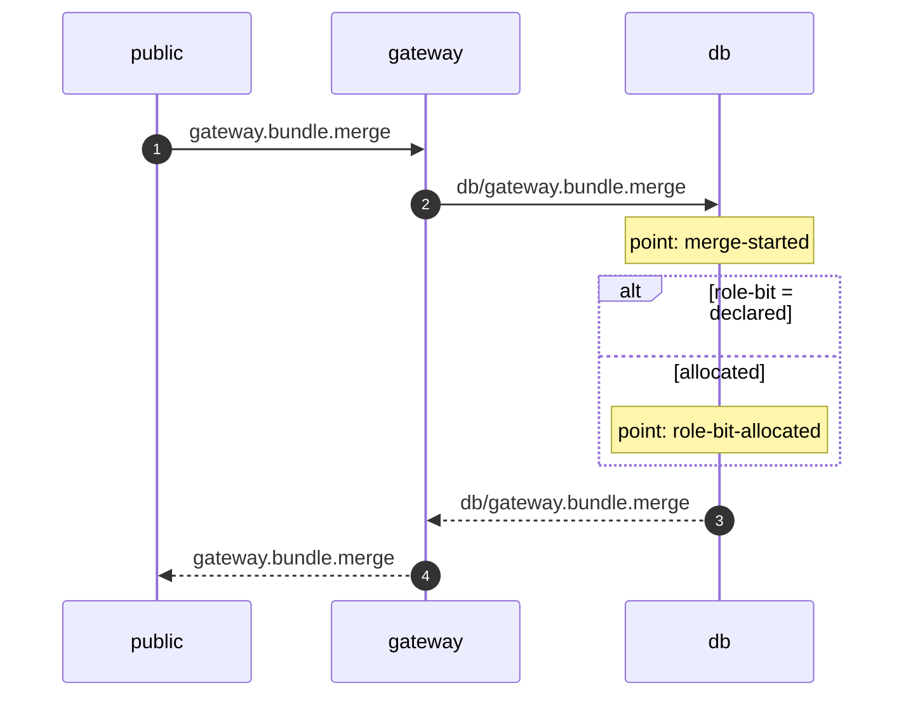

# Capturing a Flow's Sequence Diagram

> **Copy a working spec; do not explore.** `realm/blong-gateway/test/observedFlow.play.ts` captures
> a flow the framework already records, with no instrumentation at all.
> `realm/blong-gateway/test/observedMergeFlow.play.ts` beside it captures one that carries points
> and branches, and `core/blong-realm/test/blong.play.ts` is the flow realm's own spec. All three
> are registered in `docs/blong/docs-artifacts.json`.

## What one capture produces

| Artifact                    | Proves                                 | Location                            |
| --------------------------- | -------------------------------------- | ----------------------------------- |
| `*.play.ts-snapshots/*.png` | the browser drew the diagram           | beside the spec                     |
| `docs/<name>.md`            | the drawing a reviewer reads in a diff | registered in `docs-artifacts.json` |

The markdown is written on the first run and **compared** on every run after it: a spec that
silently rewrote it would report an unreviewed diagram change as a pass, so regenerating it is a
deliberate act (`BLONG_REGENERATE_DIAGRAMS=1`).

## Recipe

### 1. Pick the flow kind, and decide whether the source needs instrumentation

The **kind** is the method the flow was minted with (`gateway.bundle.merge`), and it is the name the
flow page filters by. For a handler that is not on the public surface — an orchestrator, an adapter
— it is the **gateway** method that reaches it, so read it off the realm's `gateway/` schema
(`the file names the method it declares`) or the list in `server.ts`, not off the handler's own
name.

**Check the realm loads the flow realm first.** The pages live in `@feasibleone/blong-realm`, and a
realm that does not load it has no `blong.flow.*` page to capture at all:

```typescript
// index.browser.ts — the browser bootstrap, beside the ui/login children
async function blong() {
    return import('@feasibleone/blong-realm/browser.ts');
},
// and in the config: a child with no config block is skipped
blong: {},
```

and `"@feasibleone/blong-realm": "workspace:^1.0.0"` in the package's devDependencies, followed by
`node common/scripts/install-run-rush.js update` so the import resolves. Loading a realm also gives
the portal its pages, so the realm's existing screenshot baselines may shift: check them, and never
regenerate a baseline to make a suite green.

A flow that reaches an adapter or a namespace through a proxied call is recorded by the framework
itself, so nothing has to be added to draw its hops — `observedFlow.play.ts` is then the whole
recipe.

Add progress to the source only when the diagram should show what a handler _did_:

```typescript
export const gatewayBundleMerge: Handler<...> = async (params, $meta) => {
    $meta.checkpoint?.('merge-started', {bundleName}); // Note over db: point: merge-started
    const role = $meta.decide?.('role-bit', {declared}, [
        // alt role-bit = declared
        {name: 'declared', when: values => values.declared !== null, run: () => declared},
        {name: 'allocated', when: () => true, run: () => allocated}, // else allocated
    ]);
    // ...
};
```

- Both are optional calls: production leaves them `undefined`, which is what makes the `?.` free.
  Switch them on for the run that captures with `registry: {checkpointMode: 'debug'}` in the
  package's dev config block (`index.ts`).
- A point may be dropped and a branch may not: the branch _is_ the control flow, which is what the
  `alt` block is drawn from — including the candidates that were weighed and refused.

### 2. Write the spec

```typescript
import {expect, test} from '@feasibleone/blong-browser/playwright';
import {
    captureDiagram,
    diagramText,
    drawsACall,
} from '@feasibleone/blong-browser/playwright/diagram';

test.use({blongPermissions: true}); // grants the calls capability for this run

const KIND = 'gateway.bundle.merge';

test('the flow this realm served is drawn', async ({portal}) => {
    // A DataTable renders its empty state as a row of its own, so filter to data rows.
    const rows = portal.page
        .locator('.p-datatable-tbody tr')
        .filter({has: portal.page.locator('[data-testid="flow-execution"]')});
    const pinned = rows.filter({hasText: KIND}).first();

    // Produce the flow and read it back as one retried pair: the list is built from the ledger of
    // what has been served, and a read taken moments after the call can come back without it.
    await expect(async () => {
        await portal.page.reload();
        await produceTheFlow(portal); // the page load or handler call that serves the flow
        await portal.menuClick('blong.flow.browse');
        await portal.waitForTableData();
        await portal.page.getByRole('textbox', {name: 'Filter'}).fill(KIND);
        await expect(pinned).toBeVisible({timeout: 5_000});
    }).toPass({timeout: 40_000});

    await pinned.click();
    await expect(portal.page.locator('[data-diagram-rendered]')).toBeVisible();

    const diagram = await diagramText(portal);
    if (!drawsACall(diagram)) {
        test.skip(true, 'this execution declared no calls, so there is no hop to draw');
        return;
    }
    await captureDiagram(portal, expect, {
        name: 'observed-merge-flow-gateway',
        artifact: 'docs/observedMergeFlow.md',
        diagram,
    });
    expect(diagram, 'the hop the realm answered').toContain(KIND);
    expect(diagram, 'a checkpoint as a note').toMatch(/Note over db: point: merge-started\n/);
    expect(diagram, 'the branch as a block').toMatch(/alt role-bit = declared\n/);
});
```

Pin the row **by kind**, not by position: every request the process serves becomes an execution and
the list is live, so the first row is often another spec's flow. When the realm's own tests serve
the same kind, pin the newest as well — the execution cell holds the ULID, which sorts by time:

```typescript
const listed = rows.filter({hasText: KIND});
let newest: Locator | undefined;
let newestId = '';
for (let index = 0; index < (await listed.count()); index++) {
    const row = listed.nth(index);
    const id = (await row.locator('[data-testid="flow-execution"]').innerText()).trim();
    if (id > newestId) {
        newestId = id;
        newest = row;
    }
}
```

The retry's budget must fit inside the test's, or the first attempt's timeout is reported as the
test failing: `test.setTimeout(240_000)` with `toPass({timeout: 90_000})` is what a cold first
attempt needed (a lazily loaded realm plus vite's dependency optimize). Warm the portal before the
loop — `await expect(page.locator('.blong-portal-menubar')).toBeVisible()` — so that cost is paid
outside a retry attempt, and clear `node_modules/.vite` in the packages under change when a diagram
looks stale; once warm the spec runs in seconds.

**If the flow has no page that produces it**, call the method from the page instead — the wrapped
handler is exposed as `window.__blongHandler.<camelCaseMethod>` when the portal test hook is on:

```jsonc
// index.browser.ts — test-only; `prod` never activates `integration`
integration: {
    ui: {portal: {portal: {testHook: true}}},
} as never,
```

Wait for `.blong-portal-menubar` before `page.evaluate`, because the hook is installed when the app
mounts, and a `page.reload()` immediately before it races the boot.

### 3. Register the artifact

```json
{
    "id": "gateway.observed-merge-flow",
    "kind": "file",
    "destination": "realm/blong-gateway/docs/observedMergeFlow.md",
    "package": "realm/blong-gateway",
    "command": "BLONG_REGENERATE_DIAGRAMS=1 node --run playwright -- test/observedMergeFlow.play.ts --update-snapshots"
}
```

### 4. Run it

```bash
# First run, and any run whose diagram change has been reviewed:
BLONG_REGENERATE_DIAGRAMS=1 node --run playwright -- test/observedMergeFlow.play.ts --update-snapshots=all
# Every run after that: the artifact and the screenshot are compared
node --run playwright -- test/observedMergeFlow.play.ts
# CI mode (the `ci` intent, derived ports): skip the browser install
CI=1 PLAYWRIGHT_SKIP_INSTALL=1 node --run playwright -- test/observedMergeFlow.play.ts
```

`--update-snapshots` on its own means `changed` and rewrites only a screenshot that already fails;
use `--update-snapshots=all` to re-baseline one deliberately.

### 5. Verify

```bash
node ../../tools/blong-dev/bin/blong-dev.ts docs check  # the artifact is registered and current
node ../../tools/blong-dev/bin/blong-dev.ts lint --files <changed paths>
```

Run the lint **from the package the files belong to** — the `../../tools` path above assumes it —
and read the `✓` lines to confirm which tools ran. tsc and eslint are only discovered when the
working directory has a `tsconfig.json` / eslint config, so the same command from the repository
root checks spelling and markdown, exits 0 and looks like a pass. A package that has no eslint
config of its own (`realm/blong-gateway` and nine others) drops eslint the same way.

### 6. Drawing every run of a kind, not one execution

A reference is an execution id **or a flow kind**, and the service decides which: a kind answers
with the union of its executions, which is the only way a branch that some runs take and others do
not appears as the pair of alternatives it is. The flow page offers that in its kind selector, and a
spec reaches it by choosing a kind instead of a row:

```typescript
await portal.page.getByTestId('flow-kind').click();
await portal.page.locator('.p-dropdown-item').filter({hasText: KIND}).first().click();
```

Capture it as its own artifact — it is the picture a reader wants when the question is "how does
this flow go", and the counts on its arrows say how many runs took each path. It does not replace
the execution capture: one shows a run in detail, the other shows the shape of all of them.

## What the drawing should look like



- A **caller's** point is drawn above the call it was announced before; a **receiver's** between the
  request and the answer, because that is when it happened. Both ends of one call share the leg id
  and the target — a receiver adopts the identity the caller sent — so the phase the record was
  written in is what tells them apart (`start`/`end`/`error` are the caller's, `received`/`answered`
  the receiver's). A branch the receiver took wraps only the points that followed the decision.
- **An empty arm cannot be the last one.** Mermaid refuses to draw a section with nothing in it when
  it precedes `end`, so the arms are ordered to end with one that has content, and a block whose
  arms are all empty is given a note saying so. Read the labels, not the order, for the candidate
  names.
- **A point is drawn with the record that claimed it, not where it was announced.** Points are
  consumed by the first record written after them in that scope, so a point announced before an
  outgoing call is drawn above _that_ call, and one announced after it rides the answer of the call
  being handled — a handler that dispatches will show both halves at once (D-259).
- **A call's milestones are drawn where the call closes** — after the legs it called, so a point the
  answer carried appears below them, which is the order the code ran in. They are drawn before the
  answer itself, so a request and its answer still read as one round trip (T-139).
- **A block names every candidate the code declared**, and labels the ones the decision never
  reached (evaluation stops at the branch it takes), so a drawing shows both what was refused and
  what was never tried (T-140).
- Participants are the logical units a call names, never the process: in a monolith every component
  logs as the process, so a participant read from the record would draw one participant and turn
  every call into a self-hop.

## Traps

- **The row is another spec's execution.** Every request the process serves becomes an execution and
  the list is live: pin by kind, and prefer the newest execution over the first row (F-250).
- **The row is absent for seconds after the flow was served.** Reload inside `toPass`: the page
  reads once and never again, so waiting longer does not help.
- **"Nothing observed yet" matches `tbody tr`.** A DataTable renders its empty state as a row of its
  own — filter to rows that carry `[data-testid="flow-execution"]`.
- **Two boxes match the filter's test id.** The portal keeps every opened page mounted: address the
  filter by its label.
- **The served bundle looks stale.** `rm -rf node_modules/.vite`, or run with `CI=1` (vite is
  started with `--force` there). An already-running dev server is reused when it is not CI.
- **A `%%` comment probe never appears in the artifact.** The page exposes the text it was given,
  not the mermaid source, so a probe that should be seen has to render (F-249).
- **A field added to a record never arrives.** Grep every place that rebuilds that object, not only
  the emitter — a validator that constructs the shape from named fields drops the rest (F-251).
- **Nothing is drawn although the flow ran.** The calls capability, or `log.calls.off`, is off for
  that method: see the **blong-log** skill.
- **The artifact compares equal after a change to the model.** Check which execution the pinned row
  is showing before trusting it.
