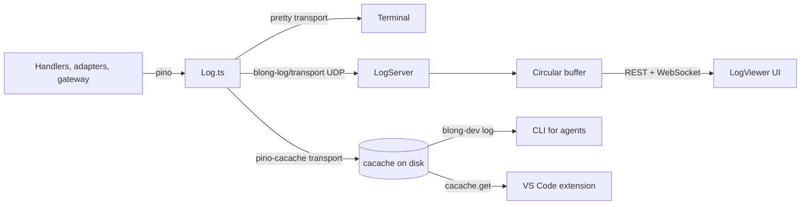

# blong-log-dev Skill

## What this skill covers

The Blong logging stack is a set of cooperating pieces. This skill is for **developing and
extending** them; for using them to monitor applications, see the **blong-log** skill.

- `core/blong-log/` — real-time log viewer: UDP receiver, circular buffer, REST + WebSocket server,
  and the React LogViewer client.
- `@feasibleone/blong-log/transport` — pino transport that ships log entries over UDP to the server.
- `core/blong-gogo/src/pino-cacache.ts` — pino transport that persists full entries on disk
  (cacache) for on-demand inspection.
- `core/blong-dev/src/commands/log.ts` — the `blong-dev log` CLI that reads the cacache cache.
- `ext/rest-fs/src/extension.ts` — VS Code extension that opens a single cached entry when you click
  a `blong://log/<ULID>` terminal link.

## Data flow



The same `Log.ts` instance can fan out to several transports at once (see
`core/blong-gogo/src/Log.ts`): the pretty console, the cacache disk store, and the UDP transport to
the log server. Each entry carries a monotonic ULID `id` injected by the `Log` mixin.

## File map

```
core/blong-log/
  src/
    index.ts           ← public exports (LogServer, transport, types)
    server.ts          ← LogServer: UDP receiver + circular buffer + REST/WebSocket + static client
    cli.ts             ← `blong-log` CLI (--udp-port, --http-port, --host, --buffer-size, ...)
    transport.ts       ← UDP pino transport (host/port/batchSize/flushInterval/maxPacketSize)
    buffer.ts          ← CircularBuffer with ULID ordering (default 10000 entries)
    udp-receiver.ts    ← UDP batch reassembly (12-byte header, batch timeout)
    types.ts           ← LogEntry, FilterOptions, LogServerOptions, WsMessage, LEVEL_MAP
    client/
      LogViewer.tsx            ← the React log viewer
      app.tsx                  ← standalone app entry
      LogViewer.stories.tsx    ← Storybook stories (10 stories)
      __fixtures__/data.ts     ← deterministic sample entries
      __image_snapshots__/     ← visual regression baselines

core/blong-gogo/src/
  Log.ts               ← pino logger; wires the cacache transport when `log.cacache` is set
  pino-cacache.ts      ← cacache disk transport + retention pruning

core/blong-dev/src/
  commands/log.ts      ← `blong-dev log` command (reads the cacache cache)
  cli.ts               ← command registry (adds the `log` case)
  index.ts             ← programmatic exports

ext/rest-fs/src/
  extension.ts         ← terminal link provider for blong://log/<ULID> + cacache lookup
```

## Data model

Entries are plain pino log objects — see `LogEntry` in `core/blong-log/src/types.ts`. Key fields:
`id` (ULID), `time` (epoch ms), `level` (pino number 10..60), `msg`, `name`, `traceId`, `err`,
`req`, `res`, `$meta` (`{mtid, method, ...}`).

## On-disk format (pino-cacache)

`core/blong-gogo/src/pino-cacache.ts` stores each entry with cacache:

- **key** = the entry's ULID `id` (monotonic, so lexicographic order is chronological),
- **content** = the entry JSON with `stripKeys` removed (default `['id', 'time']`),
- **metadata** = `{timestamp}` (the pino `time`, epoch ms).

Readers must therefore restore `id` from the cacache key and `time` from the entry metadata.
Retention (default 10000 entries) is pruned once per day using the `__blong_retention_state__`
marker entry.

**Wiring:** `core/blong-gogo/src/Log.ts` activates the cacache transport when the `log` component
config has `cacache` set; the `dev` intent sets `log.cacache: true` (see `load.ts`). Note that
`true` is passed through as the transport options, so a realm/suite must provide
`cacache: {cachePath: ...}` for a custom location — the de-facto default `~/.blong/log-cache` is
only assumed by the CLI and the extension.

## `blong-dev log` internals

`core/blong-dev/src/commands/log.ts`:

1. `cacache.ls(cachePath)` → index, minus the retention-state key.
2. Concurrent `cacache.get` (32 workers) → parse JSON → build
   `{id (key), time (metadata.timestamp ?? index time), level, data}`.
3. Filter chain: `--level` (numeric min), `--name` (case-insensitive substring), `--search`
   (substring over `JSON.stringify`), `--trace-id` (exact), `--method` (substring over
   `$meta.method`), `--after` (keep ids newer), `--limit` (default 50, `0` = all).
4. Sort newest-first (time, then id). Output `condensed` (default, plain), `pretty` (colorized on
   TTY, `--no-color` to disable), or `json`. Summary (`N of M`) goes to **stderr**; entries to
   **stdout**.
5. A single positional ULID fetches and prints one entry (defaults to `json` output).

The command uses a small `parseArgs` helper supporting `--name value`, `--name=value`, and boolean
`--flag` forms.

## Extending `blong-dev log`

The command is intentionally small — coding agents (and humans) are expected to extend it when new
debugging needs arise rather than reaching for shell one-liners.

**Add a filter:**

1. Parse the option in `log()` (e.g. `const contextFilter = options.get('context');`).
2. Add a clause to the `entries.filter(...)` chain, following the `--name` / `--method` patterns.
3. Document it in the command's JSDoc `Options:` block and in the **blong-log** skill's options
   table.

**Add an output mode:**

1. Extend the `OutputFormat` union and add a `formatXxx(entry, useColor)` function.
2. Wire it into both print branches (single-entry and list) in `log()`.
3. Keep `condensed` plain and parseable (no ANSI), keep summaries on stderr, and keep newest-first
   ordering — agents and scripts depend on these.

**Register a new command:** add a `case 'name'` in `core/blong-dev/src/cli.ts`, a usage line, and an
export in `core/blong-dev/src/index.ts`.

**Dependencies:** the command uses the `cacache` package (declared in
`core/blong-dev/package.json`). After changing dependencies, run `rush update`.

**Validation:**

- Type-check/lint: `node --run ci-lint` in `core/blong-dev` (or `blong-dev lint <files>`).
- Manual: populate a temp cacache with `cacache.put(path, ulid, buffer, {metadata: {timestamp}})`
  and run `node bin/blong-dev.ts log --cache-path <temp>` in each mode.
- There is no dedicated unit test for the command yet — add one under `core/blong-dev/src/commands/`
  following the tap pattern used across the monorepo if the command grows.

## LogViewer UI and Storybook

The React client lives in `core/blong-log/src/client/`. Development uses Storybook with 10 stories
(full/light theme, empty, errors-only, trace/service/level filtered, search, large datasets) and
Playwright-based visual regression tests.

```bash
cd core/blong-log
npm run storybook          # dev server at http://localhost:6006
npm run storybook:test     # visual regression (needs Storybook serving)
npm run storybook:test:ci  # build static → serve → test → exit
npm run visual:update      # refresh baselines after intentional visual changes
npm test                   # tap unit tests (buffer, server, udp-receiver)
```

PNG baselines live in `src/client/__image_snapshots__/`; sample data in
`src/client/__fixtures__/data.ts`; story definitions in `src/client/LogViewer.stories.tsx`; config
in `.storybook/`.
