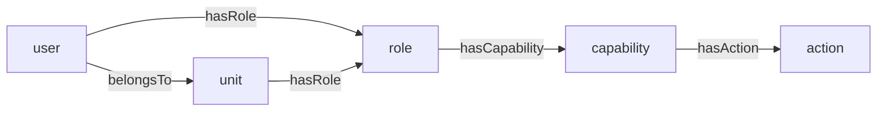

# @feasibleone/blong-access

RBAC access control realm — user profiles, credentials, actions, capabilities, roles, policies,
access flows, sessions, and audit logging. Authentication and authorization are built on top of the
resource graph from `@feasibleone/blong-core`: named entities (user, role, capability, action, …)
are resources, relationships are `core.triple` edges, and effective permissions are materialized
into `core.path`.

## Data model

| Table | PK | Notes |
| ----- | -- | ----- |
| `access.user` | `userId` → `core.resource.resourceId` | emailAddress, isActive |
| `access.credential` | `credentialId` (increment) | FK userId; credentialType (`password`/`clientSecret`), PBKDF2 hash + salt, isActive, expiresAt |
| `access.role` | `roleId` → `core.resource.resourceId` | roleBit (0–1023, unique), description |
| `access.capability` | `capabilityId` → `core.resource.resourceId` | bundles actions into a "what" |
| `access.action` | `actionId` → `core.resource.resourceId` | name = the semantic triple / RPC method |
| `access.policy` | `policyId` → `core.resource.resourceId` | credential complexity/lifecycle rules (schema-only) |
| `access.flow` | `flowId` → `core.resource.resourceId` | MFA step definitions, e.g. `["password","totp"]` (schema-only) |
| `access.access` | `accessId` → `core.resource.resourceId` | time/IP/geo rule configuration (schema-only) |
| `access.session` | `sessionId` (uid) | active sessions (schema-only) |
| `access.audit` | `auditId` (ulid) | append-only auth event log (schema-only) |

Access tables are registered with order numbers 200–209. `user`/`role`/`capability`/`action` are
fully wired end-to-end; `policy`, `flow`, `access`, `session`, and `audit` exist as schema entities
but are not yet consumed by handlers.

## The RBAC model

Authorization is a chain stored in the graph:



Two SQL views (`access_effectiveRolePath`, `access_effectiveActionPath`) and one stored procedure
(`access_pathRefresh`) materialize reachability into `core.path` for the path types
`access.effectiveRole` and `access.effectiveAction`. Authorization queries read the materialized
`core.path` (a single indexed lookup on `originId` + `pathType`), never recursive `core.triple`
traversal. After any RBAC graph mutation, run `CALL access_pathRefresh()` (the
`accessAuthorizationMerge` handler does this automatically).

## Authentication flow

1. `login.token.create` (from `@feasibleone/blong-login`) → `access.credential.check`
2. `accessCredentialCheck` looks up the user by `core_resource.resourceName` + `typeAlias =
   'access.user'`, verifies PBKDF2, and reads effective role bits + action names from `core.path`
3. Role bits (0–1023) are packed into a base64 `permissionMap` bitmask carried in the JWT `per` claim
4. The gateway `authorize` hook (`access.authorization.list`) decodes `per`, maps role bits →
   capabilities → actions, and returns allowed methodIds (lowercase, dots stripped). A `preHandler`
   compares the requested method's methodId against the list — missing → **403**, no/invalid token
   → **401**.

## Key handlers

| Handler | Wire method | Purpose |
| ------- | ----------- | ------- |
| `accessCredentialCheck` | `access.credential.check` | verify credentials; return userId + permissionMap + actions |
| `accessAuthorizationList` | `access.authorization.list` | permissionMap → allowed action methodIds (TTL-cached); used by the gateway `authorize` hook |
| `accessAuthorizationMerge` | `access.authorization.merge` | idempotent upsert of users/roles/capabilities/actions + `CALL access_pathRefresh()` |
| `accessTestPrivate` | `access.test.private` | protected reference endpoint (`{success: true}`) |
| `accessTestPublic` | `access.test.public` | public reference endpoint (`auth: false`) |

## Usage

Include the realm as a child in your suite's server entry and turn the RBAC gate on:

```ts
// index.ts / server.ts
children: [
    async function srv() {
        return import('@feasibleone/blong-server/server.ts');
    },
    async function login() {
        return import('@feasibleone/blong-login/server.ts');
    },
    async function core() {
        return import('@feasibleone/blong-core/server.ts');
    },
    async function access() {
        return import('@feasibleone/blong-access/server.ts');
    },
    // ... your realms
],
config: {
    default: {
        srv: {},
        gateway: {authorize: 'access.authorization.list'}, // ← turns RBAC on
    },
    // ...
},
```

Browser-side, `browser.ts` auto-discovers the `meta/` schema definitions; `browser-test.ts` is the
test client entry that proxies the `access` and `login` namespaces to the server.

## Extending

- **New action**: seed with `resourceType: access.action` + `name` (the semantic triple) in
  `meta/db/` or `meta/dbTest/`; add a gateway `validation` wrapper to expose it as RPC; grant it to
  a capability via `hasAction`.
- **New capability / role / user**: seed with `resourceType` + `name`, or use
  `accessAuthorizationMerge` (reference entities by **name**, never raw IDs). Roles need a free
  `roleBit` — a new role must be pre-seeded via `accessRoleMerge.yaml` because the merge handler
  hardcodes bit 0.
- **Bulk RBAC setup** (test data): `meta/dbTest/accessAuthorizationMerge.yaml` —
  `user: {name: {password, roles}}`, `role: {name: capability}`, `capability: {name: action}`.
- **New policy/flow** (password rules, MFA steps): the tables exist — wire handlers to consume them.

## Testing

```bash
npm run ci-test    # waits for MySQL, then runs blong-dev test (tap)
```

The suite runs `test.login.flow` and `test.authorization.flow` in both the server and browser
platforms, asserting the 401/403/200 authorization gate.

## References

- [blong-core skill](../../.github/skills/blong-core/SKILL.md) — extending/utilizing the core, party, and access realms
- [blong-schema skill](../../.github/skills/blong-schema/SKILL.md) — declarative schema management
- [blong-validation skill](../../.github/skills/blong-validation/SKILL.md) — gateway validation wrappers
