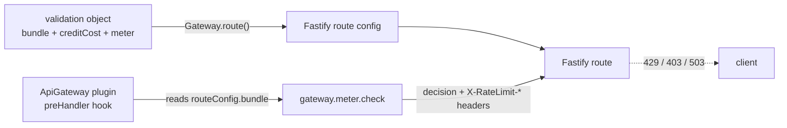

# @feasibleone/blong-gateway

API Gateway realm — OAuth applications, metered bundles (rate + monthly credits), and
subscriptions, backed by Redis metering and a Fastify plugin. Applications authenticate with
client credentials, subscribe to API bundles, and every metered request is rate-limited and
charged against a shared monthly credit bucket in one atomic Redis operation.

The realm builds on `@feasibleone/blong-core` (resource graph) and `@feasibleone/blong-access`
(RBAC: roles/capabilities/actions + credentials). It contributes:

- **OAuth application registration** — a developer app with `clientId`/`clientSecret` credentials.
- **API bundles** — metered offerings, each modelled as an `access.role` (a bundle **is** a role).
- **Subscriptions** — link an application to a bundle and grant the app the bundle's scopes via a
  `hasRole` graph edge.
- **Metering** — per-request rate limiting and monthly credit deduction, enforced by a Fastify
  plugin in `blong-gogo`.
- **A management UI** (blong-browser model pages) for applications, bundles, and subscriptions.

## Data model

| Table | PK | Notes |
| ----- | -- | ----- |
| `gateway.application` | `applicationId` → `core.resource.resourceId` | the `clientId` is the `core_resource.resourceName`; ownerUserId, applicationType, description, isActive |
| `gateway.bundle` | `bundleId` → `core.resource.resourceId` | **bundleId === roleId** (the bundle is also an `access.role`); baseMonthlyCredits, rateLimit, rateWindowSec, isActive, description |
| `gateway.subscription` | `subscriptionId` (uuid) | applicationId + bundleId, status (`active`/`suspended`/`cancelled`), startsAt, endsAt, createdAt; unique on `(applicationId, bundleId)` |

A bundle wraps an `access.role`: `gateway_bundle.bundleId` equals the role's `roleId`, and the
bundle's scopes are the role's capabilities/actions. Subscribing writes
`application hasRole bundleRole` in the graph and calls `CALL access_pathRefresh()`, so the
application's effective actions (and hence its JWT `per`/permissionMap) follow from the subscribed
bundle — authorization stays uniform with the rest of Blong (`access.authorization.list`).

## How it's wired to the Fastify metering plugin

Metering is **opt-in per route** and enforced by a small Fastify plugin in `blong-gogo`
(`core/blong-gogo/src/ApiGateway.ts`, an infra item with deps `log`/`gateway`/`local`).



The flow:

1. **Validation objects declare metering.** A gateway validation wrapper declares the bundle and
   per-call credit cost:

   ```ts
   // gateway/vision/visionCompute.ts
   export default validation(
       async ({lib: {type}}) =>
           function visionCompute() {
               return {
                   params: type.Object({imageUrl: type.Optional(type.String())}),
                   result: type.Object({success: type.Boolean(), vision: type.String()}),
                   bundle: 'Vision AI', // metered by this bundle
                   creditCost: 5,       // deducted from the monthly credit bucket
               };
           },
   );
   ```

2. **`Gateway.route()` threads them into the route config.** When a validation object carries
   `bundle`, `creditCost`, or `meter`, they are copied verbatim onto the Fastify route's
   `config` (see `core/blong-gogo/src/Gateway.ts`).

3. **The ApiGateway plugin meters the request.** It registers a Fastify plugin (`name:
   'api-gateway'`) with a `preHandler` hook that runs **after** the jwt plugin (auth + authorize)
   and is the last gate before the route handler — it does **not** authorize:

   - If the route has no `bundle` in its config, or `meter: false`, the hook returns immediately.
   - Otherwise it resolves the configured `meterHandler` (`gateway.meter.check`) via
     `ports.<subject>.request` and calls it with `{bundle, creditCost}` and the request's auth
     credentials.
   - On success it sets `X-RateLimit-Limit`, `X-RateLimit-Remaining`, and `X-Credits-Remaining`
     response headers.
   - If the decision blocks (`allowed: false`), it replies with the configured status per reason:
     `rate`/`credits` → **429**, `subscription` → **403** (with `Retry-After` when a reset time is
     known).
   - **Fail-closed**: any metering error (e.g. Redis down, handler unavailable) blocks the request
     with **503**.

Enable the plugin in the suite's server config:

```ts
config: {
    default: {
        apiGateway: {
            enabled: true, // no-op when false
            meterHandler: 'gateway.meter.check',
        },
    },
}
```

The plugin's status-code defaults are `{rate: 429, credits: 429, subscription: 403}` and can be
overridden in the `apiGateway` config.

## Metering design (Redis)

`gateway.meter.check` (`adapter/db/gatewayMeterCheck.ts`) is the decision orchestrator:

1. Reads the cached per-bundle config from Redis (`{app}:cfg`).
2. On a cache miss, resolves the application's **active** subscription to the bundle from MySQL
   (join `gateway_subscription` → `gateway_bundle` by bundle resource name) and hydrates the Redis
   cfg; a missing/expired subscription denies with `reason: 'subscription'`.
3. Runs the **atomic Lua script** (`core/blong-gogo/src/rateLimit/script.ts`) that does rate
   limiting + credit deduction in one `EVAL` hop.

All keys for one application share the `{app:<id>}` hash tag (the crockford application id) so the
script stays atomic on a single Redis Cluster slot:

| Key | Type | Purpose |
| --- | --- | -------- |
| `{app:<id>}:cfg:<bundle>` | HASH | `baseMonthlyCredits`, `rateLimit`, `rateWindowSec` |
| `{app:<id>}:credits:YYYY-MM` | HASH | monthly credit bucket (`balance`, `base`, `updatedAt`), auto-initialised on the first request of a new month |
| `{app:<id>}:rate:<bundle>:<window>` | STRING | fixed-window rate counter with TTL |

Mid-month credit adjustments go through `gateway.credit.adjust` (a thin wrapper over the Redis
`HINCRBY`), or directly via `HINCRBY {app:X}:credits:YYYY-MM balance <delta>`.

## Key handlers

| Handler | Wire method | Purpose |
| ------- | ----------- | ------- |
| `gatewayApplicationRegister` | `gateway.application.register` | register an OAuth app + `clientSecret` credential (rotates prior active credential) |
| `gatewayBundleAdd` | `gateway.bundle.add` | create a bundle: ensure a fresh `access.role` (unique name + next roleBit) and insert the bundle row (bundleId = roleId) |
| `gatewaySubscriptionMerge` | `gateway.subscription.merge` | upsert subscriptions (unique app+bundle) + `hasRole` edge + `access_pathRefresh` |
| `gatewayMeterCheck` | `gateway.meter.check` | per-request metering decision (called by the ApiGateway plugin) |
| `gatewayCreditAdjust` | `gateway.credit.adjust` | mid-month credit balance adjustment |
| — (auto-bound) | `gateway.dropdown.list` | application/bundle dropdowns for the management UI — served by the knex adapter's `{subject}.dropdown.list` (P2), configured via the `dropdown` table spec |
| `gatewayApplication/Bundle/SubscriptionModel` | `gateway.{application,bundle,subscription}.find/get/add/edit/remove/report` | auto-generated generic CRUD via `subject.validation` |
| `visionCompute` / `customerGet` | `vision.compute` / `customer.get` | demo metered APIs (bundles `Vision AI` / `Customer API`) — test-only handlers in `adapter/dbTest/`, loaded only in the `dev` intent |

## Usage

Include the realm as a child of your suite's server entry and configure RBAC + the metering
plugin:

```ts
// index.ts / server.ts
children: [
    async function srv() {
        return import('@feasibleone/blong-server/server.ts');
    },
    async function login() {
        return import('@feasibleone/blong-login/server.ts');
    },
    async function core() {
        return import('@feasibleone/blong-core/server.ts');
    },
    async function access() {
        return import('@feasibleone/blong-access/server.ts');
    },
    async function gateway() {
        return import('./server.ts');
    },
],
config: {
    default: {
        srv: {
            'subject.validation': {
                mock: {
                    gatewayApplicationModel: true,
                    gatewayBundleModel: true,
                    gatewaySubscriptionModel: true,
                },
            },
        },
        gateway: {authorize: 'access.authorization.list'}, // RBAC gate for management routes
        apiGateway: {enabled: true, meterHandler: 'gateway.meter.check'},
    },
},
```

**Seed data** lives in `meta/db/` (production seed, e.g. `gatewayBundleMerge.yaml`) and
`meta/dbTest/` (test seed, e.g. `gatewaySubscriptionMerge.yaml`), applied by the `db` intent. The
bundle seed grants an `Admin: gatewayManagement` role so management tokens can call the gateway
routes.

## Management UI (browser)

The realm contributes Browse/New/Open pages for applications, bundles, and subscriptions via the
blong-browser model system (`meta/model/gateway*Model.ts`). Two wiring requirements:

- **Browser namespace** — `browser/orchestrator/subject/init.ts` must export the `gateway`
  namespace so the browser can bind `gateway.*` calls (otherwise you get "Method binding failed").
- **Automatic validation schemas** — the `srv['subject.validation'].mock` config above generates
  the `ValidationFn` schemas that expose the generic CRUD RPC routes; without it the browse pages
  404.

The browser entry is `index.browser.ts` / `browser.ts` (Vite dev server, also the Playwright
target).

## Extending

- **New metered API**: add a handler + a gateway validation wrapper declaring `bundle` and
  `creditCost` (see `gateway/vision/visionCompute.ts`); the ApiGateway plugin meters it
  automatically. Use `meter: false` to opt a route out.
- **New bundle**: seed via `gatewayBundleMerge.yaml` (name + roleBit + capabilities/actions +
  rate/credit limits) or call `gateway.bundle.add`; roleBits must not collide with the access
  realm's seeded roles (0–4) — use 100+.
- **New application / subscription**: `gateway.application.register` + `gateway.subscription.merge`
  (or the management UI).

## Testing

```bash
npm run ci-test    # waits for MySQL, then blong-dev test (tap) + blong-dev playwright
```

- **Tap meter flow** (`index.test.ts` → `server/test/test/testMeterFlow.ts`, 11 steps) runs against
  real MySQL + Redis: registers an app, merges bundles/subscriptions, exchanges a
  `client_credentials` token, and asserts metering (rate limits, credit deduction, cross-bundle
  blocking, adjustment). Idempotent — no DB reset needed between runs.
- **Playwright** (`test/*.play.ts`) drives the management UI: each file is
  `cleanupModel` + `browseModel` + `createAndEditModel` (12 tests). `cleanupModel` deletes
  previous runs' test rows via the browse filter (searchable "Playwright"/"suspended" markers), so
  the suite is idempotent without recreating the DB, and the browse screenshots filter to seeded
  rows.
- **ApiGateway plugin unit test** (`core/blong-gogo/src/ApiGateway.test.ts`) covers header
  injection, 429/403/503 blocking, and pass-through via Fastify `inject`.

## References

- [blong-core skill](../../.github/skills/blong-core/SKILL.md) — resource graph, RBAC, credentials
- [blong-schema skill](../../.github/skills/blong-schema/SKILL.md) — declarative schema management
- [blong-validation skill](../../.github/skills/blong-validation/SKILL.md) — gateway validation wrappers
- [blong-model skill](../../.github/skills/blong-model/SKILL.md) — model pages for the management UI
