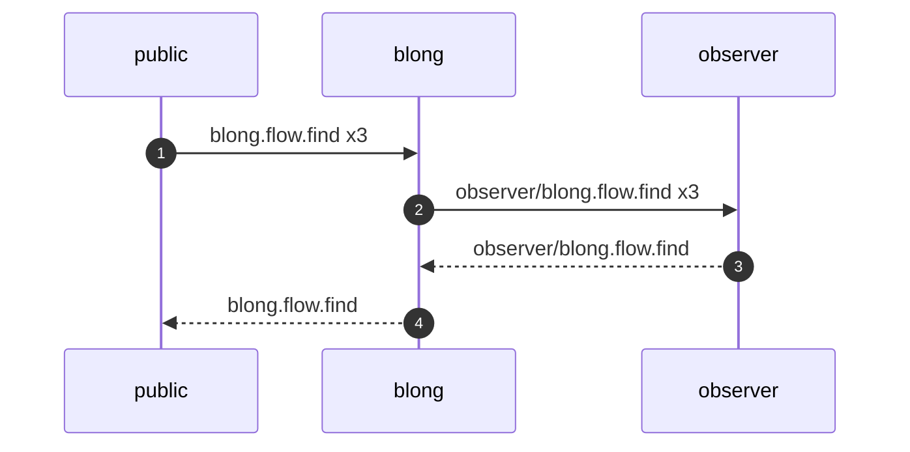

# Sequence Diagrams

```mermaid
sequenceDiagram
    autonumber
    participant public
    participant blong
    participant observer
    public->>blong: blong.flow.find x3
    blong->>observer: observer/blong.flow.find x3
    observer-->>blong: observer/blong.flow.find
    blong-->>public: blong.flow.find
```
