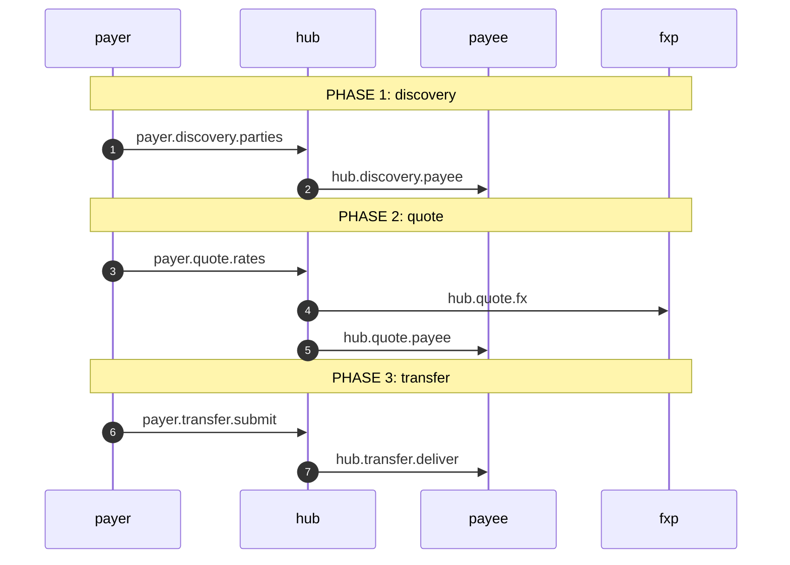
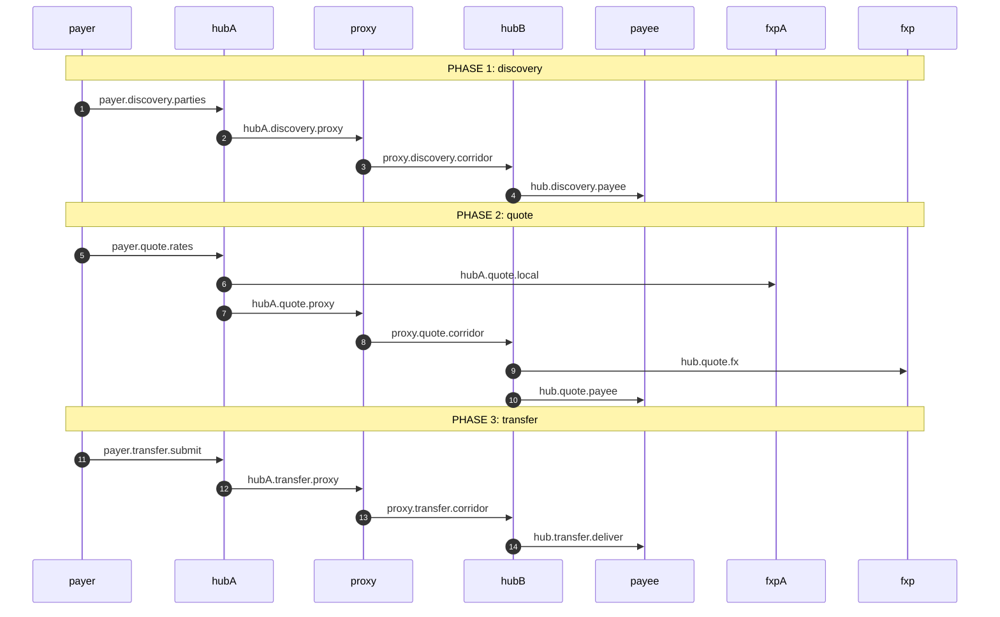

<!--
    GENERATED — do not edit by hand.

    Rendered from a real run of the flows in `flow/` by `test/flow/observedFlows.test.ts`,
    which fails when this file is stale. Regenerate with:

        SEMANTIC_LOG_UPDATE_DIAGRAMS=1 ./node_modules/.bin/tap test/flow/observedFlows.test.ts

    Each block below is embedded **verbatim** in its section of
    `docs/blong/docs/patterns/semantic-log-flows.md`, and the same test compares the two —
    so a diagram cannot say one thing here and another there.
-->

# Observed flows

Each diagram below is drawn from what the **service observed** of one real execution: the
arrow is a call a record declared, the receiver is the participant the caller named, and
the label is the leg id the source code declares — so `hub.transfer.deliver` here is
greppable in the code that makes the call, and the table names the file and line that
declares it. Nothing is drawn from a document, which is what lets these replace hand-written
diagrams without becoming another one.

The counts are per execution, so a call a chatty participant logged five records about is
still one call. `x2` on an arrow would be two executions' worth of it, and a crossed arrow
is a call the caller declared that nothing answered — a deployment fact that a diagram
drawn from deductions could not show at all.

<!-- BEGIN OBSERVED FLOWS: transfer.single -->
Participants: `payer`, `hub`, `payee`, `fxp`. 7 calls observed across 1 execution(s).

| call | caller → receiver | phase | position | declared | answered | declared in |
| ---- | ----------------- | ----- | -------- | -------- | -------- | ----------- |
| `payer.discovery.parties` | `payer` → `hub` | discovery | 1 | 1 | 1 | `flow/payer.ts:66` |
| `hub.discovery.payee` | `hub` → `payee` | discovery | 1.1 | 1 | 1 | `flow/hub.ts:68` |
| `payer.quote.rates` | `payer` → `hub` | quote | 2 | 1 | 1 | `flow/payer.ts:82` |
| `hub.quote.fx` | `hub` → `fxp` | quote | 2.1 | 1 | 1 | `flow/hub.ts:99` |
| `hub.quote.payee` | `hub` → `payee` | quote | 2.2 | 1 | 1 | `flow/hub.ts:110` |
| `payer.transfer.submit` | `payer` → `hub` | transfer | 3 | 1 | 1 | `flow/payer.ts:121` |
| `hub.transfer.deliver` | `hub` → `payee` | transfer | 3.1 | 1 | 1 | `flow/hub.ts:141` |
<!-- END OBSERVED FLOWS: transfer.single -->
<!-- BEGIN OBSERVED FLOWS: transfer.inter -->
Participants: `payer`, `hubA`, `proxy`, `hubB`, `payee`, `fxpA`, `fxp`. 14 calls observed across 1 execution(s).

| call | caller → receiver | phase | position | declared | answered | declared in |
| ---- | ----------------- | ----- | -------- | -------- | -------- | ----------- |
| `payer.discovery.parties` | `payer` → `hubA` | discovery | 1 | 1 | 1 | `flow/payer.ts:66` |
| `hubA.discovery.proxy` | `hubA` → `proxy` | discovery | 1.1 | 1 | 1 | `flow/hubA.ts:60` |
| `proxy.discovery.corridor` | `proxy` → `hubB` | discovery | 1.1.1 | 1 | 1 | `flow/proxy.ts:45` |
| `hub.discovery.payee` | `hubB` → `payee` | discovery | 1.1.1.1 | 1 | 1 | `flow/hub.ts:68` |
| `payer.quote.rates` | `payer` → `hubA` | quote | 2 | 1 | 1 | `flow/payer.ts:82` |
| `hubA.quote.local` | `hubA` → `fxpA` | quote | 2.1 | 1 | 1 | `flow/hubA.ts:94` |
| `hubA.quote.proxy` | `hubA` → `proxy` | quote | 2.2 | 1 | 1 | `flow/hubA.ts:102` |
| `proxy.quote.corridor` | `proxy` → `hubB` | quote | 2.2.1 | 1 | 1 | `flow/proxy.ts:46` |
| `hub.quote.fx` | `hubB` → `fxp` | quote | 2.2.1.1 | 1 | 1 | `flow/hub.ts:99` |
| `hub.quote.payee` | `hubB` → `payee` | quote | 2.2.1.2 | 1 | 1 | `flow/hub.ts:110` |
| `payer.transfer.submit` | `payer` → `hubA` | transfer | 3 | 1 | 1 | `flow/payer.ts:121` |
| `hubA.transfer.proxy` | `hubA` → `proxy` | transfer | 3.1 | 1 | 1 | `flow/hubA.ts:136` |
| `proxy.transfer.corridor` | `proxy` → `hubB` | transfer | 3.1.1 | 1 | 1 | `flow/proxy.ts:47` |
| `hub.transfer.deliver` | `hubB` → `payee` | transfer | 3.1.1.1 | 1 | 1 | `flow/hub.ts:141` |
<!-- END OBSERVED FLOWS: transfer.inter -->