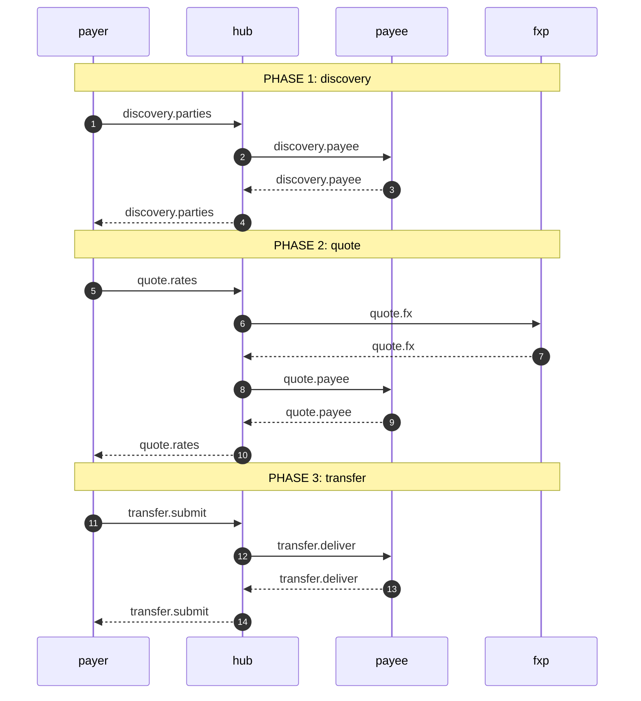
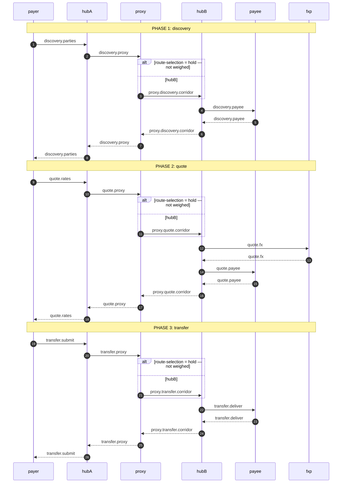

<!--
    GENERATED — do not edit by hand.

    Rendered from a real run of the flows in `flow/` by `test/flow/observedFlows.test.ts`,
    which fails when this file is stale. Regenerate with:

        SEMANTIC_LOG_UPDATE_DIAGRAMS=1 ./node_modules/.bin/tap test/flow/observedFlows.test.ts

    Each block below is embedded **verbatim** in its section of
    `docs/blong/docs/patterns/semantic-log-flows.md`, and the same test compares the two —
    so a diagram cannot say one thing here and another there.
-->

# Observed flows

Each diagram below is drawn from what the **service observed** of one real execution: the
arrow is a call a record declared, the receiver is the participant the caller named, and
the label is the leg id the source code declares — so `hub.transfer.deliver` here is
greppable in the code that makes the call, and the table names the file and line that
declares it. Nothing is drawn from a document, which is what lets these replace hand-written
diagrams without becoming another one.

The counts are per execution, so a call a chatty participant logged five records about is
still one call. `x2` on an arrow would be two executions' worth of it, and a crossed arrow
is a call the caller declared that nothing answered — a deployment fact that a diagram
drawn from deductions could not show at all. An answered call is a pair: the request out,
and the answer back on a dashed arrow under the same leg id, because a receiver's own
record of the leg is what the answer is. The dashed arrow is drawn where the answer
arrived — after everything the call itself called has been answered, which the positions
say — so the pairs nest the way the execution did. A call that never leaves its own
participant is the one exception: it is drawn once, because the answer to it would repeat
the same caller, the same label and the same step, and the arrow is already solid — the
receiver's record is what made it solid in the first place.

A branch is an `alt`/`else` block whose arms are named for the candidates the code declared, and an
arm whose predicate never ran says so. The arms are **ordered so the block renders**: mermaid refuses
a section with nothing in it when it is the last before `end`, so the empty arms come first and the
one carrying the calls last. The labels, not the order, are what name the candidates.

<!-- BEGIN OBSERVED FLOWS: transfer.single -->
Participants: `payer`, `hub`, `payee`, `fxp`. 7 calls observed across 1 execution(s).

| call | caller → receiver | phase | position | declared | answered | declared in |
| ---- | ----------------- | ----- | -------- | -------- | -------- | ----------- |
| `discovery.parties` | `payer` → `hub` | discovery | 1 | 1 | 1 | `flow/payer.ts:67` |
| `discovery.payee` | `hub` → `payee` | discovery | 1.1 | 1 | 1 | `flow/hub.ts:56` |
| `quote.rates` | `payer` → `hub` | quote | 2 | 1 | 1 | `flow/payer.ts:85` |
| `quote.fx` | `hub` → `fxp` | quote | 2.1 | 1 | 1 | `flow/hub.ts:57` |
| `quote.payee` | `hub` → `payee` | quote | 2.2 | 1 | 1 | `flow/hub.ts:58` |
| `transfer.submit` | `payer` → `hub` | transfer | 3 | 1 | 1 | `flow/payer.ts:124` |
| `transfer.deliver` | `hub` → `payee` | transfer | 3.1 | 1 | 1 | `flow/hub.ts:59` |
<!-- END OBSERVED FLOWS: transfer.single -->
<!-- BEGIN OBSERVED FLOWS: transfer.inter -->
Participants: `payer`, `hubA`, `proxy`, `hubB`, `payee`, `fxp`. 13 calls observed across 1 execution(s).

| call | caller → receiver | phase | position | declared | answered | declared in |
| ---- | ----------------- | ----- | -------- | -------- | -------- | ----------- |
| `discovery.parties` | `payer` → `hubA` | discovery | 1 | 1 | 1 | `flow/payer.ts:67` |
| `discovery.proxy` | `hubA` → `proxy` | discovery | 1.1 | 1 | 1 | `flow/hubA.ts:53` |
| `proxy.discovery.corridor` | `proxy` → `hubB` | discovery | 1.1.1 | 1 | 1 | `flow/proxy.ts:45` |
| `discovery.payee` | `hubB` → `payee` | discovery | 1.1.1.1 | 1 | 1 | `flow/hub.ts:56` |
| `quote.rates` | `payer` → `hubA` | quote | 2 | 1 | 1 | `flow/payer.ts:85` |
| `quote.proxy` | `hubA` → `proxy` | quote | 2.1 | 1 | 1 | `flow/hubA.ts:88` |
| `proxy.quote.corridor` | `proxy` → `hubB` | quote | 2.1.1 | 1 | 1 | `flow/proxy.ts:46` |
| `quote.fx` | `hubB` → `fxp` | quote | 2.1.1.1 | 1 | 1 | `flow/hub.ts:57` |
| `quote.payee` | `hubB` → `payee` | quote | 2.1.1.2 | 1 | 1 | `flow/hub.ts:58` |
| `transfer.submit` | `payer` → `hubA` | transfer | 3 | 1 | 1 | `flow/payer.ts:124` |
| `transfer.proxy` | `hubA` → `proxy` | transfer | 3.1 | 1 | 1 | `flow/hubA.ts:122` |
| `proxy.transfer.corridor` | `proxy` → `hubB` | transfer | 3.1.1 | 1 | 1 | `flow/proxy.ts:47` |
| `transfer.deliver` | `hubB` → `payee` | transfer | 3.1.1.1 | 1 | 1 | `flow/hub.ts:59` |
<!-- END OBSERVED FLOWS: transfer.inter -->