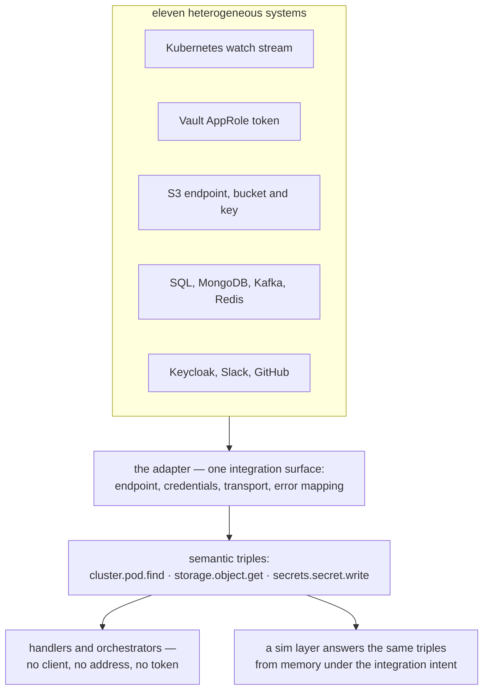

Every external system arrives with its own habits. A Kubernetes watch stream never "returns", a
Vault token expires, S3 wants a bucket and a key before it will talk, Kafka hands you a consumer
group you did not ask for, and Redis speaks Lua when you want the answer to be atomic. Integration
code is where those habits leak into a codebase — a client here, a credential there, an SDK call in
the middle of a business rule.

Blong's answer is to make them all look the same. Kubernetes, Keycloak, S3, Vault, Slack, GitHub,
SQL, MongoDB, Kafka and Redis reach the rest of the framework as one thing: a handler that answers a
semantic triple.

<!-- truncate -->

## One surface, one vocabulary

An adapter is the only place in the framework allowed to know what it is talking to. Everything
outside it calls a triple — `subject`, `object`, `predicate` — and the adapter decides what that
means for its driver:

```typescript
// realm/example/adapter/storage.ts — an instance over the built-in S3 driver
export default adapter<{s3: {endpoint?: string}}>(() => ({
    extends: 'adapter.s3',
    activation: {
        default: {
            namespace: 'storage',
            imports: [],
            s3: {region: 'us-east-1', endpoint: 'http://localhost:9000'},
        },
    },
}));
```

With that layer in place, `storage.object.get` and `storage.bucket.list` are calls a handler makes
through the handler proxy, exactly like a call into another realm. The namespace is the adapter's
name in the framework's vocabulary, and the triples in `core/blong-gogo/src/adapter/server/` are the
same triples the framework's own suites and the commander explorer use — that shared vocabulary is
what makes an adapter both callable and discoverable:

<!-- Heterogeneous systems, one adapter surface, and the triples the rest of the framework sees -->



Three translations show what the boundary is worth.

**Vault keeps its own token.** A handler never carries a credential. When no static token is
configured, the adapter logs in with AppRole at startup, stores the returned client token in its
context, and revokes it on shutdown. `secrets.secret.get` has no authentication argument because
authentication is not the handler's business.

**A Kubernetes watch is a stream with no end.** `cluster.pod.watch` cannot be a promise that
resolves once. The adapter turns the client's watch callback into an async generator, derives the
resource path from the triple's object segment, and lets the caller iterate — the same call shape
whether the events came from a cluster or from memory.

**S3 needs a bucket before it needs a key.** The adapter reads the object segment, decides whether
the call is bucket-scoped or key-scoped, and builds the matching SDK command. The handler asks for
an object; the adapter is the one that knows a bucket has to be named first.

The rule that makes this hold is short: **adapters never call adapters**. If a business step needs
two systems, that is an orchestrator's job, and the orchestrators are the layer that will become
separate services later. An adapter that reached into another adapter would weld two deployment
decisions together and quietly make the monolith/microservice choice for us.

## Two answers to the same triple

Because an adapter is defined by the triples it answers, not by the code behind it, a second
implementation can answer the same triples without touching the caller. That is the `sim` layer: a
well-known layer that activates only under the `integration` intent, where a stand-in — an echo
server, a mock OpenAPI service — answers the calls that would otherwise need infrastructure. A test
suite gains the intent and its dependencies become in-process; the handlers under test are
unchanged, because nothing in a handler knows which of the two answers it got.

The split is honest about its limits. Where the hard part is a protocol, a simulated endpoint is
enough. Where the hard part is state — a database's isolation levels, a broker's offsets, a bucket's
eventual consistency — a stand-in proves less than it appears to, so the repository tests those
against the real thing: MySQL, MongoDB, Kafka, Redis, Keycloak, Vault, MinIO and the k3d cluster all
run for the integration suite, with the same triples exercised against the real driver.

## Redis arrived last, and for two clients

Redis joined the catalogue after the others, and not only for domain work. The gateway meters API
usage — per-minute rate windows, monthly credit totals — and that needs an atomic read-modify-write
across processes, so the gateway attaches an instance of the Redis adapter under a `meter` namespace
and runs its own Lua scripts through it. The generic Redis vocabulary is inherited and stays
reachable through the same port.

That is the pattern the whole catalogue follows: one driver, one class of external system, one
namespace of triples — and one place where the quirks live. Swapping an endpoint, adding TLS,
rotating a credential or pointing a test at a stand-in are all edits to a layer file, not to the
business logic that calls it.

The catalogue is in the [adapter pattern](/docs/patterns/adapter), the boundary itself in the
[adapter concept](/docs/concepts/adapter), and the layer that swaps simulated answers in is
described with the rest of the [layers](/docs/concepts/layer).
