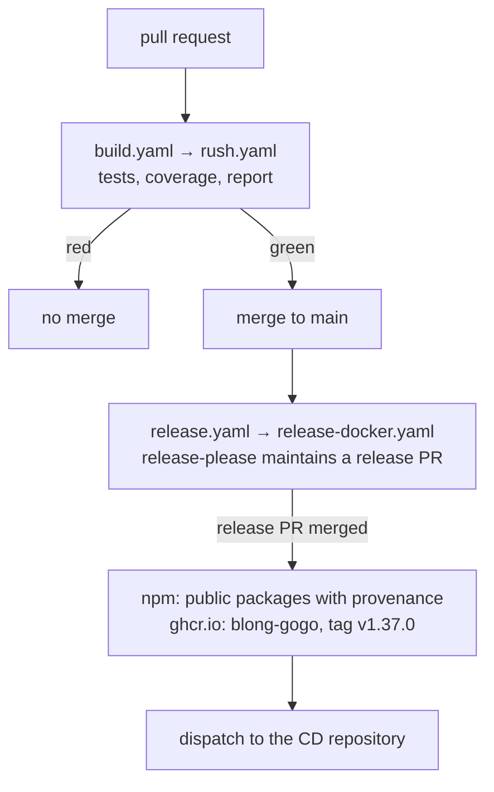

Releasing a framework is a different job from releasing an application. An application ships once
and the version belongs to a deployment; a framework is consumed by other people's builds, so every
published version is a promise that has to hold for strangers, and the promise has to be
attributable when it breaks. The repository has to answer three questions without a human
remembering anything: what changed, what version does that make, and can a consumer prove the
artifact came from this commit.

In January we replaced a manual, change-file-driven release with a pipeline where the version is a
consequence of the merge and the artifacts are attested. The commit that did it is called
`fix: prepare for publishing`, and it deleted more than it added.

<!-- truncate -->

## Three workflows, one release

The repository has exactly three workflows, and their division of labour is the design:

- `build.yaml` runs on a pull request and is the gate. It performs no release step at all.
- `release.yaml` runs on a push to `main` — and only there. There is no tag trigger, no schedule and
  no manual dispatch.
- `baselines.yaml` is dispatched by hand to capture Playwright screenshot baselines on a runner; it
  has nothing to do with publishing.

Both CI and the release delegate to reusable workflows in a shared actions repository rather than
spelling out the steps here. That is a deliberate trade: one place maintains what a green run means
for every repository that uses it, at the cost of a pipeline that changes under a repository that
only pinned `@main`.

## The version is derived, not decided

The old flow used Rush change files: every pull request dropped a file describing the change, and CI
verified that one was present. It made the author describe the change twice — once in the commit and
once in the file no human reads.

The replacement is release-please in manifest mode. A manifest lists every package in the monorepo —
32 of them, each with its current version — and the bump comes from the conventional-commit type in
the merged title. On every push to `main` the workflow asks release-please to keep a release pull
request up to date. Merging that pull request is the moment a release exists; nothing else
publishes.

The consequence is that versions are per package and can drift on purpose. Today `core/blong` is at
1.31.0 while `core/blong-openapi` is at 1.2.1, because one accumulated features and the other did
not. A consumer of a small package is not forced to take a release note for a realm it does not use,
and a realm that did not change keeps its number.

<!-- From the pull request gate to a published image and the dispatch that deploys it -->



## Publishing is opt-in, and provable

A package enters the registry by declaring a `ci-publish` script. The script is the whole
declaration — the release workflow finds the packages that have one and runs it:

```json
{
    "scripts": {
        "ci-publish": "node ../../common/scripts/install-run-rush-pnpm.js publish --access public --provenance"
    }
}
```

Seven packages currently opt in: the core types, the runtime, the chain executor, the OpenAPI codec,
`semantic-log`, `blong-login` and `blong-test`. A package that should not be published simply does
not have the script — and one that needs to stop has an even cheaper way to say so: `blong-browser`
keeps its publishing command as `.ci-publish`, one dot away from being picked up, which is a clearer
statement of intent than a deletion.

`--provenance` is the part a stranger benefits from. The publish runs with an OIDC token the release
job asks for explicitly, so npm records a signed attestation tying the package to the workflow and
commit that built it. A consumer can verify where a published version came from instead of trusting
that nobody typed a password into a laptop.

## The image is the same release

A deployment does not consume the npm packages; it consumes the container. One image is built —
`blong-gogo` — from a multi-stage Dockerfile that runs `rush deploy` for the runtime project, so the
image contains exactly the runtime's dependency closure rather than the monorepo. Its entry point is
the framework CLI itself: the container is the `blong` command, configured by intents and arguments,
which is why the same image can be a monolith or a set of microservices.

The tag comes from the manifest — `v1.37.0` today — and there is no `latest`, because a tag that
moves is a tag that cannot be rolled back to. Before the push, the image is scanned and a critical
vulnerability fails the build; after it, the pipeline dispatches to the repository that deploys it,
which is the only place that knows about clusters.

## Why the gate is mundane and the release is not

The gate is a well-worn shape: install, rebuild, run tests against a throwaway cluster and real
backends, measure coverage, render a report, post it as a sticky pull-request comment, and fail the
job if any of it failed. Two details are worth naming. The test step is allowed to fail so the
diagnostics step can still run, and a separate step then fails the job — otherwise the situation
that needs evidence is the one that destroys it. And a pull request that changes nothing but the
rebuilt metrics baseline skips CI entirely, which keeps the pipeline from running on its own
bookkeeping.

What is not mundane is where the release begins: not with a person deciding it is release time, but
with a merge. Everything after it — the version, the changelog, the npm publish, the image tag, the
deployment dispatch — is derived from that one decision, which is the only form of a release process
that a stranger can audit.

The reasoning behind the model is in the [release rationale](/docs/rationale/release), and the CI
gate it depends on is described in the [test patterns](/docs/patterns/test).
