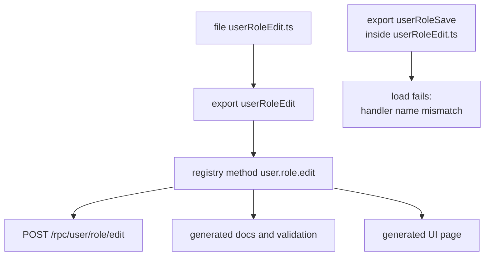

Every framework has a naming convention. Almost none of them check whether you followed it, and none
of them can tell you what a function does without reading its body. In Blong a handler's name is not
documentation about the code — it _is_ the API. The file the code lives in, the function it exports,
the method the network carries, the URL that reaches it and the row that appears in the generated
documentation are all the same string.

That single decision is why the framework can generate a routing table, a validation schema and an
API document without being told anything twice — and why it can reject a name that disagrees with
itself instead of quietly publishing it.

<!-- truncate -->

## One string, five places

A handler is named with a semantic triple, `subjectObjectPredicate`: a singular subject, a singular
object and a present-tense predicate. The file name is the export name is the wire method name:

```typescript
// realm/user/orchestrator/user/userRoleEdit.ts
import {handler} from '@feasibleone/blong';

export default handler(
    () =>
        async function userRoleEdit(params, $meta) {
            // ...
        },
);
```

That one file publishes the method `user.role.edit`, and the public API answers it at

```http
POST /rpc/user/role/edit
```

Nothing maps one to the other. The loader derives the name from the file, the registry files it
under the same name, the RPC router splits the name into path segments, and the generated
documentation prints the same three words. There is no `@Route` decorator, no controller class and
no route table to keep in sync — the name is the only place the fact is written down:

<!-- One name, five places, and the branch the loader rejects -->



## The vocabulary is fixed too

A triple only works as an API if the third word is predictable, so the predicates are not a matter
of taste either. Before inventing a verb, reuse one:

| Operation       | Predicate                                             |
| --------------- | ----------------------------------------------------- |
| a single record | `get`, `find`, `add`, `edit`, `remove`, `merge`       |
| many records    | `insert`, `update`, `delete`                          |
| lifecycle       | `list`, `create`, `check`, `refresh`, `start`, `stop` |

The same idea reaches into the payloads: properties are two words, `userName` rather than `name`,
`customerId` rather than `id`. It reads as pedantry until a generated form labels a field, and then
it is the difference between "Name" being obvious and being ambiguous in six places at once.

Older conventions leak through, and the framework does not pretend otherwise: a function whose name
is not a valid triple — `sum`, `hashPassword` — is treated as a injected library function, visible
to its siblings and not published anywhere else. The rule is a gate, not a law of physics.

## The framework checks

A convention that lives only in a style guide erodes. Blong enforces this one at load time: when a
file defines a single handler, the exported function name must match the file name, and the loader
throws with both halves of the problem spelled out —

```text
Handler name mismatch in 'userRoleSave.ts': function is named 'userRoleEdit'
but file is named 'userRoleSave.ts'. Either rename the function to 'userRoleSave'
or rename the file to 'userRoleEdit.ts'.
```

Anonymous handlers are still allowed — the loader gives them the name their file implies. What is
not allowed is a handler that claims to be two things at once.

The generator holds the same line. [Kukum](/docs/concepts/kukum) — the API that scaffolds primitives
— runs the conventions as a check before it writes a file, and refuses a predicate that is not in
the table:

```text
predicate 'save' is not a standard predicate (get/find/add/edit/remove/merge) — reuse one before inventing
```

So the naming rules of this framework are enforced in two places that a developer actually hits: the
moment the process loads, and the moment an agent or a colleague asks the API to create something
new. Both failures happen while the code is being written, not in review.

## What it buys

The payoff is not tidiness; it is that every other mechanism has one source of truth to read from.

- **No routing table.** The public RPC surface is derived from names the loader already has.
- **Generated UI reads the same names.** A model spec binds a page to `subjectObjectFind` and
  friends, so the page and the API cannot drift.
- **The editor is part of the API.** `ctrl+p userRole` finds the handler, and `ctrl+p ure` finds it
  too: the triple is in the file name precisely so that the first letters are a search key.
- **Agents and humans get the same signal.** The check runs before the file exists, so a wrong name
  costs a round trip, not a review comment.

Naming is usually the first thing a framework leaves to the developer, and the last thing a
generator can rely on. Turning it into an enforced invariant is what makes the rest of Blong — the
generated pages, the documented API, the primitives that scaffold other primitives — possible
without a second description of the system.

Read the invariant once in [Naming](/docs/concepts/naming), then the
[handler patterns](/docs/patterns/handler) for the file layout and [RPC](/docs/patterns/rpc) for the
wire format.
