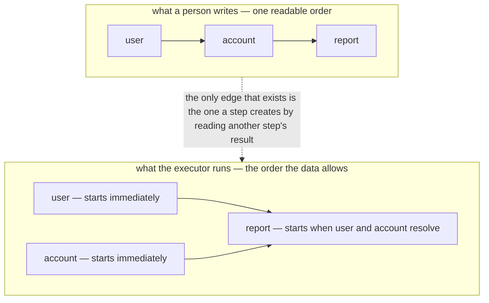

A test is a story, and stories are linear. So test code is linear: set up a user, then fetch the
account, then build the report, then assert. The runner then executes that story one line at a time,
and a suite of such stories takes as long as the sum of everything in it — even though the four
lines that set up four unrelated fixtures had no reason to wait for one another.

The usual fixes are both unsatisfying. You can declare the dependencies by hand and watch the
declarations rot as the test changes, or you can run everything concurrently and watch the suite
fail in ways that depend on timing. Blong took the third option: the executor discovers the
dependencies from the test's own data flow and parallelises everything the data flow permits.

<!-- truncate -->

## Written in human order, executed in machine order

A test handler returns a list of steps — a chain — written in the order a person would explain them.
The step's second argument is its context, and the context is a proxy:

```typescript
export default handler(({lib: {group}, handler: {fetchUser, fetchAccount}}) => ({
    testCheckout: ({name = 'checkout'}, $meta) =>
        group(name)([
            async function user(assert: IAssert) {
                return fetchUser({}, $meta); // no context read — starts immediately
            },
            async function account(assert: IAssert) {
                return fetchAccount({}, $meta); // no context read — starts immediately
            },
            async function report(assert: IAssert, {user, account}) {
                const [u, a] = await Promise.all([user, account]); // the two edges
                assert.ok(u.id && a.balance >= 0);
                return {userId: u.id, balance: a.balance};
            },
        ]),
}));
```

Nothing in that code says "run `user` and `account` in parallel". It says what a person would say —
fetch the user, fetch the account, then report — and the parallelism falls out of the second
argument. Reading `user` from the context is what creates the edge to the step named `user`; a step
that reads nothing has no edges and starts at once:

<!-- The written order and the executed order of the same three steps -->



The context properties are thenable, which is what makes a person's ordinary code the declaration.
`await context.previous`, `const {previous} = context; await previous`, and awaiting a nested
property all work — the destructuring is not a snapshot, it is a promise that resolves when that
step finishes. Deep paths resolve against the producing step's result, so a test that reaches two
levels into a previous step still names only that step.

## The queue is the scheduler

Underneath, the executor starts every step of a level and puts the work through a `p-queue` with a
concurrency limit — ten by default, configurable per run. There is no topological sort and no
priority ordering, because there is nothing to compute ahead of time: the graph only exists as the
run creates it. A step that awaits a dependency is simply blocked inside its queue slot until the
producing step resolves the proxy.

That design has a limit worth stating plainly. A blocked step holds its slot, so a suite configured
with a very low concurrency and a deep dependency chain can serialise more than the graph requires.
The limit is the knob that keeps a test suite from opening two hundred sockets at once; it is not a
scheduler.

Two guards make the observed-graph approach safe to write in. A reference to a step that does not
exist fails with the offender named instead of a timeout:

```text
Invalid step reference(s) detected: Step "report" references "context.invoice",
but no step named "invoice" exists. Available steps: account, user
```

And a duplicate step name is rejected too, because two steps with one name would make a reference
ambiguous — the reason the Cucumber bridge renames the steps it generates with a per-scenario suffix
before handing them to the executor.

## Groups, barriers and snapshots

A chain is a tree as well as a graph. An inner array is a sub-test with its own name, which is how a
reusable flow gets reused: `testLoginTokenCreate({}, $meta)` can be dropped into another test as one
step. An empty array is a barrier — everything before it must finish before anything after it starts
— and an array naming steps (`['user', 'account']`) is a snapshot point: wait for the named steps,
then compare the collected results against a stored baseline.

## The run tells you what it did

Because the executor observes the graph, it can report it. After a run it can produce the dependency
graph, each step's queue time and execution time, the critical path, and a parallel-efficiency
number — the ratio of total step time to wall-clock time. A test whose efficiency is close to one is
effectively serial, and the report names the bottleneck step.

That is the difference between "we run tests in parallel" and knowing it. A suite that reads as a
story, executes as a graph, and reports where the time actually went is also a suite whose timings
can be trusted — and that turns a slow suite from a mystery into a measurement.

The step and context syntax is in the [test patterns](/docs/patterns/test), the executor's behaviour
in the [chain concept](/docs/concepts/chain), and the bridge from `.feature` files in the
[Cucumber patterns](/docs/patterns/cucumber).
