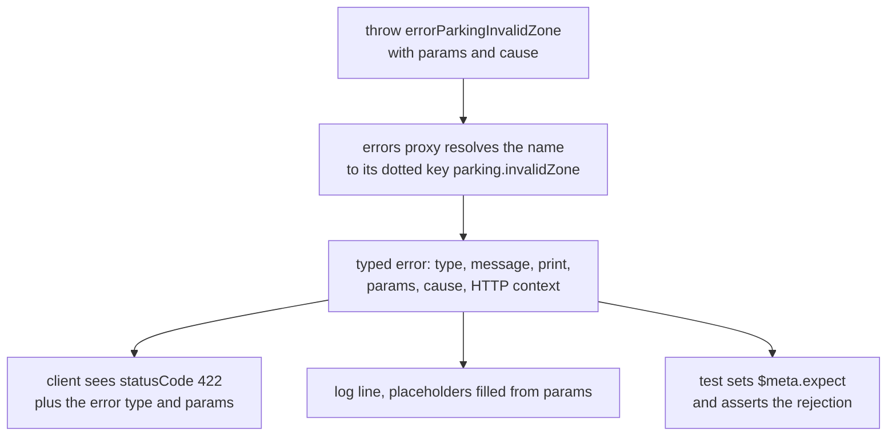

Almost every framework says its errors are typed. What that usually means is that an error class
exists somewhere, and every code path that raises it imports it, constructs it and hopes the message
matches what the documentation promised. The definition and the call site drift apart, and the drift
is invisible until a client reads a message that no longer describes the failure.

In Blong an error is data with a namespaced type, declared once in a realm's error layer, and
reached from a handler through a proxy — no import, no constructor, no factory wiring, and a typo
that fails before the function runs.

<!-- truncate -->

## Defining an error, and throwing it

The realm owns the error layer. Each entry is a key and a message, with the extra properties a
particular failure needs — `print` for a message written for a person, `statusCode` for the HTTP
answer:

```typescript
// realm/parking/error/error.ts
export default {
    'parking.invalidZone': 'Zone {zone} is not available',
    'parking.gateClosed': {
        message: 'Gate {gate} is closed',
        print: 'Please use another gate',
        statusCode: 409,
    },
};
```

A handler destructures the errors it can raise. The name it writes is the camelCase form of the key,
and the proxy resolves it against the registry:

```typescript
import {handler} from '@feasibleone/blong';

export default handler(({errors: {errorParkingInvalidZone}}) => ({
    async parkingPay({zone}, $meta) {
        const gate = await gateResolve({zone}, $meta);
        if (!gate) {
            throw errorParkingInvalidZone({params: {zone}});
        }
        // ...
    },
}));
```

Three things are worth noticing. The key `parking.invalidZone` carries the namespace, which is how
errors from different realms stay apart and how the framework knows that a key belongs to the realm
whose layer defined it. The parameter is filled from `params`, so the message template and the value
it interpolates are proved against each other at the only place either appears. And the destructured
name is checked at load time: the proxy throws when a name does not exist in the registry, naming
the entries that do, so a misspelled error fails during handler registration rather than in
production.

The legacy dotted form still works — `{'parking.invalidZone': errorParkingInvalidZone}` — which is
why the old syntax appears in existing code. New code writes the short form.

## What the client actually receives

Because the error was declared as data, the framework has everything it needs to answer with more
than a message. An error that crosses the public API arrives as a structured object: a `type` the
client can branch on, `message` for the logs, `print` for a person, `validation` when it came from a
field, `params` with the interpolation values, and, when the deployment runs in debug mode, the
`cause` and `stack`. The `statusCode` from the definition becomes the HTTP status — `409` in the
example above — so a client can treat it as a protocol answer rather than parse prose:

```json
{
    "jsonrpc": "2.0",
    "error": {
        "type": "parking.invalidZone",
        "message": "Zone A3 is not available",
        "print": "Please use another gate",
        "params": {"zone": "A3"}
    },
    "id": 1
}
```

Wrapping an inner failure keeps the same shape: pass the caught error as `cause` and the original is
preserved underneath the typed one.

<!-- From the throw to the client, the log and the test expectation -->



## The other half: expecting the failure

A typed error is only useful in a test if the test can assert on it — and that is where most test
suites lose their signal. A suite whose whole point is to prove that invalid input is rejected logs
a stack trace for every expected failure, so the log stream of a green run looks like a red one.

Expected errors make the intention part of the call. The test declares the failure it wants, and the
declaration travels with the request in `$meta` — the second argument every handler already
forwards:

```typescript
export default handler(({handler: {parkingPay}}) => ({
    testParkingInvalidZone: async (assert: IAssert, $meta: IMeta) =>
        assert.rejects(
            parkingPay({zone: 'red'}, {...$meta, expect: 'parking.invalidZone'}),
            {type: 'parking.invalidZone'},
            'should reject with parking.invalidZone',
        ),
}));
```

`expect` accepts one type, an array of types, or a prefix wildcard — `parking.*` — and the rule is
applied where the error is raised: a match is demoted to `debug`, so a genuine failure is the only
thing left at `error` level. The error still propagates and the assertion still has to pass; the
flag only decides how loudly the expected path is announced.

Two details make this more than a logging trick. Because `$meta` is serialized as the last element
of the RPC `params`, the expectation survives a hop into another microservice, so a test can assert
on a failure that happened three services away. And because `expect` can also arrive from the public
API, the gateway gates the feature behind `gateway.expectedErrors`, off by default and enabled for
development and integration intents — a client that could suppress `error`-level log entries at will
would be able to hide its own intrusion attempts.

## Why the proxy is the point

The proxy is a small implementation choice with a large consequence. Holding the error map behind it
means the definition stays in one place while the ergonomics improve — the name in the handler is
the name a developer would have written anyway, and the framework still owns the key, the message
template, the status code and the log level.

The typed error is then the same object at every reader: the client branches on `type`, the operator
reads `message`, the user reads `print`, the form reads `validation`, and the test asserts on the
rejection it declared up front. One definition, five audiences, no drift.

The reasoning behind the proxy is in the [error proxy rationale](/docs/rationale/error-proxy); the
shape of a typed error is in [Typed errors](/docs/concepts/errors), the mechanics of throwing it in
the [error pattern](/docs/patterns/error), and the test side in
[Expected errors](/docs/concepts/expected-errors).
