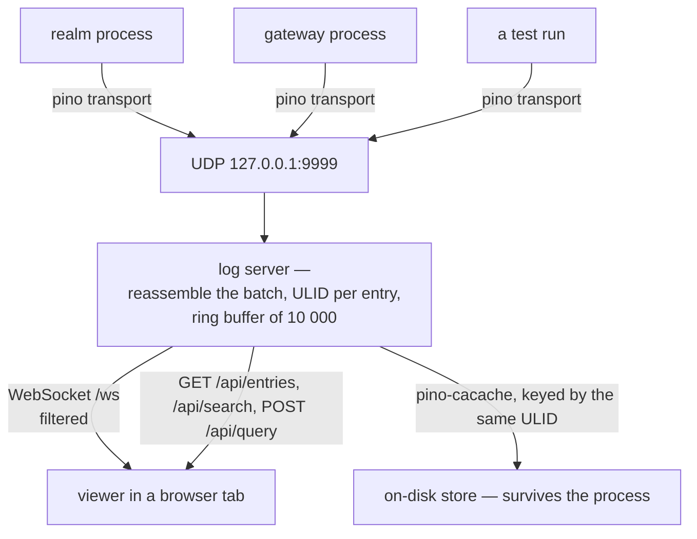
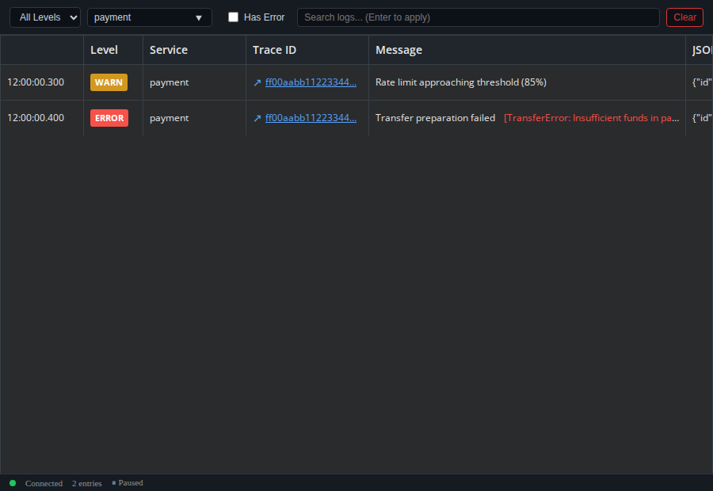

A development run of Blong is never one process. There is a gateway, one or more realms, a browser
bundle, a test run replaying the bug — each with its own terminal, each interleaved with hot-reload
noise. The one line you need is somewhere in the middle of one of those windows, and the trace id
that would tie the story together is buried inside it.

So we stopped tailing terminals. Every process ships its entries to one small server, and the server
fans them out to a viewer in a browser tab. The tab is the log.

<!-- truncate -->

## The shape: two transports and one server

On the emitting side, a pino transport batches entries and sends them over UDP. On the receiving
side, a small server reassembles the batches, gives every entry an id, keeps the most recent ten
thousand in a ring buffer, and exposes them two ways — a REST API for reads and a WebSocket for the
live tail. The viewer is a grid that fetches recent entries once and then subscribes.

```typescript
const logger = pino({
    transport: {
        target: '@feasibleone/blong-log/transport',
        options: {host: '127.0.0.1', port: 9999, batchSize: 10, flushInterval: 100},
    },
});
```



## Why UDP, of all things

Everything else in this stack is ordered and reliable, so a connectionless datagram socket looks
like the wrong instinct. For a hot path it is the right one, for three reasons.

**Logging must not be able to slow down what it observes.** A TCP write can block on a full window
and a Unix socket can block on a full buffer; a UDP send back-pressures nobody. The transport is
deliberately fire-and-forget — a failed send is swallowed, so a log call cannot fail a request it
was only supposed to describe.

**There is no connection to keep.** The transport lives inside pino's worker thread: no handshake,
no reconnect logic, no per-thread socket lifecycle to get wrong, and nothing to tear down when the
process exits the way it exits.

**Loss is acceptable here, and detectable.** Each batch goes out with a twelve-byte header — a
random eight-byte batch id, the packet index and the packet count — so the receiver can reassemble
packets in order and drop an incomplete batch after a timeout instead of rendering half a line. The
buffer is the last ten thousand entries, not a ledger: this is a development observer, and nothing
in the request path reads from it.

## The trace id is the join key

What makes the tab worth more than three terminals is one property: the trace id. Every entry
carries it, so it becomes a column, an exact filter and a click target — click it and the grid
narrows to that request across every process that handled it. In code you mostly do nothing for
this: the semantic logger binds a trace to the execution, propagates it between services in the
`x-semantic-trace` header while the call is in flight, and writes it on every record it emits.

The rest of the filtering is deliberately boring, and that is the point: level means "this level and
above", the service name is a case-insensitive substring, the trace id is exact, and free text is a
substring over the whole entry. Asking for "errors from the gateway mentioning timeout" is a query,
not a grep across windows. Filters are applied twice — server-side for the WebSocket fan-out and
client-side for immediate response — and they survive a reconnect.



## What arrived later: the line that outlives the process

The viewer answers "what is happening now", and it forgets. A ring buffer kept in memory cannot
answer "what did that line say before the process died" — which is exactly the question a failed
test asks.

The second sink is an on-disk cache written by a second pino transport: every entry is stored under
its ULID, with the full record beside it. The ULID is what makes the two halves one story — the
printed line carries the id, and `blong-dev log <ulid>` fetches that entry from the cache long after
the process is gone. Clicking a `semlog://r/<id>` link in the editor's terminal opens it as a
document, which is the shortest path from a line in a terminal to the data behind it.

The operator reference — every REST parameter and the on-disk options — is in the
[log patterns](/docs/patterns/log), and the design reasoning in the
[real-time log rationale](/docs/rationale/real-time-log).
