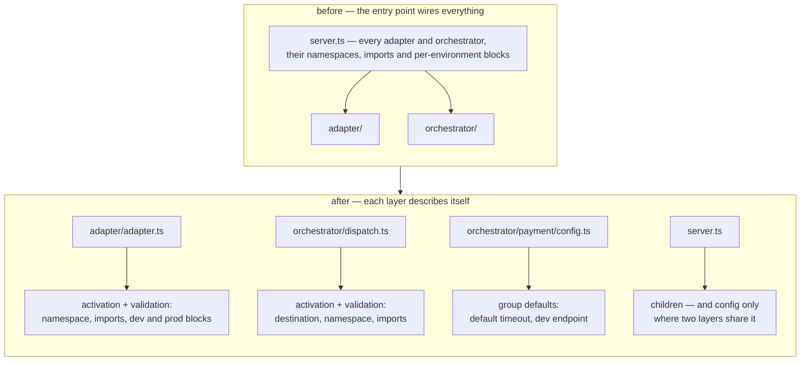

Every framework starts with an entry point that wires things up, and that entry point is honest for
about a year. Then an adapter grows a development URL, the orchestrator needs a namespace, a
production deployment wants different credentials, and the file that was supposed to list components
becomes the place where every component's configuration is written down — by someone who has to hold
the whole component in their head to do it.

Blong moves that configuration into the component. A layer declares when it is active and what
configuration it accepts, in its own file, next to the code it configures. The realm's entry point
goes back to being a list of children.

<!-- truncate -->

## The layer owns its activation

An adapter is a single file that says what it extends, what its config looks like, and which intents
turn it on:

```typescript
// adapter/db.ts — config and validation are part of the layer definition
import {adapter} from '@feasibleone/blong';

export default adapter(blong => ({
    extends: 'adapter.knex',
    validation: blong.type.Object({
        namespace: blong.type.Union([blong.type.String(), blong.type.Array(blong.type.String())]),
        imports: blong.type.Union([blong.type.String(), blong.type.Array(blong.type.String())]),
        logLevel: blong.type.Optional(blong.type.String()),
    }),
    activation: {
        default: {namespace: 'db/$subject', imports: '$subject.db'},
        dev: {logLevel: 'trace'},
        prod: {logLevel: 'warn'},
    },
}));
```

The `validation` is the contract: a deployment that passes a value the layer did not declare fails
at load with the field named, rather than half-working later. The `activation` blocks are the
layer's own answer to "am I on in this run?" — `default` always applies, and an intent's block is
merged over it when that intent is active.

Most layers do not need even that much, because their folder _is_ their declaration. `error`,
`adapter`, `orchestrator`, `gateway`, `sim`, `meta`, `server/api`, `server/init`, `server/test` and
the browser-side `backend`, `component`, `action`, `test` are discovered by name and activated for
the intents each one belongs to, with no file at all. A name the framework does not know is the
escape hatch: give the folder a `layer.server.ts` (or `layer.browser.ts`) and it joins the same
mechanism.

The concept page's activation table is not prose maintained by hand — it is rendered from
`WELL_KNOWN_LAYERS` in `core/blong-lib/layers.ts`, the same value the loader reads, which is the
only way a table like that stays true:



## Configuration has levels, and they are ordered

Moving config into components only helps if the levels are decided once, so the framework fixes
them. Each level may override the one before it, and the last one that sets a value wins:

| Level                  | Written in                                    | Covers                      |
| ---------------------- | --------------------------------------------- | --------------------------- |
| Component              | the layer file's own config                   | one adapter or orchestrator |
| Handler group defaults | `config.ts` in a group folder                 | one `realmname.foldername`  |
| Realm override         | `config: {prod: {namespace: {payment: {…}}}}` | one group, one deployment   |

A group's `config.ts` is the level that earns its keep in a growing realm. A folder of payment
handlers can carry its own defaults and its own development endpoint:

```typescript
// orchestrator/payment/config.ts
export default {
    default: {timeout: 30000, endpoint: 'https://api.payment.example.com'},
    dev: {endpoint: 'https://api.dev.payment.example.com'},
};
```

Every handler in that folder then reads the effective object as `config`. Nothing else has to know
where the value came from: the blocks are merged as `default`, then each active intent, and a value
the realm sets under `namespace.<folder>` is merged on top of both — which is how a production
deployment supplies an endpoint that is deliberately not in the source tree.

## What that buys when the deployment changes

The interesting consequence is not tidiness. It is that the same realm can be a monolith or a set of
services without a code change: a layer that names `microservice` in its activation is loaded when
the realm runs on its own, and the realm never had to know which case it was in. The decision
belongs to the word on the command line, not to the source tree.

Read the levels in the [layer patterns](/docs/patterns/layer), the folder names and their intents in
the [layer concept](/docs/concepts/layer), and the global merge chain in the
[configuration pattern](/docs/patterns/configuration).
