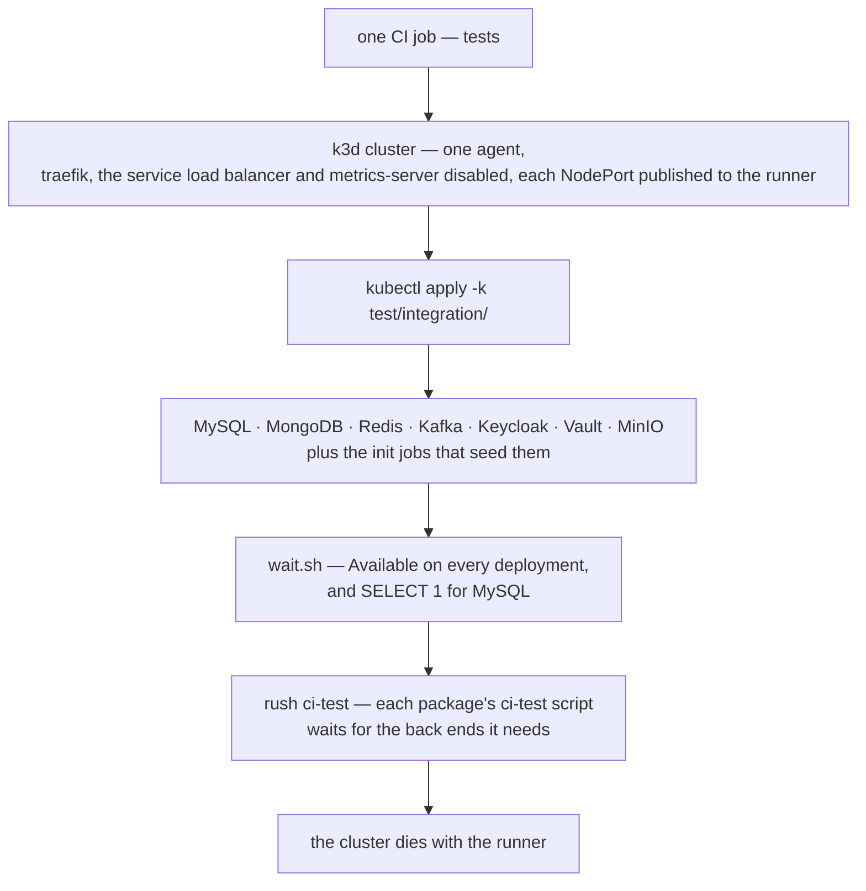

There is a class of bug that no amount of testing discipline catches, because it is not in your
code. MySQL under concurrent writes takes a lock nobody expected; a broker rebalances while you are
consuming; a token refresh races the request that needed it. A mock will never find these, and a
simulator will never find these — they exist only where two real systems meet.

The usual answer is a shared staging environment, which is either stale, contended, or both. This is
how Blong runs those tests instead: provision the real back ends into a cluster that lives exactly
as long as the job, publish their ports to the runner, and let the suites connect as if the services
were local.

<!-- truncate -->

## One switch, seven services

The mechanism is switched on by a single file existing. The CI workflow probes for
`test/integration/kustomization.yaml`; if it is there, the run creates a k3d cluster, applies the
manifests and starts the tests:



The mapping from a service to a port is the whole trick. Inside the cluster, MySQL listens on 3306
behind a NodePort; the k3d cluster publishes that node port back to the runner's own 3306, so the
adapter configuration can be ordinary localhost configuration — no test-only code path, no
reassembly of URLs, no ceremony in the suite:

| Back end | Container port | NodePort | k3d map       |
| -------- | -------------- | -------- | ------------- |
| MySQL    | 3306           | 30006    | `3306:30006`  |
| MongoDB  | 27017          | 30017    | `27017:30017` |
| Keycloak | 8180           | 30080    | `8180:30080`  |
| MinIO    | 9000           | 30009    | `9000:30009`  |
| Kafka    | 9092           | 30092    | `9092:30092`  |
| Vault    | 8200           | 30002    | `8200:30002`  |
| Redis    | 6379           | 30063    | `6379:30063`  |

Five of those deployments carry an init Job as well, because a test needs a known state and not just
a running service: the Keycloak realm, the MinIO bucket, the Kafka topic, the Vault secret and the
Redis keys are seeded before any suite connects.

## Waiting is not optional

Provisioning is the easy half. The hard half is that a container which has started is not a service
which is ready, and the classic integration failure is a suite connecting while the initialization
script is still running and getting a connection reset that looks like a broken adapter.

So the runner does not trust `Available`. Each package that needs a back end waits for it through
the shared gate, and the gate has two thresholds: the Deployment's `Available` condition, and for
MySQL a real `SELECT 1` — because `Available` only says the pod began, while the init SQL may still
be running. It polls for up to three minutes, and on timeout it prints the Deployments and the last
fifty log lines of each one that is not ready, so a failure names the service that never came up
instead of timing out silently.

The gate is per package, not global, because only the package knows which services its tests need:

```json
{
    "scripts": {
        "ci-test": "../../test/integration/wait.sh mysql && blong-dev test"
    }
}
```

## What the intent gives you — and what it does not

Two different config blocks are at work here, and conflating them is a good way to be surprised
locally.

The `integration` intent is what makes the run cheap: it sets `remote.canSkipSocket`, so calls that
would otherwise travel over the RPC socket resolve against the local registry and a `test.*` call is
an in-process function call. It also turns on gateway debugging and expected errors, and activates
the layers that work belongs to.

Connection resilience is _not_ the intent's doing. It comes from the `ci` block, which the framework
applies whenever the process runs on CI, and which spreads the database adapter's retry and pool
settings into the configuration. So a suite run locally against the same cluster gets assertions and
skipped sockets but not the retry behaviour — which is worth knowing before concluding that an
intermittent local failure would also fail in CI.

## What it costs, and what it proves

This is the most expensive level in the repository and the smallest by case count, and both facts
are deliberate. k3d rather than Kubernetes means one container instead of a cluster; one agent, no
load balancer, and traefik, the service load balancer and metrics-server disabled keeps it small;
the back-end containers are single-node images pulled fresh rather than baked; and the only caches
are the package store and the browser binaries. The cluster needs no cleanup step because it dies
with the job.

In exchange, the suite can ask questions no other level can. `test/blong-int-sql/` contains a test
that provokes a genuine deadlock and asserts on the outcome — a case that cannot be mocked, cannot
be simulated, and would be found in production otherwise. The same goes for Kafka's offsets,
Keycloak's realm behaviour and the Kubernetes adapter's own API.

Not everything has a real back end, and the suite says so: Slack and GitHub need a token and a real
workspace and are run manually, the HTTP realm is an in-process echo server, and the TCP codecs have
no cluster service at all. That list is the honest measure of what a green integration run claims.

The manifests, the port table, the checklist for adding a back end and how to read a failure are in
[integration tests with real back ends](/docs/patterns/test-int), and the choice between this level
and the cheaper two is in [mock, sim or real](/docs/patterns/mock-test).
