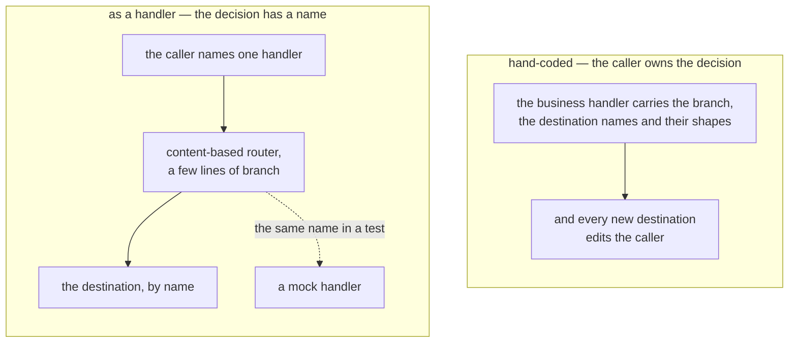

Enterprise Integration Patterns are usually a framework you adopt: you import a DSL, declare routes
in its vocabulary, and your business code learns to speak that vocabulary. It works, but the routing
decision now lives in a language the rest of the codebase does not use, and replacing one
destination with a test double means understanding the framework's lifecycle.

In Blong a pattern is not a framework — it is a handler. One file, a few lines, calling other
handlers by name through the proxy. The pattern shows up as the shape of the function, not as a
dependency.

<!-- truncate -->

## The shape is the pattern

A handler receives a message, which is its parameters plus `$meta`, and returns a result. Every
Enterprise Integration Pattern is a statement about what a function does with a message — transform
it, route it, split it, gather it — so each one becomes a short file.

**Content-Based Router** reads a field and picks the destination:

```typescript
// eip/orchestrator/eip/eipMessageRoute.ts — the whole file
import {type IMeta, handler} from '@feasibleone/blong';

/** @description Content Based Router: routes to handler A or B based on the destination field */
type Handler = (params: {destination: string; [key: string]: unknown}) => Promise<unknown>;

export default handler(
    ({handler: {mockPipeA, mockPipeB}}) =>
        async function eipMessageRoute(
            {destination, ...rest}: Parameters<Handler>[0],
            $meta: IMeta,
        ): ReturnType<Handler> {
            if (destination === 'A') return mockPipeA(rest, $meta);
            return mockPipeB(rest, $meta);
        },
);
```

That is the complete implementation. The router does not know what `mockPipeA` is, where it lives or
which realm owns it.

**Splitter** turns one message carrying a list into many messages, and chooses parallel or
sequential execution:

```typescript
export default handler(
    ({handler: {mockItemProcess}}) =>
        async function eipMessageSplit(
            {items, sequential}: Parameters<Handler>[0],
            $meta: IMeta,
        ): ReturnType<Handler> {
            if (sequential) {
                const results: unknown[] = [];
                for (const item of items) results.push(await mockItemProcess(item, $meta));
                return results;
            }
            return Promise.all(items.map(item => mockItemProcess(item, $meta)));
        },
);
```

**Aggregator** keeps state in the handler's closure until the batch is complete — which is the
honest place for it, because the batch is a property of this handler's lifetime and not of the
message:

```typescript
const BATCH_SIZE = 3;

export default handler(({handler: {mockDataSave}}) => {
    const list: unknown[] = [];
    return async function eipMessageAggregate(message: unknown, $meta: IMeta): Promise<unknown> {
        list.push(message);
        if (list.length >= BATCH_SIZE) {
            const batch = list.splice(0, list.length);
            return mockDataSave({items: batch}, $meta);
        }
        return undefined;
    };
});
```

**Claim Check** replaces a payload with a reference in two calls, and needs no message store of its
own:

```typescript
export default handler(
    ({handler: {mockDataSave, mockDataGet}}) =>
        async function eipMessageClaim(params: unknown, $meta: IMeta): Promise<unknown> {
            const {id} = await mockDataSave(params, $meta);
            return mockDataGet({id}, $meta);
        },
);
```

## What the proxy buys

Each of those handlers destructures its downstream work from the `handler` proxy instead of
importing it. Two consequences follow, and they are the reason the patterns stay small.

The first is composability: a router, a splitter and an aggregator are themselves handlers, so a
pattern can call a pattern — pipes and filters is just a handler calling two others in sequence —
and the framework resolves each name through the registry, with hot reload and per-call metadata
intact.

The second is that the destination is replaceable without touching the pattern:



Because the pattern asks for a name and not an implementation, a test can bind that name to a mock
handler that records what it received — the pattern code is unchanged, and no real destination is
involved. That is how the reference realm tests all sixteen patterns.

## A runnable reference

`demo/blong-eip/` implements sixteen patterns as one file each — request–reply, pipes and filters,
content-based and dynamic router, message filter, recipient list, splitter, aggregator, resequencer,
composed message processor, scatter–gather, envelope wrapper, content enricher, content filter,
claim check and normalizer — alongside a `test/` layer with the mock handlers and the dispatch
orchestrators that bind them. It is small enough to read in one sitting and it runs as a suite,
which is the point: the catalogue is not a document about how the patterns _could_ look in Blong.

The catalogue with every pattern's source is in the [EIP pattern page](/docs/patterns/eip); the mock
side is in [server-side testing with mocks](/docs/patterns/mock-test), and the handler shape itself
in the [handler pattern](/docs/patterns/handler).
