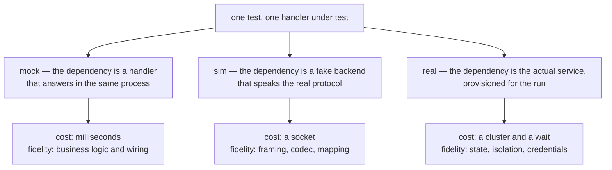

Every test suite decides how much of reality it is willing to pay for, and most suites make that
decision by accident: the first test reaches for a real database because it was there, the next one
stubs a client because the real one was slow, and two years later nobody can say what the suite
actually proves. The tests pass; the question "would this catch it?" has no answer.

Blong has three levels of backend fidelity, and the difference between them is what each one can
prove. What matters is that the level is chosen by the environment — the same test, unchanged, runs
at all three.

<!-- truncate -->

## The three levels

| Level | Lives in                      | Answers                                        | Never runs  |
| ----- | ----------------------------- | ---------------------------------------------- | ----------- |
| Mock  | `test/mock/` + `mockDispatch` | is the logic correct, and are the names wired? | the adapter |
| Sim   | the `sim/` layer              | does the protocol round-trip?                  | the backend |
| Real  | the integration suites, in CI | does the backend behave?                       | —           |

They cost roughly nothing, a socket and a cluster, in that order — and that is the order in which a
suite should move through them.



## Mock: the dependency becomes a handler

A mock is not a stubbing library. It is a handler in a `test/mock/` folder that answers the name the
business handler already asks for, registered by a `mockDispatch` orchestrator under the
`integration` intent:

```typescript
// eip/test/mock/mockDataSave.ts — the whole mock
export default handler(
    () =>
        async function mockDataSave(_data: unknown, _meta: IMeta) {
            return {id: 'claim-id'};
        },
);
```

The handler under test has no idea:

```typescript
export default handler(
    ({handler: {mockDataSave, mockDataGet}}) =>
        async function eipMessageClaim(params: unknown, $meta: IMeta): Promise<unknown> {
            const {id} = await mockDataSave(params, $meta);
            return mockDataGet({id}, $meta);
        },
);
```

It destructures two names from the handler proxy. Which implementation answers them is a property of
the environment: under `integration` the framework keeps the call in-process, `mockDispatch` has
registered the names, and the mock answers; in production the same names resolve to the real thing.
No test-only branch exists in the code under test.

A mock can also keep state if the test needs to see what it received — a `Map` in the handler's
closure is enough, because a mock is an ordinary handler:

```typescript
export default handler(() => {
    const store = new Map<string, unknown>();
    return async function mockDataSave(data: unknown, $meta: IMeta): Promise<{id: string}> {
        const id = String(Date.now());
        store.set(id, data);
        return {id};
    };
});
```

What this level buys is speed and precision, and the reference realm is the proof: `demo/blong-eip`
runs all sixteen integration patterns against mocks with no infrastructure at all — twenty-odd tests
in about five seconds — which is a feedback loop you can actually keep open while writing a pattern.

What it costs is honesty about the adapter. Nothing in a mock run executes the code that would talk
to the outside world, so a mock suite cannot fail because the URL was wrong, the certificate expired
or the driver changed its reply shape.

## Sim: the dependency speaks the real protocol

The middle level closes exactly that gap. A `sim` layer is a fake backend loaded only under the
`integration` intent, and the adapter under test is pointed at it by configuration — so the code
path includes the client, the codec and the transport.

Two worked examples in this repository show the two flavours. `test/blong-sim-api/` serves a real
OpenAPI specification from an in-process mock: the mock server answers on port 8082, the client
adapter runs its usual `codec.openapi` configuration against the same spec, and the test asserts on
a value that crossed serialization, HTTP and deserialization. `test/blong-sim-tcp/` puts a Payshield
HSM on a socket at port 1601, with client and sim sharing `ut-codec-payshield`, so the test
exercises framing, the header format and the reply parsing rather than a function that returns an
object.

The gap that remains is the backend's behaviour. A sim answers with fixed values, so an HSM that
rejects a key type, a broker that rebalances or a service that rate-limits still passes.

## Real: the backend is the point

The third level is the integration suites: real MySQL, MongoDB, Kafka, Redis, Keycloak, Vault, MinIO
and the cluster API itself, provisioned for the run and torn down with it. Here the test can only be
written if the backend is genuinely involved — `test/blong-int-sql/` contains a test that provokes a
real deadlock and asserts on the outcome, which no mock and no sim can produce because neither has
isolation levels to conflict over.

This level costs the most and proves the most, which is why it is the level with the fewest cases:
the suite waits for the backends to answer, and a run measured in minutes cannot afford the branch
combinations a mock run does in milliseconds.

## The rule

**Mock the logic, simulate the protocol, and use the real backend when the hard part is state.**

Three questions pick the level. Is the thing I am testing a decision — a branch, a composition, an
error path? Mock it. Is it a boundary — a codec, a framing, a request mapping? Simulate it. Is it
behaviour that only exists because two real things met — a lock, an offset, a token? Then the
backend has to be the real one.

The levels are in the [server-side testing page](/docs/patterns/mock-test), the `sim` layer in the
[layer concept](/docs/concepts/layer), and the cluster the real level runs in in the
[suite patterns](/docs/patterns/suite).
