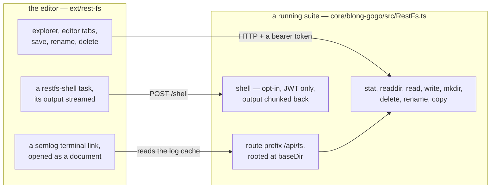

There is a specific kind of support request that every deployed system generates: something is wrong
in a running environment, the fix is one file, and the file is on a server you are not supposed to
log into. So you describe the file to a colleague who has access, they describe it back, and
eventually someone edits it over a shell with three terminal windows open and no way to see the
diff.

The last post in this arc is about removing that trip. The framework can serve a folder over HTTP,
and a VS Code extension implements a filesystem on top of it — the explorer opens the running
realm's tree, the file is edited where it lives, and a command runs on the server with its output
streamed back.

<!-- truncate -->

## Two halves, one mount point

The framework-side half is built in: a gateway plugin that serves a directory, off by default and
bounded to one root. The editor-side half is the `rest-fs` extension, which registers a
`FileSystemProvider` for the `restfs` scheme — so the remote folder is not a metaphor, it is what VS
Code's explorer, editor and tasks already know how to talk to:



Turning it on is one config block, and the routes answer as soon as the gateway is listening.
Enabled against a test folder, the first calls look like this:

```text
GET /api/fs/stat/hello.txt   → 200 {"type":"file","size":21,"mtime":…}
GET /api/fs/readdir/         → 200 [{"name":"hello.txt","type":"file"},
                                     {"name":"sub","type":"directory"}]
GET /api/fs/read/hello.txt   → 200 "hello from the realm"
POST /api/fs/shell           → 401 missing authorization header
```

## The design decisions worth naming

**One root, checked twice.** A request path is rejected unless it stays inside `baseDir`, and the
resolved path of the nearest existing ancestor is checked as well, so a symlinked parent cannot be
used to step outside the root. The directory the server exposes is the only directory it exposes.

**The shell is opt-in and authenticated separately.** Reading and writing files can be a read-write
view of a folder; running an arbitrary command on the server is a different level of trust. The
shell route does not exist unless `shell: true` is configured, and it always requires a token even
when the file routes are open.

**The editor is the client, not a second implementation.** Because the extension implements VS
Code's own filesystem interface, everything that already works on files works on the mount: diffs,
search in the open file, save-on-edit, a task with a terminal. None of that had to be built.

## What it is honestly not

Three limits are worth stating before anyone mounts a production environment with it.

The mounted tree does not follow external changes — file watching is not implemented, so a file that
something else creates on the server shows up on a refresh rather than appearing by itself. The
whole file travels in memory, bounded by a maximum file size, so it is not a tool for moving large
files or directories. And there is one root per server with no per-path permission model: the
extension authenticates with a bearer token, not with the HTTP Basic credentials its own quick-start
document still shows, so a configuration copied from there will be answered with `401`.

The feature is a targeted instrument — inspect a running environment, make a one-off fix, run that
realm's tests with the output in front of you — not a way to work in a deployed system routinely.

The routes, the configuration keys, the editor commands and what the shell requires are in
[a realm's filesystem over REST](/docs/patterns/rest-fs); the extension's own instructions are in
`ext/rest-fs/README.md`.
