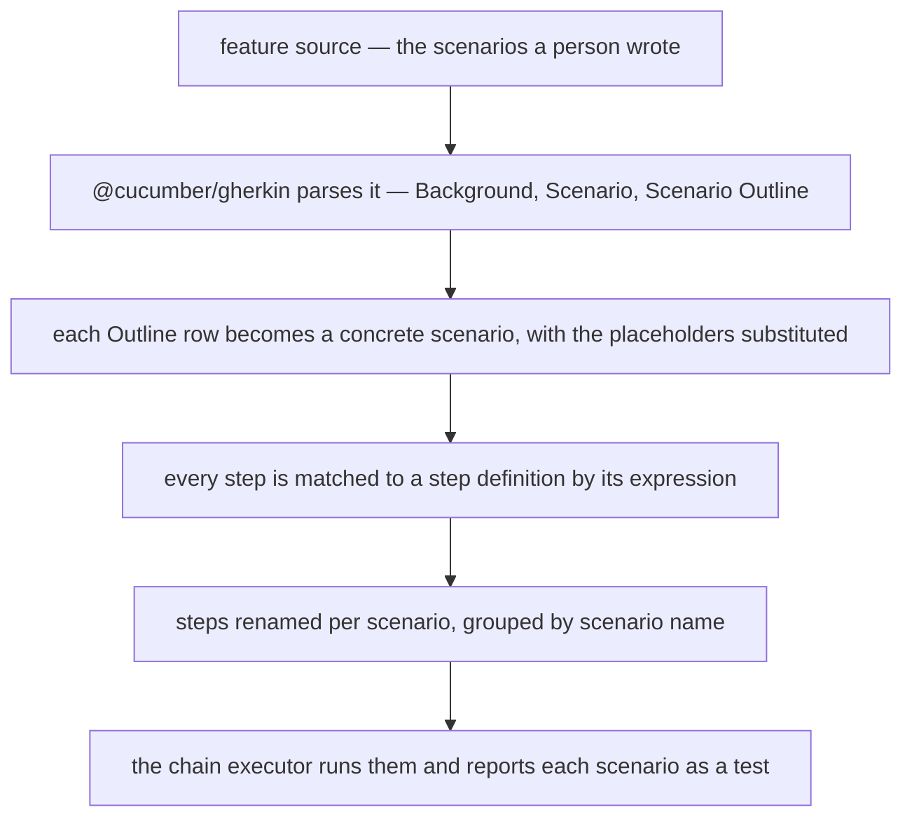

The oldest argument in testing is whether the specification or the test is the source of truth. When
they are two artifacts, the answer is neither: the specification describes what the system should
do, the test asserts what it does, and the difference between them is discovered in production. When
they are one artifact, the question disappears.

In Blong that artifact is a Gherkin scenario, parsed by the real `@cucumber/gherkin` parser and
compiled into the same chain steps every other test uses. A business rule and its automated check
are one file that a domain expert can read.

<!-- truncate -->

## From Gherkin to steps

The parser is not a hand-rolled approximation of Gherkin: `@cucumber/gherkin` reads the source, and
`featureToSteps` turns the result into the framework's own step type, `ChainStep[]` — the same shape
a hand-written test returns, so the chain executor runs both without knowing the difference:



A step definition maps an expression to a handler call, and the mapping is the whole of the glue
between the English sentence and the code:

```typescript
export default handler(({lib: {group}, handler: {cucumberCalculatorAdd}}) => ({
    testCucumberCalculator: ({name = 'cucumber calculator'}: {name?: string}) =>
        featureToSteps(
            calculatorFeature,
            {
                '{int} plus {int} equals {int}': (a: unknown, b: unknown, expected: unknown) =>
                    async function addEquals(assert: typeof Assert, {$meta}: {$meta: IMeta}) {
                        const result = await cucumberCalculatorAdd(
                            {a: a as number, b: b as number},
                            $meta,
                        );
                        assert.equal(
                            result,
                            expected as number,
                            `${a} + ${b} should equal ${expected}`,
                        );
                    },
            },
            {name, group},
        ),
}));
```

The expression `{int} plus {int} equals {int}` is compiled once into an anchored regular expression,
and the captures arrive as parameters — numbers where the token was numeric, strings where it was
quoted. The step function it returns is an ordinary chain step: it receives the assert and the
context, calls the handler through the proxy, and asserts on the result. Nothing about the test
executor changes because the source was a sentence.

## What a scenario costs, and what it buys

The scenario names in the run output are the ones the feature declares, and an Outline's rows are
expanded into their own scenarios — so a table of examples reads as five tests, not one loop:

```text
    # Subtest: cucumber calculator
        # Subtest: Add two numbers
        ok 1 - Add two numbers # time=1.257ms
        # Subtest: Subtract two numbers
        ok 2 - Subtract two numbers # time=0.354ms
        # Subtest: Parameterized calculation | 1, 2, 3
        ok 3 - Parameterized calculation | 1, 2, 3 # time=0.18ms
        # Subtest: Parameterized calculation | 10, 20, 30
        ok 4 - Parameterized calculation | 10, 20, 30 # time=0.183ms
        # Subtest: Parameterized calculation | -5, 5, 0
        ok 5 - Parameterized calculation | -5, 5, 0 # time=0.193ms
```

Two details of that output are worth knowing before you rely on it. The source is a Gherkin _string_
exported from a TypeScript module in this repository rather than a `.feature` file on disk, which is
what makes the scenario importable and type-checked beside the step definitions; and the report
names a scenario's steps individually, so a step whose definition returns a single assertion may
show as skipped in a per-step view even though the scenario passed — the scenario result is the
assertion that matters.

Three things come free from reusing the framework's step model rather than a separate runner. A
scenario's steps are renamed with a per-scenario suffix, because the chain executor rejects two
steps with the same name. Background steps are prepended to every scenario, so shared setup is
written once. And a step with no matching definition fails loudly, naming the step and listing the
patterns it knows, instead of being quietly ignored:

```text
Error: No step definition found for: "Then 5 plus 3 equals 8"
Available patterns:
```

The last one is the useful failure mode. A Gherkin suite rots when a step silently stops being
asserted; here an unmatched sentence is an error, and a renamed intention breaks the build rather
than the trust.

## One artifact per question: the access matrix

The clearest case for the format so far did not come from a business rule. It came from RBAC and the
record-level ACL, where the thing worth reading is not an assertion but a table: _who can read
whom_. `realm/blong-party` now answers it four times over — persons, service accounts, gateway
applications — and each answer is one feature file whose Data Table _is_ the test, the report and
the specification.

```gherkin
Feature: Record-level ACL matrix — party.person.get

  Background:
    Given the ACL org chart is
      | record      | kind | belongsTo | isPartOf | notes                           |
      | Axis        | org  |           |          | the granted organization        |
      | ├── Axis HQ | unit | Axis      |          | North and South are isPartOf it |
      | │   ├── Amy | person | North   |          |                                 |
      …
    And the ACL grants are
      | principal   | kind | hasScope | hasCapability              |
      | matrixNorth | role | North    | loginCapability,matrixView |
      …

  Scenario: The party.person.get access matrix
    Then the party.person.get access matrix is
      | viewer      | Amy | Ben | Cam | …  |
      | │   ├── Amy | ✅  | ✅  | ❌  | …  | implicit grant on North |
```

Three properties of that file are the whole argument.

It **reads as a picture**. The first column is the org chart; the columns are the people; a cell is
a verdict — allowed, denied, refused by RBAC. A reader who knows the domain and not the code can
check it, which is not true of a list of `assert.rejects` calls. Every column of the fixture tables
is one predicate (`belongsTo`, `isPartOf`, `hasRole`, `hasScope`, `hasCapability`), so the same
table also says _why_ the row below it comes out that way — and the assertion checks that against
the graph, so a fixture that drifts from its feature file fails instead of quietly passing.

The **steps are shared**. The four features differ only in which table they carry and which probe
their cells stand for, so the step definitions are two factories in one library and a handler maps
its own step texts to them. The rows repeat a fixture across four files on purpose — reading one
feature is reading the whole story — and the repetition costs nothing, because there is no logic in
it.

The **failure is part of the design**. A red run redraws the table with the offending cell marked
`expected≠actual` and names every mismatch — row, column, both values — underneath it. That is a
contract, so it has its own feature: `test.acl.diagnostics` drives the real helpers with a
deliberately wrong table and asserts that each mismatch is marked _in the cell it belongs to_.
Changing the marker fails that test, which is the point — a diagnostic nobody tests is a diagnostic
that quietly stops helping.

It also costs something worth being honest about. Every cell is a real call through the gateway, so
the application matrix alone takes about ninety seconds of the suite; the tables are a check on the
_fixture_, not a unit test, and a comment in `tools/blong-dev/src/commands/test.ts` explains the
180-second ceiling a tap file is given. When a new dimension is added, the answer is fewer probes
per scenario, not a larger timeout.

## Declaring the failures you asked for

An assertion that a call is _refused_ has an awkward side effect: every probe writes an error-level
log entry, because from the framework's point of view something just failed. The party suite's
matrices do that hundreds of times, and the run was drowning in its own evidence — 467 error
entries, of which 461 were the `❌` and `🚫` cells doing exactly what the feature file says they
should.

The framework already had the answer — `$meta.expect` declares the error types a caller is prepared
for, and a declared error is logged at `debug` instead of `error` — but it only worked for
in-process calls. Two things were missing for a caller entering through the public gateway: the RBAC
refusal was a plain `Error` with a status code and no `type`, so there was nothing to declare; and
the JSON-RPC body schema did not list `expect`, so the declaration was stripped by validation before
the route could read it. Both are fixed: the refusal now carries the type `gateway.notAllowed`, and
the body schema declares `expect`. The four matrix features declare the denials their cells expect,
and the suite's error stream went from 467 entries to none — leaving the log for the failures nobody
asked for.

The shape of the lesson is the same one the matrix itself teaches: a declaration only helps if the
path carries it, and "the feature exists" is not the same claim as "the feature works where you need
it". Both documents — the [expected errors concept](/docs/concepts/expected-errors) and the
[ACL pattern](/docs/patterns/acl) — now say so, with the numbers.

## Why a parser, not a DSL

It would have been less work to invent a small rule language and call it Gherkin. Using the real
parser instead means the format is the one a reader already knows, the constructs behave as
documented elsewhere, and the repository does not maintain a grammar. The two limits are honest and
documented: `Rule` is not supported, and tags are parsed but not used to filter a run.

The constructs, the expression tokens and the low-level exports are in the
[Cucumber patterns](/docs/patterns/cucumber), and the step model it compiles into is in the
[chain concept](/docs/concepts/chain).
