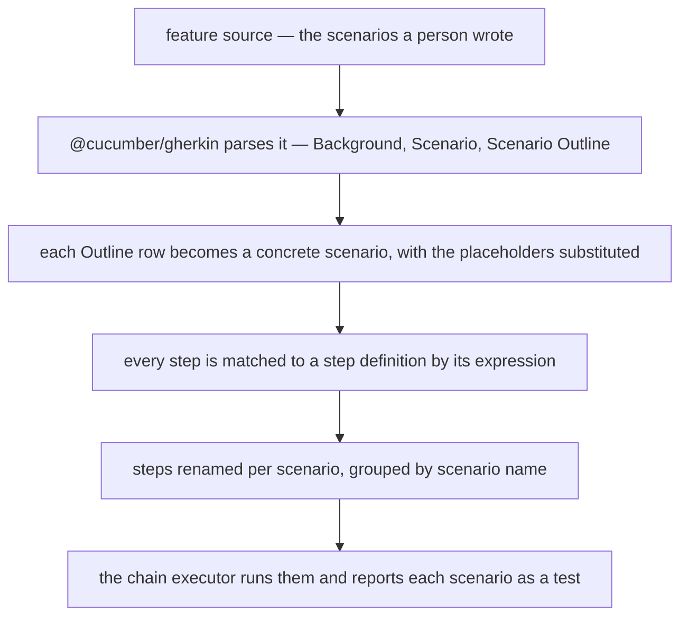

The oldest argument in testing is whether the specification or the test is the source of truth. When
they are two artifacts, the answer is neither: the specification describes what the system should
do, the test asserts what it does, and the difference between them is discovered in production. When
they are one artifact, the question disappears.

In Blong that artifact is a Gherkin scenario, parsed by the real `@cucumber/gherkin` parser and
compiled into the same chain steps every other test uses. A business rule and its automated check
are one file that a domain expert can read.

<!-- truncate -->

## From Gherkin to steps

The parser is not a hand-rolled approximation of Gherkin: `@cucumber/gherkin` reads the source, and
`featureToSteps` turns the result into the framework's own step type, `ChainStep[]` — the same shape
a hand-written test returns, so the chain executor runs both without knowing the difference:



A step definition maps an expression to a handler call, and the mapping is the whole of the glue
between the English sentence and the code:

```typescript
export default handler(({lib: {group}, handler: {cucumberCalculatorAdd}}) => ({
    testCucumberCalculator: ({name = 'cucumber calculator'}: {name?: string}) =>
        featureToSteps(
            calculatorFeature,
            {
                '{int} plus {int} equals {int}': (a: unknown, b: unknown, expected: unknown) =>
                    async function addEquals(assert: typeof Assert, {$meta}: {$meta: IMeta}) {
                        const result = await cucumberCalculatorAdd(
                            {a: a as number, b: b as number},
                            $meta,
                        );
                        assert.equal(
                            result,
                            expected as number,
                            `${a} + ${b} should equal ${expected}`,
                        );
                    },
            },
            {name, group},
        ),
}));
```

The expression `{int} plus {int} equals {int}` is compiled once into an anchored regular expression,
and the captures arrive as parameters — numbers where the token was numeric, strings where it was
quoted. The step function it returns is an ordinary chain step: it receives the assert and the
context, calls the handler through the proxy, and asserts on the result. Nothing about the test
executor changes because the source was a sentence.

## What a scenario costs, and what it buys

The scenario names in the run output are the ones the feature declares, and an Outline's rows are
expanded into their own scenarios — so a table of examples reads as five tests, not one loop:

```text
    # Subtest: cucumber calculator
        # Subtest: Add two numbers
        ok 1 - Add two numbers # time=1.257ms
        # Subtest: Subtract two numbers
        ok 2 - Subtract two numbers # time=0.354ms
        # Subtest: Parameterized calculation | 1, 2, 3
        ok 3 - Parameterized calculation | 1, 2, 3 # time=0.18ms
        # Subtest: Parameterized calculation | 10, 20, 30
        ok 4 - Parameterized calculation | 10, 20, 30 # time=0.183ms
        # Subtest: Parameterized calculation | -5, 5, 0
        ok 5 - Parameterized calculation | -5, 5, 0 # time=0.193ms
```

Two details of that output are worth knowing before you rely on it. The source is a Gherkin _string_
exported from a TypeScript module in this repository rather than a `.feature` file on disk, which is
what makes the scenario importable and type-checked beside the step definitions; and the report
names a scenario's steps individually, so a step whose definition returns a single assertion may
show as skipped in a per-step view even though the scenario passed — the scenario result is the
assertion that matters.

Three things come free from reusing the framework's step model rather than a separate runner. A
scenario's steps are renamed with a per-scenario suffix, because the chain executor rejects two
steps with the same name. Background steps are prepended to every scenario, so shared setup is
written once. And a step with no matching definition fails loudly, naming the step and listing the
patterns it knows, instead of being quietly ignored:

```text
Error: No step definition found for: "Then 5 plus 3 equals 8"
Available patterns:
```

The last one is the useful failure mode. A Gherkin suite rots when a step silently stops being
asserted; here an unmatched sentence is an error, and a renamed intention breaks the build rather
than the trust.

## Why a parser, not a DSL

It would have been less work to invent a small rule language and call it Gherkin. Using the real
parser instead means the format is the one a reader already knows, the constructs behave as
documented elsewhere, and the repository does not maintain a grammar. The two limits are honest and
documented: `Rule` is not supported, and tags are parsed but not used to filter a run.

The constructs, the expression tokens and the low-level exports are in the
[Cucumber patterns](/docs/patterns/cucumber), and the step model it compiles into is in the
[chain concept](/docs/concepts/chain).
