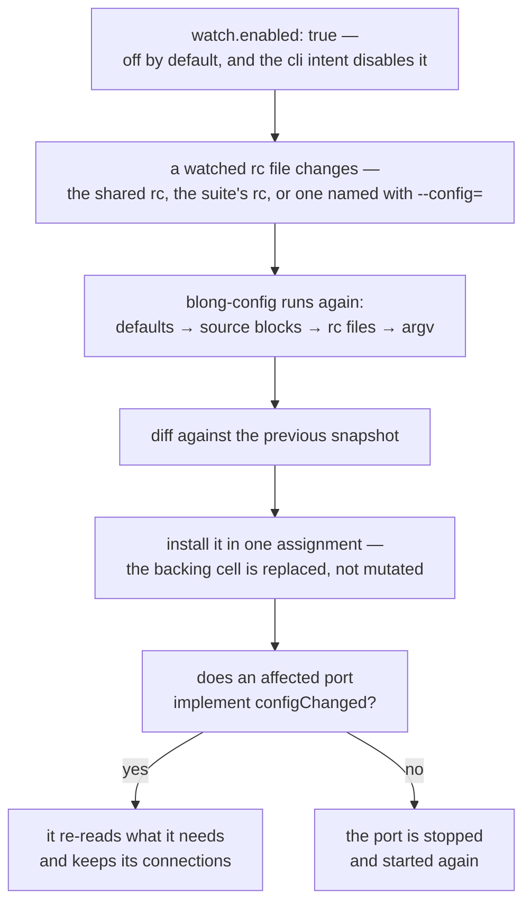

Configuration is the one part of a running system that everybody edits and nobody enjoys restarting.
A connection string, a timeout, a feature switch: the value is a line in a file, and the cost of
changing it is a process that drops every connection it was holding. So the value stays wrong until
the next deploy, and the deploy is scheduled for something else.

Blong treats the merged configuration as a live object: edit a watched file and the process re-reads
it, diffs it against what it had, and swaps it in — without restarting, and without a request ever
seeing half of the change.

<!-- truncate -->

## The merge, again, and what is watched

The effective configuration is a merge of several sources, from the framework's defaults through the
realm's own `config` blocks and the rc files to the command line, which is applied last and wins.
Reloading is that same merge run again — and because it is the same code, a reloaded value cannot
drift from what a fresh start would have produced.

Two details in that flow are the whole design. The new snapshot is built completely and then
installed by a single reference assignment, so the window in which a reader could see a partially
merged configuration does not exist. And the proxies handed to the runtime are path-based, so a
reference taken before the reload resolves against the new data — the object you are holding does
not become stale.

## Keeping the connections

The interesting half is what a component does with the diff. A port can implement `configChanged`
and decide for itself: here is what changed, here is what I will rebuild.

The database adapter is the example worth reading, because it is the one where the naive answer is
expensive. It looks for changes under its own key and returns immediately if none of them concern
it, so reloading an unrelated value does not interrupt a query in flight. When its connection
settings did change, it tears down the pool and builds a new one, once, from the new snapshot. The
HTTP and Redis adapters do the same for their own concerns.

A component that implements nothing gets the honest fallback: the port is stopped and started again.
That is a deliberate choice rather than a gap — only the component knows which of its values can be
changed under load and which require a new socket, a new pool or a new login, and a framework
guessing on its behalf would be guessing about someone else's resource.

## What does not reload

This is where a post promising "edit the config and everything follows" would be lying, so here is
the boundary.

**A handler's `config` argument is a snapshot.** It is taken when the layer is assembled, so a
handler reading `config.timeout` inside its function sees the value from load time however it
destructures it. The reload reaches the runtime's own configuration proxy and the components that
implement the hook; making the handler-facing configuration live is unimplemented.

**The intent list is frozen at start.** A reload re-runs the file layers, not the activation
decision, so it cannot turn an intent block on or off — a different topology is a different process.

**The command line wins, and stays winning.** `--key=value` is re-applied on every merge, so a value
it set cannot be overridden by editing a file.

**A key that no port owns changes nothing.** A log-level reload produces a diff and no action at
all, because no port is named `log` — the framework logs what changed and stops there.

## Why it is off by default

The watcher is not enabled by any intent, not even `dev`, and the `cli` intent turns it off
explicitly. A capability that reaches into live connections should be a decision a deployment makes,
and the switch is one key in an rc file. Two more consequences are worth naming: production never
reloads by accident, and a command-line tool built on a realm never watches a file at all.

The levels and the merge chain are in the [configuration concept](/docs/concepts/configuration), the
reload's details and its limits in the
[config hot reload rationale](/docs/rationale/config-hot-reload), and the watching itself in the
[watch concept](/docs/concepts/watch).
