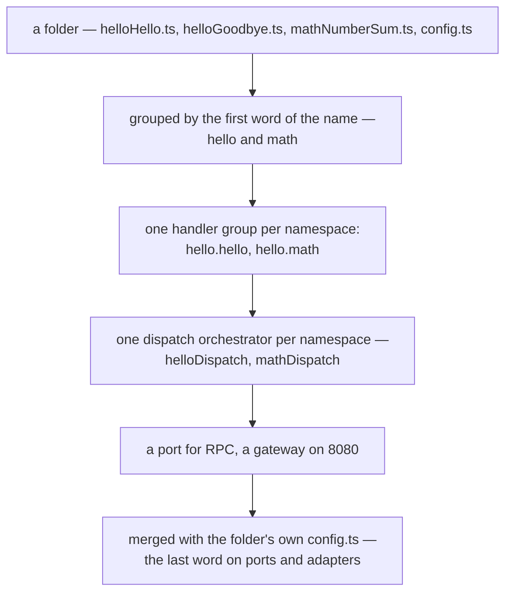

Most frameworks ask for a project before they will do anything: a manifest, an entry point, a
directory layout the tool recognises. The generator that produces it is the first thing you learn
and the first thing that goes stale, and it decides for you what a "project" is.

Blong's answer inverts that. A folder with a couple of handler files in it _is_ a server — and if a
suite names a realm whose folder does not exist, the folder is created from the template on the
spot.

<!-- truncate -->

## The command is a place, not an argument

The first surprise is the invocation. It is not `blong ./my-handlers`:

```bash
cd my-handlers
blong cli
```

A positional argument to `blong` is treated as a suite _file_, so a directory there is refused; what
the framework looks at is where you are standing. That is a real limitation, and it is also why the
mode is hard to misuse: the thing being run is the folder the process started in, and nothing about
the path can be half-resolved.

What the folder is, is decided by what is in it:

| Contents                                        | Kind       | What happens                            |
| ----------------------------------------------- | ---------- | --------------------------------------- |
| `server.ts` / `browser.ts` / `index.ts`         | `suite`    | run as an entry point                   |
| `realm.ts`                                      | `realm`    | run as a realm component                |
| handler files, no well-known layer folder       | `handlers` | synthesise a server from the files      |
| handler files **and** a well-known layer folder | `mixed`    | the synthesis, with the real layer kept |
| none of the above                               | `unknown`  | fail, naming the folder it looked in    |

A file is a handler when its name has the triple's shape — a lowercase first word and an internal
capital — so `mathNumberSum.ts` is one and `notes.md` is not. The synthesis is not a special mode
with its own rules; it writes the same declarations a suite would contain, from the files it found:



That last step is what makes folder mode more than a demo. A `config.ts` beside the handlers can
point the synthesis at a database, change the ports, or add configuration none of the generated
pieces knew about — so a scratch folder can be useful rather than merely runnable:

```text
$ cd /tmp/blong-folder && blong cli
info  blong-folder.helloDispatch dispatch event adapter.start
      config: {"type":"dispatch","namespace":["hello"],"imports":["blong-folder.hello"],...}
info  blong-folder.helloDispatch dispatch event adapter.ready
info  blong-folder.helloDispatch dispatch event adapter.stop
```

## A folder that does not exist yet

The second half of the idea is the reverse: rather than you scaffolding a realm for the framework,
the framework scaffolds the realm you asked for when it turns out to be missing. Ask a suite to load
`./payment` and, if all four of these hold, the folder appears:

1. the import failed with "module not found" — so the realm is missing, not broken;
2. `kopi.realm` is enabled in the merged configuration;
3. the missing name is not a well-known layer;
4. there is no `package.json` at the target folder.

Each condition exists to make one mistake impossible. A broken realm throws its own error and is
never scaffolded over. A layer name is refused because a whole realm written into `orchestrator/`
would be nonsense. And the `package.json` check means any folder that is already a package — a real
realm, a half-written one, anything else — is untouchable, so the trigger cannot overwrite
somebody's work. The generated files carry an `import unchanged` marker and are only rewritten while
it is present, which extends the same promise to the files after they are created.

The explicit form is there when you want it to happen on purpose:

```bash
blong realm payment              # creates the folder, then runs it
blong realm order --object order # name the entity the scaffold models
kukum realm add --subject=shop   # the same template through the primitive API
```

## What it generates, and what it refuses to reimplement

The template writes a complete realm — server and browser entries, the `error` layer, `meta/` with a
schema, a seed and a model spec, `orchestrator/subject/init.ts`, a test layer, a Playwright spec and
the toolchain files. What matters is what it does _not_ write: there is no realm-local database
adapter and no dispatch orchestrator of its own. The scaffolded realm contributes its namespace, its
schema and its model spec, and reuses `blong-server`'s subject orchestrator and `db` adapter —
exactly the rule a hand-written realm follows.

That is the same principle as the rest of this arc, applied to the one artefact frameworks usually
make special. A realm is not a project the tool invented; it is a folder with a shape, and the shape
can be discovered just as well as it can be generated.

The classification rules, the four scaffold conditions, the folder `config.ts` and the explicit
commands are in [folder mode and scaffolding](/docs/patterns/kopi); the realm layout it produces is
in the [realm patterns](/docs/patterns/realm), and the API form in the
[Kukum patterns](/docs/patterns/kukum).
