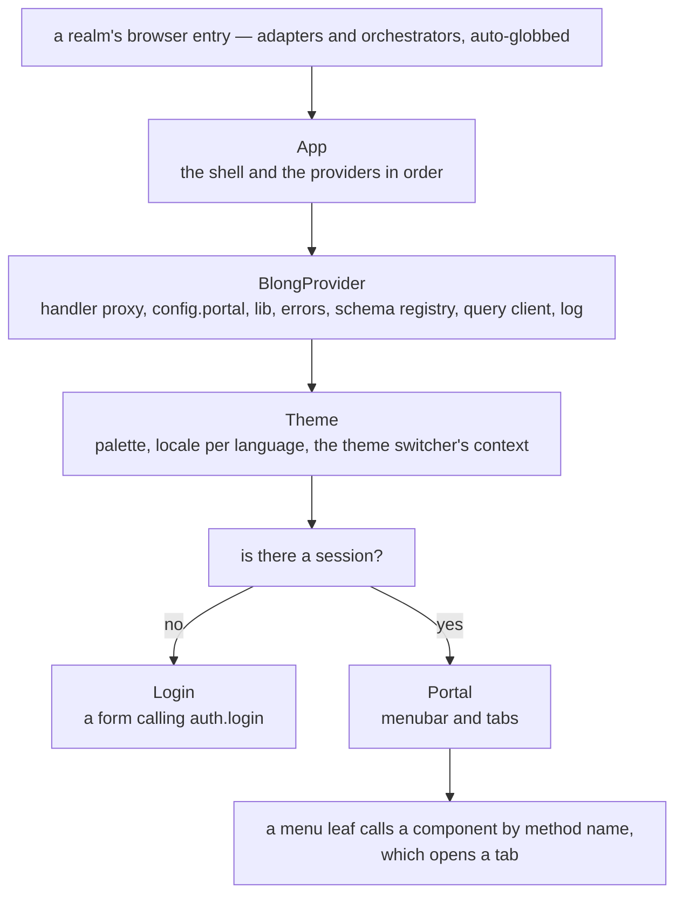
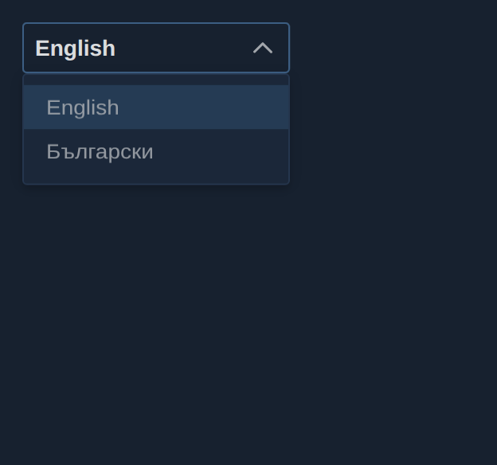
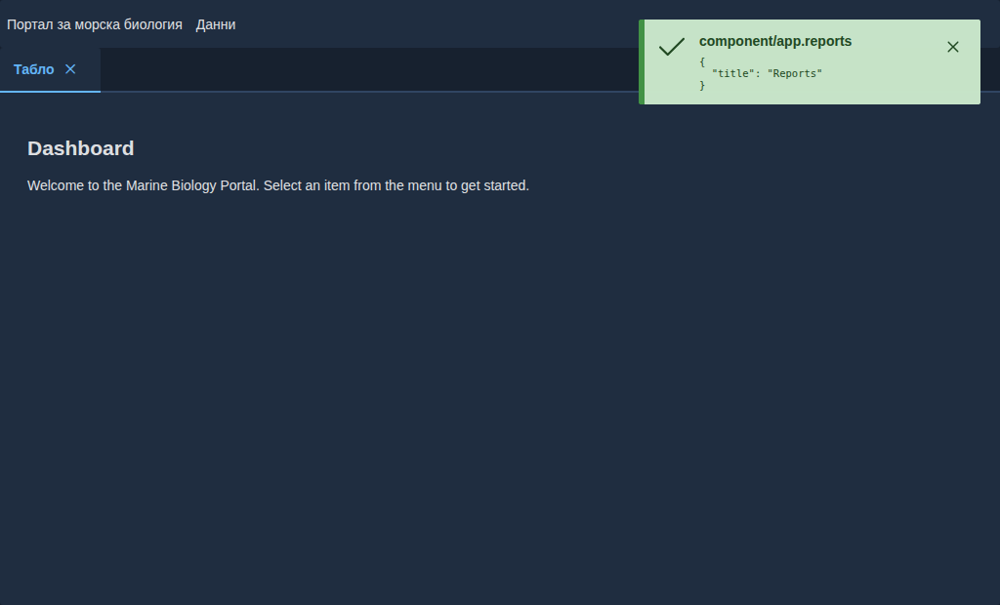

A UI framework has a decision to make long before it renders anything: how much of the application
does it own? Own too little and every realm re-invents a menubar, a login page and a place to put
state; own too much and a realm that wants a different shell has to fight the framework to get one.

Blong's browser realm answers with a stack of four levels, each of which can be replaced, and with
one small convention that keeps translation from being a second vocabulary everybody has to learn.

<!-- truncate -->

## Four levels, each with one job

`App` renders the providers and the shell; `BlongProvider` holds the framework's shared state;
`Theme` owns the visual identity and PrimeReact's locales; `Portal` turns configuration into
navigation. Login sits between the shell and the portal as a gate rather than a level:



The split matters when something has to change. A realm that wants a different login page passes
one; a deployment that wants another palette sets the theme's name; a suite that wants extra menu
entries contributes them without editing the shell. Nothing in the stack needs to be forked to be
changed.

## The portal is a menu, and the menu is configuration

A portal is not a router file. Its menu is built from the `portalConfigGet` handlers that realms
declaratively contribute, merged in the order the suite declares them: menus concatenate, groups
with the same title merge, leaves dedupe by method, and the scalars — name, theme, home, languages,
translations — take the first value set.

For a realm that follows the model convention there is nothing to write at all. Declaring a model
spec with a subject, an object and a title produces a menu group, and the browse, new, open and
report pages that hang off it are registered as components the menu can call by name. A hand-written
realm writes the menu itself, which is a few lines of literals. Either way the leaf is a method
name: the portal asks the handler proxy for that component, and opening the tab is the framework's
job.

## A second language, without a second vocabulary

The translation convention is the part worth copying. `<Text>` treats its string child as both the
key and the fallback, so the English sentence _is_ the identifier:

```tsx
<Text>Save</Text>
<Text params={{field: 'Name', minLength: 3}}>
    {'{field} must be at least {minLength} characters'}
</Text>
```

An entry in a language dictionary maps the English sentence to its translation, and the `Button`
wrapper translates its `label` the same way. Two consequences follow. A missing translation degrades
to English rather than to a key, because the key is the English; and a translator's file is a list
of sentences a domain expert can review, not a list of identifiers someone invented.

A language is declared where the rest of the portal is:

```typescript
config: {
    default: {
        portal: {
            languages: [
                {value: 'en', label: 'English'},
                {value: 'bg', label: 'Български'},
            ],
            translations: {en: {}, bg: {Save: 'Запази'}},
        },
    },
},
```

PrimeReact's own widget strings — date pickers, tables, empty messages — are a separate table, given
to the theme under `languages` so that `setLanguage` switches the application strings and the widget
locale together. The switcher renders in the menubar and disappears when only one language is
configured, and choosing one is immediate and client-side; persisting a preference is the profile
page's job. Here it is open on a real portal, and the same portal after switching:





Two honest footnotes go with it. The switcher's own labels are data, so a language appears in the
list under the name the configuration gives it. And not every control in the component library
routes through `<Text>`: the editor's built-in toolbar buttons are raw HTML buttons with English
accessible names, which is exactly the kind of detail a coverage claim hides and a documented caveat
does not.

## Reviewing a second language

A Storybook story can be rendered in another language with one argument:

```ts
export const ToolbarBG: Story = {...Toolbar};
ToolbarBG.args = {lang: 'bg'};
```

The dispatcher decorator applies the language, the dictionary and the widget locale for that story,
so the Bulgarian variant is reviewed as a picture next to the English one instead of as a paragraph
in a pull request. The same mechanism is what the Playwright suite drives when it switches a real
portal and screenshots both states.

The mechanism, the configuration keys and the widgets that do not translate are in
[internationalisation](/docs/patterns/i18n); the stack and the realm's contributions are in the
[blong-browser pattern](/docs/patterns/blong-browser) and the
[browser UI concept](/docs/concepts/browser-ui).
