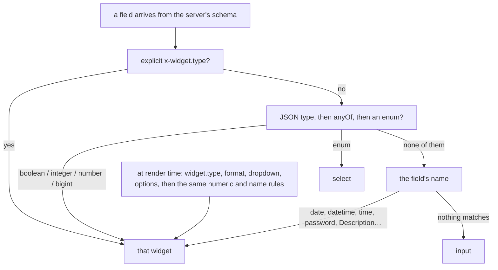
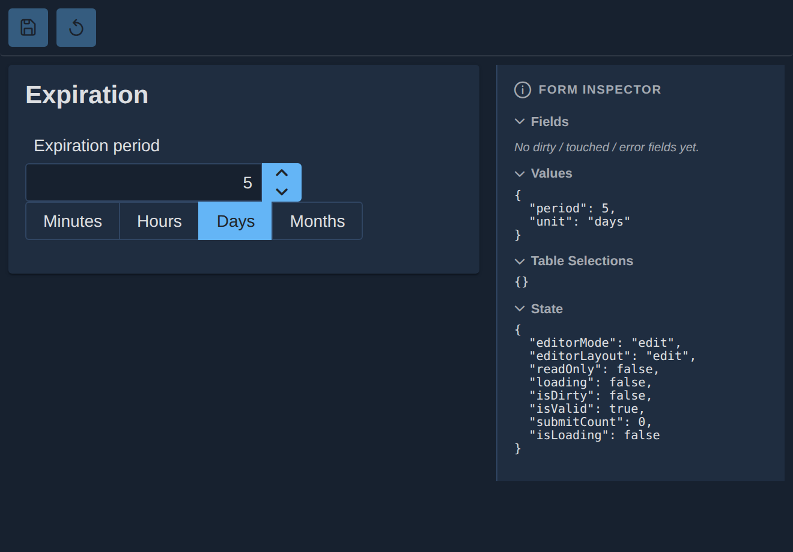
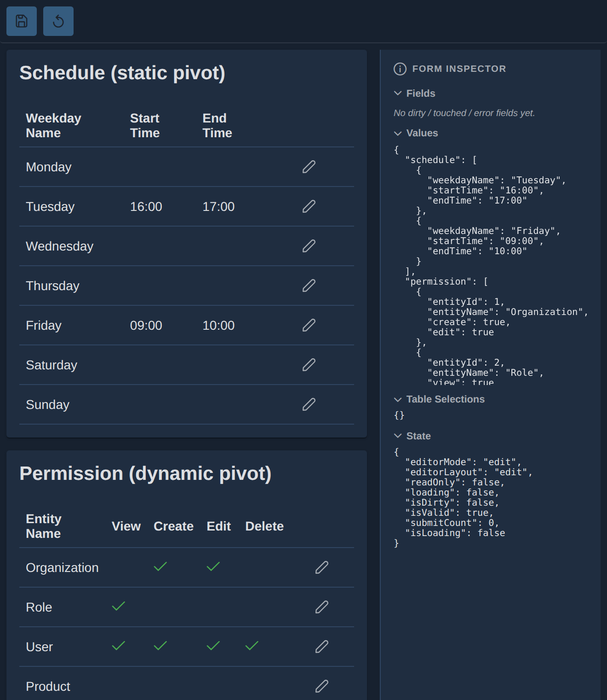

A generated form is easy to demo and hard to live with. The demo shows a text field appearing from a
schema; the thing that decides whether the generator is useful is what happens when a field needs a
different control, when one field has to influence another, when a record owns a list of children,
or when the same data has to be edited as a permission matrix. Those are the cases where a generator
either has an answer or sends you back to hand-written pages.

Blong's answers are all declared in the same place the page comes from: the widget a field gets, the
method a widget may call back, the children a record owns, and the rows a matrix starts from.

<!-- truncate -->

## One type decides the widget, in two places

The registry maps a widget type to a component — thirty-odd of them, from `input` and `currency`
through `mask`, `chips`, `multiSelectTreeTable`, `navigator` and `imageUpload` — and a suite adds
its own with one `register` call. What picks a type happens twice, and knowing both is what stops a
field from surprising you:

The first switch runs when the schema is loaded and stores its decision on the field; the second
runs when a card renders. The order is deliberate — an explicit extension beats the JSON type, which
beats a name — but the name heuristic is worth knowing about, because it is what turns a field
called `discoveryDate` into a date picker without anybody declaring it, and a field called
`description` into a textarea.

## When the field is not enough

Two escape hatches sit at opposite ends of the same idea.

A **custom widget** is a component a realm hands to the form: it declares the fields it owns in a
`properties` array — so the layout can render them as one row — and receives factories for the
input, the label and the error. Here the smallest real one, from the `Editor/CustomEditors` story,
combines a period and a unit into a single control:

A **field-change event** is how a widget talks back. A field names a method, and the form's
`methods` map provides it; the method is awaited _before_ the value is written, and receives the
field, the new value and the form's getters and setters. Returning `false` aborts the change, and a
thrown error is logged and the change dropped. That is enough for the case a generator cannot
express — a computed total, a field that must be recalculated, a value that has to be validated
against a sibling — without the widget knowing anything about the form it is in.

## Children, two ways

A record with children is the classic place where generators give up. There are two mechanisms here,
and they answer different questions.

The **inline** one is a detail card watching the selected row of a table in the same form: the
widgets inside it read and write the selected row's fields, so editing a person's details happens
next to the list of people. A polymorphic variant shows one card per kind of selected row.

The **declared** one is a model telling the generator the relationship exists:
`details: [{object: 'credential'}, {object: 'role'}]` on the user model expands into sibling
collections with their own tables, cards and tabs — and into the persistence shape at the other end.
The child rows come back **with** the master, `add` writes them, `edit` replaces them, and the
validation for that payload is generated from the same declaration. Deleting a master refreshes the
browse table and removes the children first, so a foreign key does not block the delete; deleting a
row inside an open form only edits the form until it is saved.

## The matrix

A permission matrix is not a table with rows the user creates: the rows _are_ the decision, and what
the user edits are the cells. A `table` widget declared as a pivot takes its rows from a static list
or from a dropdown, and `join` maps the seed row's key to the stored row's key so a saved cell lands
in the right place; `defaults` seeds a row the first time it is created. The access realm's user
model uses a dropdown pivot to edit role grants per target:

The limits are worth repeating because they are deliberate: a pivot has no Add, no Delete and no
multi-select checkbox — its rows come from the declaration — and a pivot whose editable cells are
all toggles is toggle-only. Writing one needs a handler that reconciles the whole array, since
CRUD-shaped persistence does not know what a matrix means.

## The explorer, and what made it fast

The generated browse page is an `Editor` in a split layout — a navigator, a table with a list
action, a detail panel, and actions on the toolbar. The `Editor/Explorer` stories write that
composition out by hand and supersede the older standalone `Explorer`'s stories for generated pages;
the standalone component is still there for a page that wants a table and filters with nothing
around them.

Three defects were worth fixing in the framework rather than in a page, because every generated page
inherited them. Typing a character re-rendered the editor and every widget (nobody needed those two
state updates; the dirty flag comes from the form library). Saving wrote the submitted value and
re-read the form, discarding server-side additions such as timestamps, where it now uses the
response. And one context carried the values, the errors, the selections and the loading flags, so
anything that changed re-rendered every consumer; it is split now, with the values reached through a
getter instead of a subscription. The first two have regression tests that assert a sibling widget
does _not_ re-render when a field is typed into — a performance fix is only real once something
fails when it regresses.

The catalogue, the two switches, the event contract and the pivot's limits are in the
[editor features concept](/docs/concepts/editor-features); the page composition is in the
[blong-browser pattern](/docs/patterns/blong-browser), and the declaration that generates the pages
in the [model patterns](/docs/patterns/blong-model).
