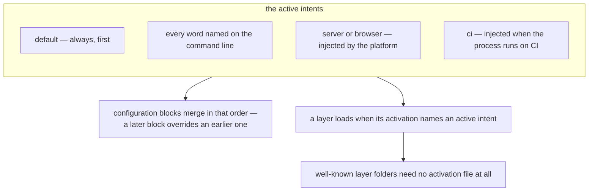

Most projects decide at build time what they are deploying. The web build gets the browser entry
point, the service build gets the server one, the test build gets the mocks, and the differences
between them live in environment files, build flags and a README about which command to run where.
The topology becomes a property of the artefact, and the artefact has to be rebuilt to change it.

In Blong the topology is a word on the command line, and the code is the same code.

```bash
blong                                   # dev + microservice + integration
blong integration blong-access.adapter  # the access realm's adapter, as a test target
blong prod                              # the same realm, as a service
blong db                                # create and seed, then exit
```

<!-- truncate -->

## What the word changes

An intent is a positional argument, and it has exactly two effects: it selects configuration blocks
to merge, and it decides which layers exist. Both follow from one list, which is why there is no
build step between the variants:



The framework injects three intents of its own. `server` or `browser` follows from the platform
being loaded, and `ci` is appended whenever the process runs on CI — which is why a captured run has
colours off and Allure reporting on without any package asking for either. A package cannot forget
to behave well in CI, because the intent it did not pass is added for it.

The set is worth reading twice: `dev` (development keys, `/api/sys/*` introspection, the verbose log
cache), `prod`, `integration` (the test layers, in-process dispatch, and the intent that exits when
CI is set), `microservice`, `db` and `cli` (both short-lived), `playwright` (the runner owns the
lifetime), and `debug`, which does nothing by itself — the introspection it is named after comes
from `dev`.

## The same code, a different system

The claim is easy to make and hard to believe, so here is the measurement. Loading one realm — the
demo realm in this repository — with different intent lists, and asking the runtime registry what it
actually wired:

| Intents                        | What exists that the other does not                                              |
| ------------------------------ | -------------------------------------------------------------------------------- |
| `integration`                  | the `codec.testDispatch` port and the `codec.test` group                         |
| `cli`                          | no test port and no test group; the registry's `exit` flag is `true`             |
| `dev` on top of those          | the `.dev`-suffixed handler group, which loads only under `dev`                  |
| `prod`                         | neither the test port nor the test group                                         |
| `integration` + `microservice` | nothing, in this realm — `microservice` is realm-declared, not framework-imposed |

Two of those rows are the interesting ones. `integration` and `cli` differ in _what the process is_:
one has a test dispatcher and runs until stopped, the other has none and exits when its work is done
— same handlers, same realm, no build. And `microservice` adding nothing by itself is the honest
correction to how this is usually described: the framework has no `microservice` configuration
block, so the intent means something only where a realm or a layer declares that block. In a realm
that does, it is the switch between running beside its neighbours and running alone.

## Lifetime is part of the meaning

An intent is not only a configuration selector; two of them say how long the process should live.
`db` and `cli` set `exit`, so the process shuts down when its work is finished — that is what makes
`blong db` usable in a script and `blong cli` usable as a command. `playwright` says the opposite:
the runner owns the lifetime, so the platform must outlive the test command. And `integration` is
the subtle one: it is long-running while you are developing and exits after the run when CI is set,
because in a captured run the test run _is_ the work.

## Precedence, and the one thing that always wins

Configuration merges in a fixed order — the framework's defaults, the realm's or suite's own blocks,
the loader's parameters, the shared rc file, the suite's rc file — and `--key=value` is applied last
inside every merge. So a command-line value beats a file, whatever the intent, and editing a file
cannot override it.

There is a second guarantee that makes `cli` trustworthy as a tool entry point: the framework's
intents re-assert their `false` values after everything else has merged, so a realm's `default`
block cannot turn the gateway back on inside a command-line run.

## What an intent does not do

It does not restart anything: the framework reloads in process, and `blong-watch` is the separate
entry point that runs it under `node --watch`, taking the same intents. It does not validate that
the combination makes sense either — exclusion groups were designed and never implemented, so `dev`
with `prod` merges both blocks in the order given and the later one silently wins. And it does not
replace configuration: the intent selects which blocks apply, and the values in them still come from
source, rc files and the command line.

The reference table is in the [intents concept](/docs/concepts/intents), the design reasoning in the
[intents rationale](/docs/rationale/intents), and the layer activations each intent turns on in the
[layer concept](/docs/concepts/layer).
