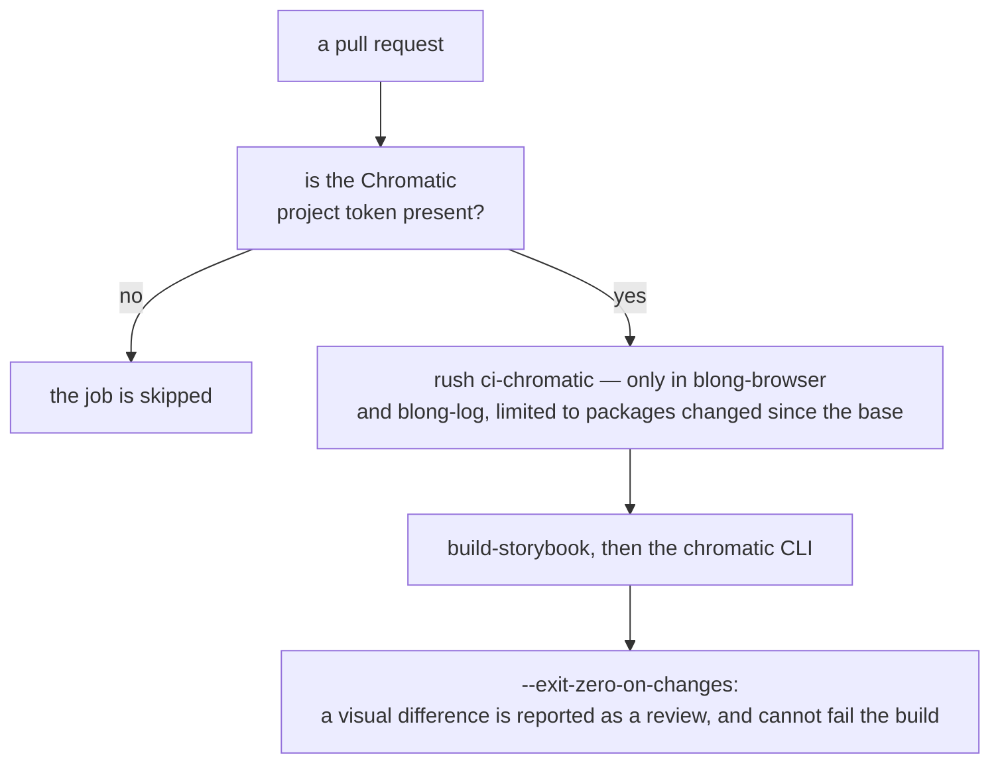

Assertions are cheap to write and expensive to keep. A test that checks four fields of a response is
four lines, and the fifth field — the one nobody thought to check — is the one that breaks in
production. Multiply that by every handler in a framework and the test suite becomes a description
of what the code used to do, maintained by hand, field by field.

Snapshot testing inverts it: capture the output once, commit it, and let a diff be the review. The
discipline is in what you capture and how narrowly, and that is what this post is about.

<!-- truncate -->

## What is snapshotted here

Four kinds, with very different grain:

| Kind                         | Where                           | Count                            |
| ---------------------------- | ------------------------------- | -------------------------------- |
| Handler and chain outputs    | `tap-snapshots/*.cjs`           | 7 files, 51 snapshots            |
| Rendered React components    | `__snapshots__/*.snap` (vitest) | 13 files in the browser package  |
| Playwright screenshots       | `*.play.ts-snapshots/*.png`     | 256 images in 38 directories     |
| Storybook, through Chromatic | the Chromatic cloud             | baselines, not files in the repo |

The first kind is the one built into the framework. A test step receives the assert object, and the
runtime injects `snapshot()` into it — the step's return value is the thing captured, and the test
code never imports the chain executor or a TAP matcher:

```typescript
export default handler(({lib: {group}, handler: {mathNumberSum}}) => ({
    testHelloNumberSum: ({name = 'number sum'}, $meta) =>
        group(name)([
            async function sumSmall(assert: IAssert, {$meta}: {$meta: IMeta}) {
                const result = await mathNumberSum({a: 3, b: 4}, $meta);
                return result; // captured, instead of asserting field by field
            },
        ]),
}));
```

Snapshots are committed next to the test, and regenerating them is explicit: `TAP_SNAPSHOT=1` on the
run. That is the whole review mechanism — the file is in the diff, so a change to the expected shape
is a change somebody looked at.

## A failure is a picture, not a boolean

What makes this bearable in practice is what the failure looks like. Perturbing one value in a
committed snapshot produces the whole object, both versions, and a unified diff:

```text
not ok 1 - addBeneficiary
  found:  { ..., "verified": true }
  wanted: { ..., "verified": false }
  diff: |
    --- expected
    +++ actual
    @@ -1,8 +1,8 @@
    -    "verified": false,
    +    "verified": true,
  at: { fileName: index.ts, lineNumber: 848, functionName: executeStepFn }
```

That is a review comment, not a mystery: the reviewer sees the shape of the record, not just the
field that changed, and the failure names the step that produced it.

## The two rules that keep it honest

A snapshot rots in two directions, and both have a mechanical answer.

**Mask what cannot repeat.** A port, a minted id, a wall clock — anything the environment produces —
turns a baseline into a coin toss. The chain takes a `mask` in the group configuration, applied to
every snapshot that group produces, and paths use `*` per segment:

```typescript
group(name, {mask: ['unitId', '*.unitId']})([...]);
```

The integration suites are the reference: the MySQL CRUD test masks the id it just minted, MongoDB
masks `_id` and `id` in both places they can appear, S3 masks the etag and the last-modified time.

**Narrow what you capture.** A whole-page screenshot, or a whole context object, is a baseline that
any layout change or unrelated field re-approves — and re-approval becomes habit, which is the
failure mode of visual testing. The rule the repository settled on is to mask _the specific cells
whose values are inherently dynamic, never the whole table_, so the picture still proves the UI
worked: the rows rendered, the structure is intact, the stable columns are visible. The cost of
ignoring this is on record here — a set of capture pages that masked nothing showed error messages
and passed as green, and one deliberate refresh rewrote 198 baselines, over half of which differed
for reasons unrelated to the change that triggered it.

## Where a picture is worth more than a diff

Playwright's screenshot assertions are the largest surface in this repository — 256 committed
baselines — and the reason is the same one this whole series keeps returning to: they survive a
redesign. A DOM assertion breaks when a class name changes and passes when the layout is broken; a
baseline does the opposite, which is what a test suite is for.

The two rules apply with one more twist: `--update-snapshots` updates only what changed and is a
no-op when the comparison passes, so a forced refresh needs `--update-snapshots=all`. That is a
deliberate re-approval of every picture in the package, not a way to make a red run green — which is
exactly the distinction a snapshot suite lives or dies by.

## Chromatic, honestly

Storybook is the third surface, and its baselines live in Chromatic rather than in this repository.
The CI behaviour is worth stating precisely, because it is easy to assume more than it does:



So Chromatic _reports_; it does not gate. The team decides what a visual change means, and the
pipeline refuses to decide for them — a reasonable position for a framework whose UI is being
actively changed, and an important one to know before believing a green run means no visual change.
A related consequence is that a Chromatic diff is not something a committed file can show, which is
why this post has a diagram where the previous ones had pictures.

The general rules — when a snapshot is the right assertion, when it is not, and how the chain's
snapshotting is configured — are in the
[snapshot testing rationale](/docs/rationale/snapshot-testing), and the mechanics of running the
suites in the [test patterns](/docs/patterns/test) and
[Playwright patterns](/docs/patterns/playwright).
