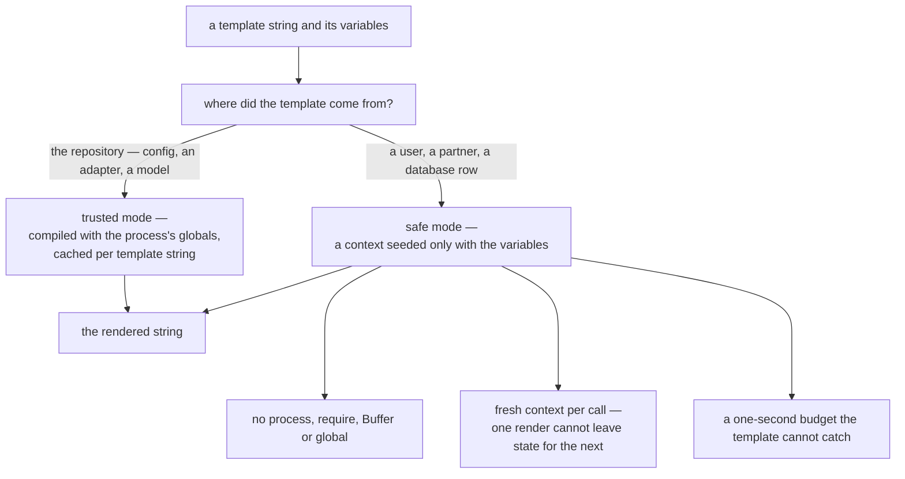

A template engine is a small feature with a large security surface. The moment the text being
rendered is not yours — a tenant's notification, a partner's message, a row somebody edited in an
admin screen — the template is untrusted code, and "render this string with these variables" is a
sentence that has ended more than one product.

The interesting part of Blong's template engine is not that it renders `${name}`. It is that the API
has two modes, and the choice between them is a statement about where the template came from.

<!-- truncate -->

## Two functions, two engines

```ts
import {render, safeRender} from '@feasibleone/blong-template';

render('Hello ${name}!', {name: 'World'}); //   trusted mode
safeRender('Hello ${name}!', {name: 'World'}); // safe mode
```

The trusted mode compiles the template with `vm.compileFunction` and caches the compiled function
per template string, so a configuration block that is rendered on every startup pays the compilation
once. It runs in the process, with the process's own globals — which is exactly right when the
template is in the repository, and exactly wrong when it is not:

```text
trusted: "${process.pid}"  → 3150758
```

The safe mode evaluates the same template in a V8 context created for it, and the difference is not
a detail of the implementation:

```text
safe: "${process}"  → ReferenceError: process is not defined
safe: "${require}"  → ReferenceError: require is not defined
safe: "${Buffer}"   → ReferenceError: Buffer is not defined
safe: "${global}"   → ReferenceError: global is not defined
```



## What the sandbox promises, and what it does not

Beyond the missing globals, two properties are worth being precise about.

**A fresh context per call.** A template cannot leave anything behind for the next render — a global
it sets is gone the next time. That closes the class of bug where one tenant's template teaches the
next one a variable.

**The variables are not copied.** A template that mutates a nested object mutates the caller's. The
data handed to a template should be treated as read-only input, not as a snapshot the engine owns.

What is reachable inside is the realm's own built-ins: `Array`, `Object`, `Math`, `JSON`, `Date`,
`RegExp`, `Map`, `Set`, `Intl` — useful for computing a value, and not a way out, because `Function`
and `eval` compile into that realm rather than the host. The usual escapes were tried and do not
work: `[].constructor.constructor('return process')()` throws, `Function('return typeof process')()`
answers `"undefined"`, and the context's global is created with a null prototype so there is no
`constructor` to walk up to.

## When a template refuses to finish

A sandbox that can loop forever is a denial of service with a friendly name, so the safe mode
carries a time bound:

```text
Error: Script execution timed out after 1000ms
```

V8 enforces it, and a template cannot catch it from the inside — a `try`/`catch` wrapped around an
infinite loop still times out, which is what makes it a bound rather than a suggestion. It covers
synchronous work, which is all a template can do: an `async` body runs synchronously until its first
`await`, so a loop before that point is caught too.

There is no memory cap, and a caller can always render again, so this is a CPU guard rather than a
complete resource policy. Saying so is part of the feature: a sandbox with a documented edge is more
trustworthy than one whose documentation implies there is none.

## The browser needed a third implementation

The browser has no `vm`, so the same API is built differently on that platform — and the difference
is instructive. The trusted mode uses `new Function`. The safe mode is an evaluator over the parsed
syntax tree with a restricted grammar, which means a browser-side safe template cannot express a
loop or a function expression at all: the template is rejected with
`Template references an undefined variable` instead of timing out, because there is no syntax for
the thing that would run away.

Two sandboxes, two guarantees: the Node one bounds what a template may compute, and the browser one
bounds what a template may say.

## Where it is used, and the honest status

Every production caller in this repository uses the trusted mode, and the list shows why that is the
right call: the merged configuration is rendered before the master key decrypts it, an adapter's
activation block is rendered through the registry, and the portal's component widget renders a page
definition with the form's values. All of those are templates that live in the repository.

The safe mode, meanwhile, has no caller outside its own tests. It exists because the boundary has to
be designed before something needs it — a template arriving from a user, a partner or a database row
— and it is tested against exactly what it claims: that the forbidden globals are gone, that the
escapes fail, and that the bound fires. A capability with no caller is a liability when it is
undocumented and a deliberate design when it is not, which is why the two-mode split is in the docs
rather than in a README footnote.

The API, the sandbox's rules and the callers are in the [template pattern](/docs/patterns/template),
and the merge step that uses the trusted mode in the
[configuration pattern](/docs/patterns/configuration).
