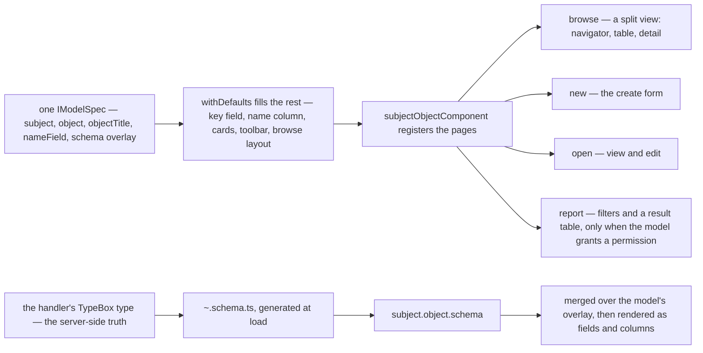
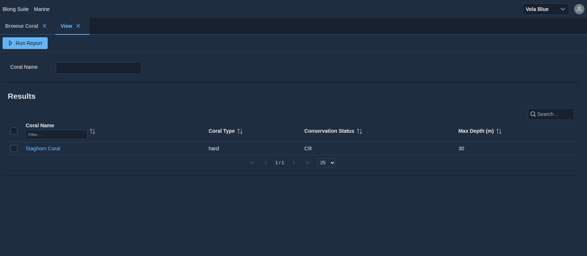

Every framework that generates CRUD screens eventually meets the same objection: the generated page
is never quite the page you need, so you write it by hand — and then the entity has two
descriptions, a server-side one that validates and a client-side one that renders, which drift apart
the first time somebody adds a field.

Blong answers by removing the second description. The type written for a handler _is_ the model: it
validates the request at the edge, creates the table that stores it, appears in the API document,
and is what a generated form reads. A page is a declaration on top of that, not a parallel universe.

<!-- truncate -->

## Four pages from one declaration

A realm declares its entities in a model spec — subject, object, the title a person sees, which
field names a row — and the browser realm's component factory registers four pages per entity, plus
the menu entries that open them:

The last two boxes are what keeps the two halves honest. The schema a form renders is fetched from
the running server, so a field added to a handler's `type Handler` arrives at the form through
`~.schema.ts` and the schema handler, merged on top of whatever the model declares. The declaration
adds presentation — which card a field belongs to, which widget renders it, what the column is
called — and does not have to repeat the field.

## What the declaration can say

The interesting part of a model specification is what it can _add_ to the generated page without
leaving the model. Cards and their widgets; a toolbar of actions, each naming a method and the
parameters it takes; a dropdown whose options come from another entity's declared key and name
fields; a report definition with its own columns; and master-detail as a `details` declaration,
which expands into a sibling collection with its own table widget, its own card and a tabbed edit
layout.

Where those are not enough, the escape hatch is a component handler: a page written by hand that
uses the same `Editor`, `Explorer` or `Report` components with its own props. The generator covers
the common part of CRUD, and the hand-written page is the deliberate answer for the rest rather than
a failure of the generator.

## The limits, stated by the code

Three limits are worth knowing before adopting this, and each is visible in the implementation.

**A field needs both a schema entry and a mention.** The form renders the fields a card names; a
field that exists in the server schema but appears in no card and no column does not render. The
defaults compensate for the common case — the name field, the key field and a default card when a
model declares no cards at all — but the rule is a whitelist, not "render everything the server
knows".

**A generated report cannot narrow itself.** Its filter fields are not editable in the generated
layout, so a report with a parameter to choose needs a hand-written page. This is a known limitation
rather than a design position.

**Master-detail is a layout, not an ORM.** The declaration produces the sibling collection, the card
and the tabs; the validation that accepts a master and its lines in one call comes from the same
schema generation, not from a relationship the UI discovered.

## Verified, not asserted

The four page kinds were rendered from one marine model — `browse`, `new`, `open` and `report` — in
the suite's Storybook against fixture data, with no page errors: the browse page builds its
navigator, table and detail panels, the create form renders the coral fields with the dropdowns
resolved, and the report page builds its filters and its result columns. The two screenshots above
are the repository's own captures of those pages from the running suite, cropped to a column-width
window so the text arrives at its own size; the full-page versions are on the
[model pages](/docs/patterns/blong-model).

The argument for the whole approach is in the
[metadata-driven UI rationale](/docs/rationale/metadata-driven-ui) — including the trade-off that
generated pages are generic by construction — and the specification itself in the
[model patterns](/docs/patterns/blong-model) and the [model concept](/docs/concepts/blong-model).
