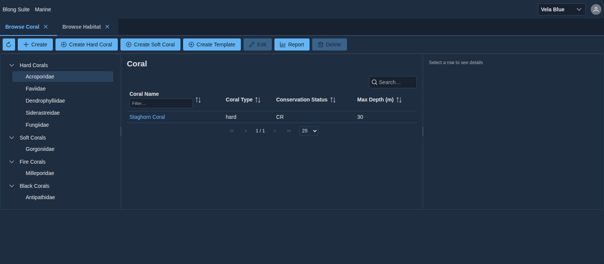

Read a hundred browser tests from a system that has been running for a few years and most of them
are not about the product. They are about the plumbing: a helper that signs in, a helper that
navigates to the right page, a helper that waits for the table to fill, and — the one that hurts — a
copy of the field names, so that the day a form is redesigned, forty tests fail for a reason
unrelated to the feature each one was protecting.

Blong's Playwright layer takes that plumbing away and puts a floor under it, so a test file is close
to a statement of intent. The fixtures log in; the CRUD helpers find the page, its widgets and its
fields from the model the server already declares; and the primary assertion is a picture rather
than a selector.

<!-- truncate -->

## A fixture, not a helper

```typescript
import {test, expect} from '@feasibleone/blong-browser/playwright';
import {browseModel} from '@feasibleone/blong-browser/playwright/model';

test.use({blongPermissions: true});

test.describe('Marine habitat', () => {
    browseModel(test, expect, {subject: 'marine', object: 'habitat'});
});
```

The `portal` fixture is the whole setup: it opens the app, logs in for you and hands the test a
`Portal` object — `menuClick`, `fill`, `save`, `tableRowClickByText`, `waitForTableData`,
`waitForFormLoad`. Credentials come from the fixture options (`blongUsername`, `blongPassword`,
which a suite sets once in its config and a test overrides with `test.use`) rather than from each
file, and the login itself is the real thing: the fixture fills `input[name="username"]` and
`input[name="password"]`, clicks `login-submit` and waits for the portal to mount under
`html[data-portal-config="merged"]`. The submit button calls the application's own `authLogin`
handler, so the test walks the same path a person does — there is no test-only way into the app.

## Permissions start at none

The interesting option is `blongPermissions`, and its default is `false`. A test that wants to
create a record says so:

```typescript
test.use({blongPermissions: true});
```

That inverts the usual accident. Rather than every test silently inheriting a fully-privileged
session and discovering, some Friday, that a permission check was never exercised, each test states
the capability its scenario needs, and a capability nobody states stays off. Thirty-seven spec files
opt in; the ones that test the gate itself do not. The switch is honest about what it is, too: it
flips a value in the browser's own store (`setPermissions(true)`), it is not a server grant, so the
server-side check is unaffected — a test that widens the UI still cannot do what the token forbids.



## The helpers do not know your entity

`browseModel` and `createAndEditModel` take a subject, an object and a field map:

```typescript
createAndEditModel(test, expect, {
    subject: 'marine',
    object: 'coral',
    fields: {'coral.coralName': 'Test Coral', 'coral.familyId': 'Acroporidae'},
    editFields: {'coral.coralName': 'Edited Coral'},
});
```

They are generic because they read nothing and assume nothing. The route is the model's own
convention — `menuClick('marine.coral.browse')`. The create button is the id the framework mints for
the page's action, `action-component-marine-coral-new`. Each field's widget type is detected from
its `blong-*` class: a dropdown, a checkbox, a date, a textarea, a number. The field map is keyed by
the `name` attribute, which uses dots (`coral.coralName`) while ids use hyphens (`coral-coralName`),
and `fillFields` does the conversion, so a test author never has to remember which convention
applies where.

What makes this possible is that the page does not exist until the model declares it. A model
specification registers its components as `${subject}.${object}.browse` and pushes the matching
entry into the portal menu, and the app asks the server for that menu at startup. So the helper
clicks a route that came from the declaration, fills widgets that came from the declaration, and the
test itself never names a selector that a redesign could invalidate.

## The assertion is a picture

```typescript
await expect(portal.page).toHaveScreenshot('marine-coral-browse.png');
```

Screenshots are the primary assertion, not a debugging aid. The reasoning is the one that made this
layer worth writing: a test that asserts a locator's text passes while the layout is broken, and it
fails the day a label is reworded — which is the wrong way round for a suite whose claim is that the
product still works. A picture fails when the page a person sees changes, and it says _what_ changed
without anyone reconstructing it from a stack trace. The tolerance is one percent of pixels
(`maxDiffPixelRatio: 0.01`), and baselines are committed beside the spec as
`<spec>.play.ts-snapshots/<name>-<project>-<platform>.png`, so a redesign arrives as a reviewable
image diff rather than as a wall of red.

The cost is real and worth naming: a picture is only as good as the state it was taken in. That is
why the helpers pin the rows they photograph — a search term narrows the table, ids are minted
deterministically, clocks are masked — and why a screenshot test that depends on yesterday's data is
a test that fails on Tuesdays.

## It runs against the real server

`defineBlongConfig()` starts both halves: the backend under `blong-watch` (the same watch server
used for development, with the `microservice integration dev playwright` intents) and the suite's
Vite dev server, with `baseURL` pointing at the frontend's `/s/` base path. The browser loads the
unbundled development application — the code you are editing, hot-reloaded — rather than a build
artifact that could be an hour older than your change.

The ports are worth knowing because they are the thing that surprises people. Locally the pair is
8080 and 5173, and an already-running server is reused, which is why a test run is instant when your
dev loop is already up. In CI the pair is derived from the package's position in `rush.json` — the
backend on `9000 + index`, the frontend a hundred above it — so a monorepo can run many suites in
parallel without inventing ports, and `PLAYWRIGHT_BACKEND_PORT` / `PLAYWRIGHT_FRONTEND_PORT`
override either.

The practical effect is a suite you can run the way you run the app: start the dev loop, run
`node --run playwright`, and watch a browser log in, browse, create, edit and delete while the
pictures it takes are compared against the ones in the repository.

See [the concept page](/docs/concepts/playwright) for the fixtures and the identifier conventions
and [the pattern guide](/docs/patterns/playwright) for the helper catalogue, the coverage story and
how a suite is wired.
