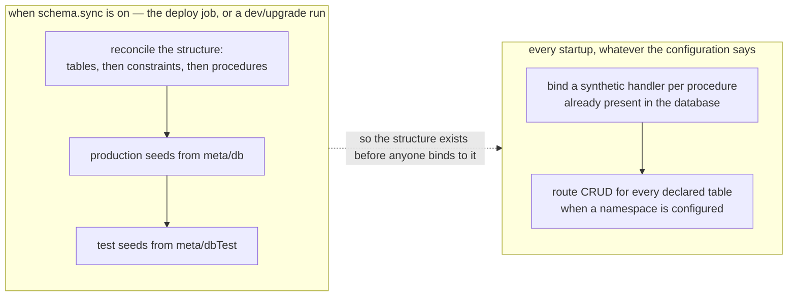
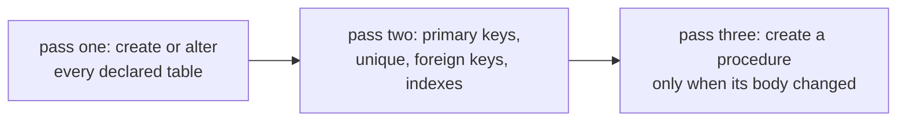

Every migration directory carries the same three problems, and nobody who has maintained one for a
few years still argues about them. The files are ordered, so the order matters and a merge can put
two of them side by side. The history is append-only, so the schema you have is the sum of
everything ever written rather than a description of what is wanted. And the DDL that stores a
record is written twice — once in a migration, once in the validation that accepts the request — so
the two drift the first time somebody adds a field on one side only.

Blong deletes the second description and the ordering problem with it. The TypeBox object a handler
already uses to validate its input is the table. There is no migration directory, no version table
and no numbered prefix to invent.

<!-- truncate -->

## The declaration is the table

A realm declares its types once, in `meta/type/schema.ts`:

```typescript
export default schema(async ({lib: {type}}) => ({
    person: type.Object(
        {
            personId: type.uuid(),
            firstName: type.stringNotNull(),
            lastName: type.stringNotNull(),
            birthDate: type.dateNull(),
            notes: type.stringNull(),
        },
        {
            constraints: {
                primaryKey: 'personId',
                foreign: {personId: 'core.resource.resourceId'},
            },
        },
    ),
}));
```

The table is declared separately, in `meta/db/db.ts`, and it does not repeat the fields. An entry
can be a plain number, which is the creation order:

```typescript
tables: {
    'party.person': {order: 300, resource: {nameColumn: 'lastName'}, edges: [/* … */]},
    'party.contact': 303,
    'party.address': 304,
},
```

Two names are doing work here, and both are worth knowing. The dotted key is split into subject and
object, and the definition is looked up as `objectSchema[subject][object]` — which is why the spec
only carries what it _overrides_: the order, the dropdown binding, the graph edges, the record-level
guard. The key is also the SQL name with the dot replaced, so `party.person` is the table
`party_person`. And `order` is not decoration: the sync sorts by it so that a table exists before
the table that points at it.

## Three concerns, two of them at deploy time



Both lanes are the same `ready()` hook on the `adapter.db` group. What separates them is the merged
configuration: `default`, `prod`, `microservice` and `ci` declare no `schema` block, while `dev` and
`upgrade` do. So a production pod reconciles nothing and binds its handlers, while a development run
reconciles its own database on every save — self-healing, which is the behaviour you want when the
schema is something you are still editing. The documentation now states this as configuration rather
than as a code path, because that is what it is; the earlier version of that page claimed normal
application instances never run DDL, which holds only for the intents that never ask for it.

Constraints go in a second pass, once every table exists, because a foreign key needs its target:



## Procedures are handlers without files

A stored procedure is a `.sql` file whose body is compared against `information_schema.ROUTINES`
before anything is written, so a run that changes nothing writes nothing. After `ready()`, every
procedure whose name does not start with `_` is callable as a synthetic handler on the adapter — a
`sql_item_list_active` procedure is reached as `sqlItemListActive`, in the place a TypeScript
handler would be:

```typescript
const activeItems = await handler.sqlItemListActive({}, $meta);
```

That one line carries three properties. A test can mock it by name, because the mock layer registers
a handler under the same name. Its implementation can move from SQL to TypeScript without a caller
changing, which is how a hot procedure gets rewritten behind a stable API. And the method name in
the logs, the API document and the assertion is `sql.item.listActive` either way — the wire does not
advertise which side of the boundary the code sits on.

Overriding one is a handler file named after the method, delegating back through `super`:

```typescript
export default handler(() => ({
    async sqlItemListActive(params, $meta) {
        const rows = await super.sqlItemListActive(params, $meta);
        return rows.filter(row => row.isActive);
    },
}));
```

## CRUD is routed, not generated

Declare a `namespace` and every declared table answers nine methods with no handler files: `get`,
`find`, `add`, `edit`, `remove`, `merge`, and the bulk `insert`, `update`, `delete`. These are not
handler objects attached per table — the call falls through to the adapter's generic `exec`, which
derives the table name from the method. That distinction is practical rather than pedantic: since
there is no handler object underneath, an override delegates with `super.exec(params, $meta)` rather
than through a synthetic name. It is what `accessUserEdit` does when it persists the graph edges a
user row implies on top of the ordinary update.

## Where the type map is deliberately narrow

The mapping from TypeBox to SQL is short, and its shortness is a decision rather than an unfinished
edge. A column becomes a primary key by **marker**: `type.increment()` carries
`default: 'auto-increment'`, `type.ulid()` becomes a `BINARY(16)` key, `type.uuid()` a binary UUID
key. A plain `Type.Integer()` named `itemId` is an ordinary `INT` — the name proves nothing.
`Type.String({format: 'date-time'})` is a `DATETIME`, and `Type.Unknown()` becomes a `TEXT` column
because there is no type to map. A composite key, or a key on a column that carries no marker, comes
from the `constraints` declaration instead.

Anything outside that map is a column the framework refuses to guess at, and the alternative — a
converter clever enough to handle every shape — is how a schema tool acquires opinions you cannot
see. Idempotence is the same kind of bargain: the sync asks `hasTable` and `columnInfo` before it
writes, so repeated runs are free, and dropping a column that disappeared from the declaration is
opt-in through `dropColumns`, because the default that silently deletes production data is not a
default anyone wants.

The gap that remains is worth stating rather than hiding. There are no down-migrations, because
there is no file to reverse: rolling back a column means editing the declaration, which is the same
operation as changing it. For a destructive change that is exactly the moment you want a person
deciding, rather than a script replaying a numbered file nobody has read since it was written.

See [the concept page](/docs/concepts/schema-sync) for the mechanism, the
[pattern guide](/docs/patterns/schema-sync) for the configuration and the type map, and
[the rationale](/docs/rationale/schema-sync) for why this approach beat the migration alternatives.
