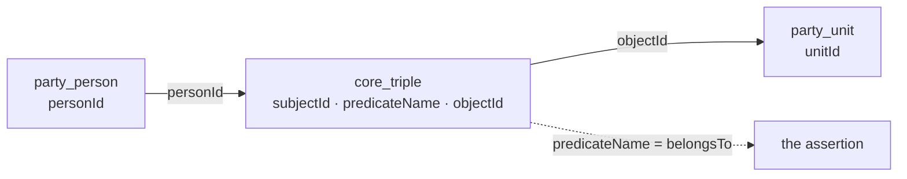
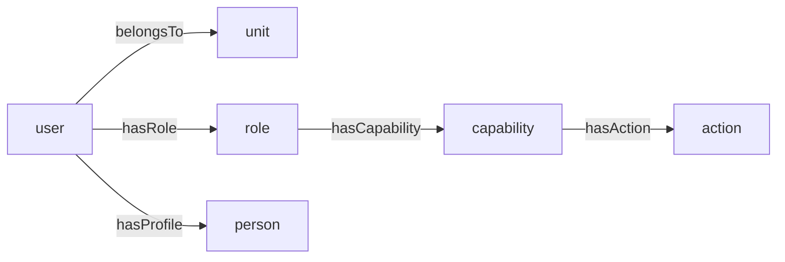

Ask a system of any age a simple question — "which organisations is this person connected to?" — and
you can watch it fail in a specific way. The person exists three times: once in the HR tables, once
in the customer records, once in the login store, and the three rows share a name and nothing else.
The connections are worse: a membership is a join table here, a foreign key there, a JSON array in
the third place, and no query can follow the chain without knowing which of them it is standing in.

Blong puts people, organisations, units, roles, users and actions in one graph. An entity is a
**resource**; a relationship is an **edge** between two resources; and the realms that describe them
are lenses over that graph rather than separate stores standing beside it.

<!-- truncate -->

## The substrate is four tables

| Table           | Columns                                              | Key                                                 |
| --------------- | ---------------------------------------------------- | --------------------------------------------------- |
| `core.resource` | `resourceId` (uuid), `resourceName`, `typeId`        | PK `resourceId`; FK `typeId` → `core.type`          |
| `core.type`     | `typeId` (increment), `typeAlias`                    | PK `typeId`; unique `typeAlias` (`party.person`, …) |
| `core.triple`   | `subjectId`, `predicateName`, `objectId`             | PK all three; both endpoints FK → `core.resource`   |
| `core.path`     | `originId`, `destinationId`, `pathType`, `pathDepth` | PK `(originId, destinationId, pathType)`            |

The edge table is the one to look at twice. It has no `tripleId`: an edge is identified by what it
asserts, so asserting the same membership twice inserts nothing, and there is no id to leak into
another table. Both of its endpoints are foreign keys to the _same_ table, which is why one edge
table can carry a membership, a role grant, a tree position and a scope, and why the predicate name
is load-bearing rather than decorative. A relationship is not a resource — the endpoints are — and
that distinction is what keeps the graph from needing a table per pair of things that can be
related.

## A membership is a row



The person table has no `unitId`; the unit table has no `personId`; there is no `person_unit` join
table. There is one edge, and the same three columns hold `isPartOf` for the unit tree, `hasRole`
and `hasCapability` for the permission chain, `hasScope` for an organizational grant and
`hasProfile` for the person behind an account. Adding the next relationship is an insert, not a
migration, which is the property a domain model wants most: the day someone asks for "a person can
be a member of a unit _and_ a contractor for it", the answer is a predicate, not a table.

## Identity in one place, and what that does not buy

A resource-backed table's primary key is a foreign key to `core_resource.resourceId`, so an entity
row and its identity are one row rather than two that can drift. Two operations in `blong-core`
exist because more than an insert is involved:

- **`core.resource.ensure`** finds or creates a resource by `(typeAlias, resourceName)`, then
  inserts the entity row if it is missing — and if it finds a resource whose entity row does not
  exist, it heals it instead of minting a second resource under the taken name.
- **`core.triple.merge`** inserts a set of edges, ignoring the ones already present, and can refresh
  the materialized paths afterwards.

That is what makes seeding idempotent, and it is worth being exact about its strength: the pair is a
_logical_ identity, not a unique constraint. `resourceName` carries a non-unique index, so two
writers that go around it can leave two resources with the same name in one type, and a generic
`add` given no name mints one named after the column. A development database that has been driven by
tests for a few months shows both: dozens of resources named after the same person, and a handful
literally named `party.person.personId`. The honest summary is that identity holds for writes that
go through `merge`/`ensure`, which is why they are the operations the framework's own registration
and seed paths call.

## Party types are tables; sub-entities are not

`blong-party` declares `person`, `organization` and `unit` as three resource-backed tables, each
with its own key (`personId`, `organizationId`, `unitId`) and its own display column (`lastName`,
`legalName`, `unitName`). There is no `party_type` discriminator and no `party` table with a kind
column — the **type alias** distinguishes them, which is why asking for "all parties" is a union
over types rather than a filter.

The realm's actual sub-entities look different, and deliberately so: `party.contact`,
`party.address` and `party.identifier` carry their own auto-increment keys and an FK column
`partyResourceId` pointing at `core.resource`. They hang off a party and have no identity of their
own, so they get a plain table instead of a resource. ## Three lenses, one set of edges



**Party** reads the hierarchy — membership through `belongsTo`, the unit tree through `isPartOf`,
the human behind an account through `hasProfile`. **RBAC** walks user → role → capability → action,
directly or through the unit the user belongs to, and materializes the answer into `core.path` as
`access.effectiveRole`, `access.effectiveAction` and `access.effectiveScope`, so a permission check
is one indexed lookup instead of a recursive walk. **The record-level ACL** adds the narrowing
direction: `access_acl` is a table whose principal, action and target are all resources, so a rule
can attach to any of them, and its implicit half is a `hasScope` edge in the same graph.

Note what is _not_ claimed here: the graph does not replace the tables. A role is still a table with
a `roleBit` column; `access_acl` is still a table with rules in it; the unit hierarchy is
materialized into `core_path` rather than computed on every read. What the graph changes is that the
relations — the part that used to grow tables or columns every time the business learned a new word
— are data.

## Querying it

Because the predicates are the join, two shapes cover most questions. An edge lookup names as many
of the three key columns as you know:

```jsonc
// the units under an organisation: unit --belongsTo--> organisation
{"method": "core.triple.find", "predicateName": "belongsTo", "objectId": "<organization resourceId>"}

// what this resource points at, and what points at it — both indexed
{"method": "core.triple.find", "subjectId": "<resourceId>"}
{"method": "core.triple.find", "objectId": "<resourceId>"}
```

A path lookup reads the materialized answer:

```jsonc
{"method": "core.path.find", "originId": "<userId>", "pathType": "access.effectiveAction"}
```

Neither query names a domain table, so the same two shapes answer a party question and an
authorization question: the domain decides what an edge means, and the graph decides how it is
stored and traversed.

Two tables complete the schema without being part of any working path: `core.property` and
`core.translation` are declared, and nothing reads or writes them yet. They are reserved rather than
usable, and worth knowing about precisely so nobody mistakes them for an API.

[The resource graph](/docs/concepts/resource-graph) is the concept page; [RBAC](/docs/concepts/rbac)
and [the record-level ACL](/docs/concepts/acl) are the two lenses built on it.
