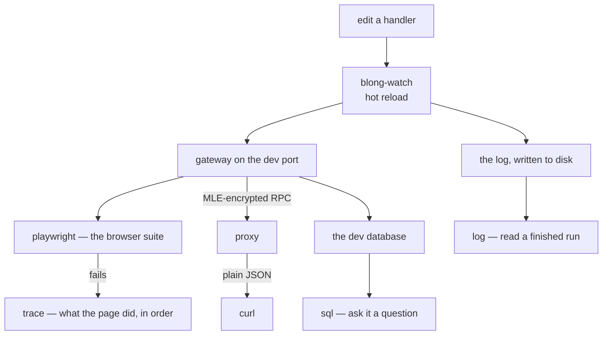

Every codebase accumulates a directory of shell scripts, and every one of them starts as a good
idea. `load-db.sh` because the connection string was long. `read-log.sh` because the logs only
existed in a terminal that had already been closed. `open-trace.sh` because a Playwright trace is a
zip of JSON lines and reading it by hand is a tax on every failure. Each script is correct on the
machine of the person who wrote it, and none of them is documented anywhere a new contributor would
look.

Blong puts that directory in one command, and the reason it is worth a post is not the count of
subcommands — it is that the commands are shared by the two kinds of caller this repository has: a
person at a terminal, and a coding agent working through the same loop.

```text
blong-dev lint [files...]    Run tsc + cspell + eslint in current package
blong-dev lint-staged        Lint git staged files across all affected packages
blong-dev test               Run tap tests in current package
blong-dev report vitest      Convert coverage/vitest.json into .ci-report/
blong-dev ci-report          Aggregate .ci-report/ into the CI report
blong-dev playwright [args]  Run Playwright tests in current package
blong-dev proxy [opts]       MLE proxy for curl (--port/--target/--username/--password)
blong-dev trace <trace.zip>  Print a human-readable Playwright trace timeline
blong-dev log [ulid] [opts]  Fetch log entries from cacache (--output/--level/--search/...)
blong-dev sql [opts]         Run a SQL query via .blong_devrc (--output json|pretty)
blong-dev memory <verb>      Add, list, show, close, format or check agent memory entries
blong-dev docs <verb>        List, generate, check or verify the docs site artefacts
```



<!-- truncate -->

## One command per thing-nobody-remembers

**Lint.** `blong-dev lint --files $(git diff --name-only)` runs the spell check, the lint and the
type check with the repository's own configuration, from whatever package the file lives in — and
bundles its own cspell, eslint and tsc. The files narrow the spell and lint work; the type check
still covers the package, because a file cannot be type-checked in isolation. `lint-staged` is the
same command fanned out over every package the staged files belong to, and it is what the pre-commit
hook runs.

**Test, and the report.** `blong-dev test` runs tap in the current package, keeps the raw TAP in
`.ci-report/` and prints a compact failure view. `blong-dev playwright` wraps the browser runner and
builds the Allure report, and `blong-dev report vitest` exists because `blong-browser` runs vitest
while the rest of the monorepo runs tap — one contract has to receive both, or the CI report is a
lie about which packages were checked. `blong-dev ci-report` then aggregates every package's report
into the single file CI publishes, with the metrics history and the failure bundle.

**The proxy.** The gateway's RPC endpoint is encrypted end to end, which is the right property in
production and an obstacle in development: you cannot see what the front end is sending, or call a
method with curl. `blong-dev proxy` performs the MLE handshake once, optionally logging in on
startup, and then forwards plain JSON:

```bash
blong-dev proxy --port 8099 --target http://localhost:8080 \
    --username testAdmin --password testPassword

curl -s -X POST http://localhost:8099/gateway/bundle/find \
     -H 'content-type: application/json' -d '{"params":{"paging":{}}}'
```

The method comes from the path, or from a dotted `method` in the body, so anything that can send an
HTTP request can now exercise any method of the running server — which turns "curl cannot talk to
this gateway" from a fact into a five-second setup.

**The trace.** A Playwright trace is a zip of JSON lines, and the test that failed usually captured
no screenshot, so the useful thing is a timeline:

```text
Trace: trace.zip

--- actions ---
[   40.5s] Frame.goto ./
[   41.6s] Frame.fill input[name="username"]
[   41.8s] Frame.click internal:testid=[data-testid="login-submit"s]
[   41.9s] Frame.waitForSelector html[data-portal-config="merged"]

--- failed requests ---
(none)
```

That output is worth describing precisely, because the command used to get it wrong. A trace is
written in numbered chunks — `0-trace.trace`, then `1-trace.trace` when a run records more than one
file's worth of events — and the command read only the first. On a real failing run from this
repository, chunk zero held 333 bytes and the entire recording sat in chunk one, so the command
printed an empty timeline: not an error, not a warning, just a plausible-looking "nothing happened".
It now reads every chunk in order, and says so when it finds none. The lesson generalises: a tool
that prints nothing where you expect a list has to be distinguishable from a tool that found
nothing, or you will spend an afternoon debugging a test that ran perfectly.

**The log.** `blong-dev log --level error --limit 20` reads what the logging transport wrote to disk
while the process was alive, filtering by level, service name, trace id, method or free text; a ULID
prints one entry in full. This is the difference between "the logs are gone, restart it and try
again" and being able to read what happened in a run that finished yesterday.

**The database.** `blong-dev sql "SELECT * FROM access_role"` connects from `.blong_devrc` and falls
back to the development defaults, deriving the database name as `<suite>-<user>` when nothing is
configured. The alternative it replaces is exec-ing into a pod to look at development data.

**Docs and memory.** `blong-dev docs verify` builds or serves the documentation site, loads every
page and every blog post in Chromium, and reports the diagrams and images it expected against the
ones that actually rendered — which is how a broken diagram is caught by a command instead of by a
reader. And `blong-dev memory` owns the agent memory files: identifiers, section, wrapping,
generated index, and a `check` that fails a commit.

## The same commands for the agent and for you

The commands are one CLI rather than a script directory for a reason that is easy to miss: the
development loop and the agent loop are the same loop. An agent fixing a failing test needs the
test's output, the persisted log, a query against the development database and the memory file
recording what was learned — exactly what a person needs. When those are commands, both callers can
use them, and this repository's instructions do point agents at `blong-dev memory`, `blong-dev sql`
and `blong-dev lint` by name.

Two habits keep that from turning into a tool that serves neither caller. Anything with output gets
a machine mode beside its human one — `--output json`, `list --json` — so a person gets a table and
an agent gets something it can parse. And anything that would otherwise be a shell incantation in
someone's notes becomes a command, which means it can be tested, documented and corrected.

The API is described in [the blong-dev pattern](/docs/patterns/blong-dev), including the flags each
command takes and the files it reads.
