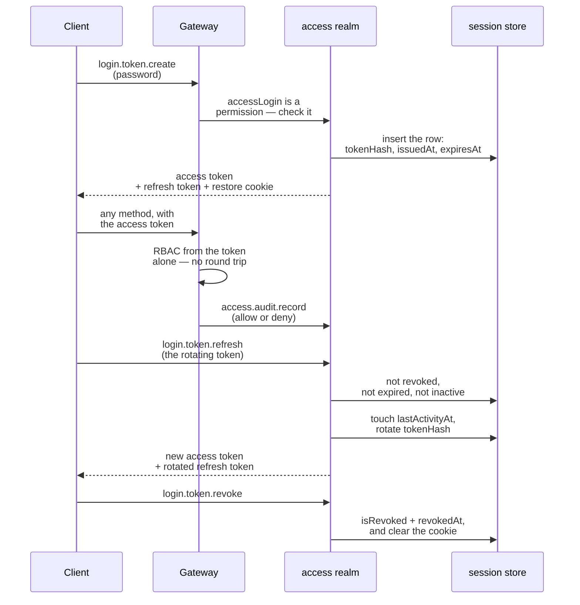

A signed token is a lovely thing right up to the moment you need to take it back. It cannot be
revoked, it says what it said when it was minted, and it stays valid until it expires — which is why
"stateless JWTs" and "we need to log this user out" cannot both be true without a second mechanism
underneath.

Blong's answer keeps the token as the fast path and adds a database-backed session behind it, with
rotation, inactivity, revocation, and an audit trail written at the one place every controlled
operation passes through.

<!-- truncate -->

## Two tokens and a row

```text
  login.token.create ──▶ access token (short-lived)  ──▶ every RPC call
                     └─▶ refresh token (rotating)    ──▶ access_session row
```



The access token is a JWT and carries what the gateway needs to answer a request with no database
round trip: the caller's identity, the session id, and a bitmap of role bits. The refresh token is
an opaque handle whose hash is stored on the session row, and renewal is a call of its own —
`login.token.refresh`, not a grant on `login.token.create`, which accepts only a password or a
client credential and minting a session is deliberately not part of what it does for a machine
client.

Rotation is the detail that makes a stolen refresh token uninteresting. Every renewal writes a new
hash to the row and returns a new token, so the hash follows the newest token and replaying an older
one no longer matches. Inactivity is anchored on `lastActivityAt`, which renewal touches, and a
session older than `login.expire.inactivity` is refused renewal and reported `inactive`. Revocation
sets `isRevoked` and `revokedAt` and clears the restore cookie; cleanup then deletes revoked,
inactive and expired rows.

## Logging out, and who may do it

`access.session.close` is the revoke primitive, and the interesting part is what it takes to call
it, because the answer differs by entry point. With no id it defaults to the session id in the JWT,
so an empty call logs the caller out — but only through `login.token.revoke`, whose route is
declared with the access check skipped. Called directly over RPC, the gateway's check runs first and
the method needs the `access.session.close` action like anything else; the adapter's own-session
shortcut sits _after_ that check, not instead of it. Closing somebody else's session always needs
the action, and is refused with a 403 otherwise.

That ordering is the right one, and it is worth naming why: "log yourself out" and "log anyone out"
are different permissions, and a shortcut that skipped authorization because the id happened to look
like the caller's own would be a confused-deputy bug in waiting.

## Login is itself a permission

The session gate does not treat authentication as a special case outside the access model: the
`accessLogin` action has to be among the caller's effective actions, or the gate refuses to
establish _or renew_ a session. So deactivating a user, or withdrawing that one action, ends their
ability to get a new session — and also their ability to resume one from the restore cookie, which
is the part easier to forget. A revoked grant that could still be restored from a cookie would be a
grant that was not really revoked.

## The audit is written where the decision is

Every access-control decision is recorded next to the check itself, at the gateway — the single
choke point every RBAC-controlled operation passes through. `access.audit.record` appends one row
per request with the actor, the session, the action, whether it was allowed, the HTTP status and the
IP:

| Column                                         | What it holds                                     |
| ---------------------------------------------- | ------------------------------------------------- |
| `auditId`, `occurredAt`                        | ULID key and timestamp                            |
| `actionName`, `isSuccess`, `statusCode`        | what was asked, and the outcome                   |
| `userId`, `actorId`, `sessionId`               | who asked, and on whose behalf                    |
| `credentialType`, `ipAddress`, `failureReason` | how they authenticated, from where, why it failed |
| `detail`                                       | sanitised DML context — see below                 |

Two properties make the trail usable. It is **best-effort and non-blocking** — an audit failure
never fails the request it was describing — and the only detail it records for a write is a
whitelisted set of identifier-shaped keys (`…Id`, `…Name`, `…Key`), never the payload. A
credential's hash, a password, a description: none of them reach the audit table.

Reading it is a page, not a query. `access.audit.browse` lists the entries with no toolbar at all —
an audit log an operator can edit is not an audit log — and `access.audit.find` is the method behind
it, so an orchestrator or a test can assert on the same rows. Operators also get
`access.session.browse`, which lists live sessions with a **Close Session** action, so the
revocation described above is a button as well as a handler.

## Self-registration, and what it does not have

The one entry point that must work without a session is registration: `access.registration.add` is
declared `auth: 'login'`, validates an email and a password of at least eight characters, and then
creates three things — the account (with the `Guest` role), the person it belongs to, through a
cross-realm `party.person.add`, and a `hasProfile` triple connecting them in the resource graph.
Google sign-in with no existing link or matching address runs the same handler with a subject id
instead of a password, so there is one shape of account however it arrived.

And here the documentation has to be blunt rather than aspirational: a self-registered account is
**active immediately**. There is no pending state, no email verification, no approval queue — the
rights it has are exactly what the `Guest` role carries, and everything else is an operator grant
through `access.user.edit` afterwards. If you were expecting an approval step, the correct reading
is that the _Guest role_ is the approval, and a deployment that wants a human in the loop needs to
add one; nothing in the realm currently distinguishes an account that is waiting from one that is
ready.

That is also why the audit matters more here than anywhere else. A registration is a write with no
actor behind it — nobody was logged in when the row appeared — so the recorded entries for the
account it produced are what make the account attributable at all.

The full lifecycle, the configuration keys and the self-registration flow are in
[the sessions concept page](/docs/concepts/sessions); the role and capability model it reuses is in
[the resource graph](/docs/concepts/resource-graph) and [RBAC](/docs/concepts/rbac).
