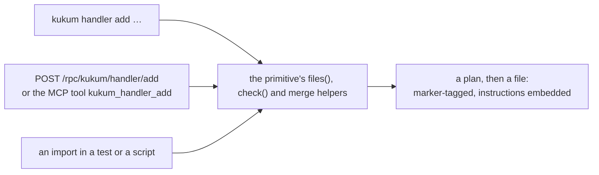

Every framework with a strong convention ends up documenting that convention twice. Once as prose —
"a handler file is named `subjectObjectPredicate`, it exports the same name, it forwards `$meta`" —
and once as the skeleton somebody pastes from the last file they wrote. The prose drifts from the
code, the skeleton drifts from the prose, and the person following either one finds out which by
compiling.

Blong moved the skeletons into the framework. There is now an API that writes a primitive on
request, validates the name _before_ anything reaches disk, and can tell you what is already wired
up in the process you are talking to. It is called `kukum`, and it is the answer to a question the
skills used to answer in prose.

<!-- truncate -->

## Fourteen primitives, five predicates

```bash
kukum primitive find --output=json     # what can be generated at all
kukum handler add --subject=shop --object=order --predicate=add --kind=api
kukum realm find                       # the realms already in the tree
kukum source get orchestrator/shop/shopOrderAdd.ts
```

The surface is small because it is derived rather than enumerated. Fourteen primitives — `realm`,
`suite`, `layer`, `handler`, `orchestrator`, `adapter`, `error`, `schema`, `seed`, `model`, `test`,
`gateway`, `component`, `storybook` — against five predicates: `find`, `get`, `add`, `edit`,
`check`. Fourteen times five is seventy routes, and the registry builds them by looping over the two
lists rather than by listing seventy things. Each primitive also declares its kind (`api`,
`library`, `db` for a handler), the skill that owns it, and the folder roots it may write into.

The predicates are not four aliases of "create". `get` returns the template file set a primitive
_would_ produce without touching disk, so you can read what you are about to accept. `find` returns
the instances that already exist under the primitive's roots. `check` runs the guardrails and lints
what is there. `edit` requires a path, and preserves the instructions a file carries.

## Refused before it is written

This is the part that changes how the thing is used. Ask for a name that violates the conventions
and nothing is written, because the descriptor's checks run before anything is planned:

```text
REFUSED: subject 'my-realm' must be lowerCamelCase: it is substituted into template identifiers,
         so names like "my-realm" would not parse
REFUSED: predicate 'upsert' is not a standard predicate (get/find/add/edit/remove/merge) —
         reuse one before inventing
REFUSED: layer 'test' must be one of: orchestrator, gateway, adapter
```

Three things are worth noticing about those messages. They are generated by the same code the CLI,
the RPC endpoint and an in-process caller all go through, so the rule cannot be enforced on one path
and forgotten on another. They are specific about _why_ — the subject is substituted into template
identifiers, which is the reason the rule exists rather than a style preference. And they are
narrower than the documentation used to imply, which the documentation now states: the subject is
checked on every primitive that takes one, the object on the four where its shape matters, the
predicate only on `handler`, where reusing a standard predicate is the point.

## Three doors, one room



The CLI does not reimplement anything. It loads the same suite a server would, then resolves the
command's method against the **live registry** — which is why the third door is not exotic: the
handlers are library factories, so a test can call them directly with a filesystem host and no
server at all. The RPC path registers the same functions and the gateway derives
`/rpc/kukum/{primitive}/{predicate}` from the names, with an MCP tool name beside it
(`kukum_handler_add`) for an agent that talks MCP rather than HTTP.

The honest caveat, since it cost me an afternoon: the CLI runs the same loader as a server, so it
activates the database adapter, and the development configuration derives a database name from the
suite. `kukum primitive find` therefore fails with `Unknown database 'kukum'` on a fresh checkout
until that database exists — a generator that needs a database is a defect, and it is recorded as
one. Creating it once is the workaround.

## Introspection, and what it needs

"What is wired up right now" is the question the `find` predicates answer, and they divide by what
they need:

- `primitive.find` is static: it returns the primitives, their kinds, their skills and their
  predicates, from the descriptor list.
- `method.find` and `tree.find` read the running registry's own description — so they answer
  properly inside a loaded process, and return `{available: false}` when there is no registry to
  ask. That is a good answer: an agent asking a static question of a static context should be told
  it is static, not handed a plausible empty list.
- `instruction.find` and `source.get` need only a filesystem: they walk the target and return every
  `@kukum-instructions` marker they find, per file, which is how "what still needs doing" is
  answered mechanically instead of by reading diffs.

## Instructions travel with the file

```typescript
// orchestrator/shop/shopOrderAdd.ts
import unchanged from '@feasibleone/blong';
// @kukum-instructions: wire the gateway route
// @kukum-instructions: add a tap test
```

`--instructions` is repeatable, and the marker is written into the file's header. Two properties
make it more than a comment: the instructions are _inherited_ by whoever edits the file next — a
later `kukum handler edit` keeps them unless it is asked to replace them — and they are retrievable
in bulk, so an agent asked to finish a partially generated realm does not have to guess which files
are unfinished. The marker also doubles as the ownership test: a file carrying it is
machine-generated and may be merged into; a file without it is somebody's work and is skipped rather
than clobbered.

## Why generate instead of transcribe

The recipes used to live in the skills as prose with a skeleton to copy, and the change is visible
in the repository: one commit replaced those skeletons with a pointer to the API across twenty skill
files, because a copied skeleton is a snapshot of the framework at the moment somebody pasted it. A
generated primitive cannot be out of date — if the templates change, the next `add` produces the new
shape — and a rule expressed as a refusal cannot be skipped the way a rule expressed as a sentence
can.

Two limits are worth stating, because a post about generation invites the opposite impression. The
guardrails are partial: the layer restriction is enforced by the `handler` descriptor alone, and a
`--layer` given to a primitive that does not read it is ignored, so "validated" means "the checks
that descriptor declares", not a framework-wide proof. And the measurement effort around this — a
rubric that scores how well the prose instructions produce a working realm — has no run results in
the tree yet, so the numbers to quote do not exist. What does exist is the API, its refusals, and
the fact that the tests that were transcribed by hand are now produced by the same code path the CLI
uses.

See [the concept page](/docs/concepts/kukum) for what the primitives are, the
[pattern guide](/docs/patterns/kukum) for the commands and the merge rules, and
[the rationale](/docs/rationale/kukum) for why the recipes moved out of the skills.
