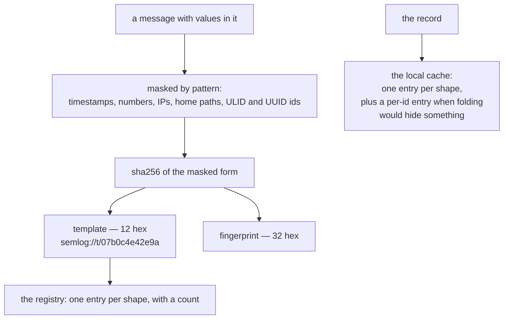
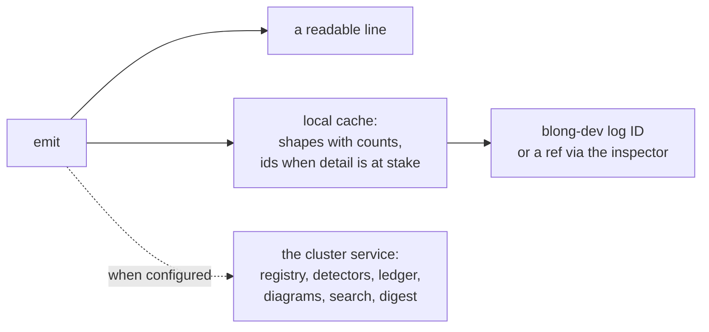

A log line is a sentence with a timestamp stapled to it, and everything that has gone wrong with
production observability follows from that. Two runs of the same code produce two different strings,
because one of them transferred 1001 and the other 9876 — so nothing can be counted, nothing can be
compared, and the only thing that scales is a search that scales with your bill. Then the incident
arrives and the line you need is the one that was never written, because writing it would have meant
logging a customer's balance.

Semantic logging is an attempt to fix both ends at once: mask the values, hash what is left into a
**template** that is the same on every occurrence, mint an identity for the record locally, and ship
the structure rather than the text.

<!-- truncate -->

## The line, and the id behind it

<!-- cspell:disable -->

```text
2026-09-27T20:57:11.121Z info  transfer 1001 failed [semlog://t/2de91fb46004]
2026-09-27T20:57:11.123Z error flow=01J8ZQ3M4N5P6Q7R8S9T0V1W2Y/-#-1 leg=payer.hub/transfer.create#1 \
    transfer failed [semlog://r/01M3JAGM6KZMSJD6GEF50THXN2 semlog://t/07b0c4e42e9a \
    semlog://x/01J8ZQ3M4N5P6Q7R8S9T0V1W2X p=01M3JAGM6KZMSJD6GEF50THXN1]
```

<!-- cspell:enable -->

Four things are visible in that second line, and each one is a decision. `t/07b0c4e42e9a` is the
template — the masked shape of the message, twelve hex characters of a hash. `r/01M3JAG…` is the
record's own identity, a ULID minted in this process, which is what turns the line into a handle:
the record id from that line, passed to `blong-dev log`, prints the whole record — its refs, its
payload refs and its fingerprint. `x/01J8ZQ…` is the flow execution, carried across processes in
`x-semantic-trace`. And `p=01M3JAG…N1` is the record **that caused this one** — the lineage edge,
not an inference from timestamps.

The identity is minted locally, from a monotonic ULID factory, one per record. That matters more
than it sounds: an id that comes from a central service is an id you do not have when the service is
down, and an id derived from the message is an id two occurrences share. The honest qualifications
are worth stating too: the line prints `r/<id>` when it is folded — an error, a record that withheld
a payload, one carrying a payload ref — and not on every verbose line, and a record is resolvable by
its own id when it earned a cache entry rather than being counted into its shape. The template ref
is the one that is always there.

## Masking, hashing, and the exact size of the claim



Run the two obvious messages through it and the claim is demonstrable rather than asserted:

```text
"transfer 1001 failed"  => "transfer <NUM> failed"
    template: [LEVEL: INFO] [SERVICE: db-driver] [MSG: transfer <NUM> failed]
    fingerprint: e4cb7c116818a6239aafc0f859556c15

"transfer 9876 failed"  => "transfer <NUM> failed"
    template: [LEVEL: INFO] [SERVICE: db-driver] [MSG: transfer <NUM> failed]
    fingerprint: e4cb7c116818a6239aafc0f859556c15
```

Same fingerprint, because the number never reached the hash. And here is the part a pitch usually
leaves out: the masking is a set of ordered patterns, not a parser, so its edges are visible and
worth knowing.

| Input                        | Masked as                          | Comment                       |
| ---------------------------- | ---------------------------------- | ----------------------------- |
| `insufficient balance 42.50` | `insufficient balance <NUM>.<NUM>` | decimals are two numbers      |
| `order v2 failed`            | `order v2 failed`                  | a version token survives      |
| `traceid 9f8e7d6c5b4a3210 …` | `traceid <NUM>f8e7d6c5b4a3210 …`   | 16-hex is not a recognised id |
| `GET /users/42 200 in 15ms`  | `GET <HOME> <NUM> in <NUM>ms`      | a route masked as a home path |

So the registry is exact about the shapes it recognises and approximate about the rest. That is a
reasonable place to be — the alternative is a template language nobody maintains — provided it is
written down, and provided the artefacts are reviewed rather than trusted. Which is the next
decision: the **registry** is what persists, and the records are evidence.

## The registry is durable; the records are evidence

One entry per **shape**, with a count, is what the store keeps:

```text
{"id":"afa5a9bfe3a5","k":"template","n":2}
```

An individual record gets its own entry only when folding it into its shape would hide something —
it withheld a payload, or it carries an error. This is the difference between a store that grows
with traffic and one that grows with the number of distinct code paths, and it is why the durable
artifact is the template registry rather than the stream of records. The two halves do different
jobs: the registry answers "what does this system do, and did that change?", and the retained
records answer "what exactly happened in this one case?".

## Three anomalies, because three things are wrong

A single "anomaly score" compresses decisions that need different responses, so the detectors are
separate and named:

| Kind         | Computed from                                                 | What it means                      |
| ------------ | ------------------------------------------------------------- | ---------------------------------- |
| `novelty`    | a template ref the registry has never seen                    | a code path nobody has run before  |
| `rate-shift` | a z-score against the mean and deviation of completed windows | the same thing, far more often     |
| `drift`      | movement of a **flow**'s signature vector, fed by the ingest  | a flow is taking a different route |

The drift detector's subject is the interesting one. It is fed the flow's signature vector rather
than a template's, because a template's vector is constant by construction — it is a hash of a
masked message, so a per-template distance would always be zero. Drift is therefore a statement
about topology, and novelty and rate-shift are statements about the individual shape. All three are
implemented and exercised, including end-to-end through the ingest.

## Recording calls: three switches, one decision

Whole-flow call recording is off until something asks for it, and there are three places the
question can be answered:

1. **A short-lived grant** — the `x-blong-grant` header, minted by `blong grant calls --ttl=15m`.
   Verification is deliberately forgiving: absent, malformed, expired or signed by another key all
   return "no grant" rather than an error, because a debugging aid must never break a request.
2. **The configuration** — `callTrace.enabled` (on unless explicitly false) and `callTrace.off`,
   whose patterns match the flow's name.
3. **The flow's own inherited decision** — a capability carried in `x-semantic-trace`, so a decision
   made at the edge is honoured downstream without every process re-deciding.

The precedence as implemented is worth quoting, because "three switches" usually means "three ways
to get it wrong":

```typescript
const grantedCallsToRecord = await grantedCalls(request.headers[GRANT_HEADER], key);
enterCapability(
    CALLS_CAPABILITY,
    grantedCallsToRecord || callsFor({forward: request.headers}, kind),
);
```

A grant wins. A _present but expired_ grant does not switch recording off — it leaves the question
to the configuration, which is what "forgiving verification" means in practice. The answer is then
published as a capability, so downstream the flow reads the decision (`decided ?? local`) rather
than making a second one: the call is recorded whole or not at all. Client-supplied capabilities are
stripped before any of this.

## The service is optional

With no cluster service anywhere, an emitter still writes readable lines and still keeps its local
cache, and a ref still resolves against it — I resolved a template ref with no service running. What
the service adds is the shared registry, the anomaly detectors, the flow ledger and the diagrams
generated from it, search, and the digest. The property that makes this comfortable is that the
emitter is not buffering for a service that might arrive: stdout and the local store are where a
record lives first, and the service is a reader.



The mechanism, and the deliverables, are in [the concept page](/docs/concepts/semantic-log); the
[pattern guide](/docs/patterns/semantic-log) covers the flow ledger and the fault fixtures, and
[the rationale](/docs/rationale/semantic-log) is the long argument for novelty, rate shift and drift
as three named things rather than one score.
