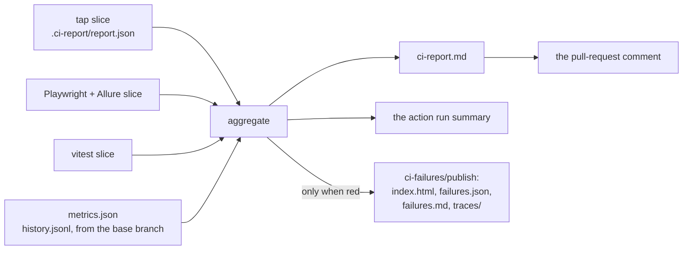

A monorepo of forty packages that each report their own results produces a specific kind of unusable
CI. The check is green and nobody believes it. The logs are thorough and nobody reads them. And the
one question a reviewer actually has — "did this branch break that test, or was it already broken?"
— has no answer anywhere in the run, because answering it needs a comparison nobody made.

Blong's answer is one document. Per package it carries the counts, the duration, the coverage and
the change against the base branch; for the run it carries the tests that did not run, the slowest
test, and every failure with its provenance. That same document is the artefact and the pull-request
comment, so there is nothing to reconcile.

<!-- truncate -->

## The delta lives in the same cell

The rule that shapes the whole table is small and worth copying: **the change is printed beside the
value it changed**, not in a column of its own.

| Package   | Result | Passed | Failed | Flaky | Not run | Total   | Duration                              | Coverage        | Report     |
| --------- | ------ | ------ | ------ | ----- | ------- | ------- | ------------------------------------- | --------------- | ---------- |
| fake-fail | ❌     | 8      | 2      | 0     | —       | 10 (+2) | 1m 05s (+5.0s) ⏱️ logs in as the… 11s | 🔴 25% (-5.0pp) | `[report]` |

That row is real — the local fixture's output — and it shows the four decisions the table makes. A
count is `10 (+2)`. A duration carries its change and the name of the slowest test, which is what
makes "the build got slower" actionable rather than true. Coverage is against the committed baseline
with a red mark past a one-point regression. And `Report` is a link predicted from the reporting
base before anything is published, so the document is complete when it is written rather than
patched afterwards.

Two columns exist only when they have something to say, which is the same principle applied to
absence: **Not run** (`skipped + todo`) appears only when a package has one, and **Flaky** is
separate from **Passed** always. A suite that skipped half its tests is a green that must not look
like the others, and a suite that survives by retrying is not healthy — it is a suite whose health
nobody has measured. Flaky tests are counted in their own column, marked `⚠️` in the package's
result icon, listed as `🟡 flaky` in the failures table, and separated inside the failure bundle.

## Three runners, one contract

The packages do not agree on a test runner, and nobody should pretend otherwise: tap for the
framework packages, Playwright with Allure for the browser suites, vitest for `blong-browser`. What
they agree on is that each writes a **slice** into `.ci-report/`, and aggregation is a sum over
slices rather than a reader per runner:

| Runner              | Adapter                                    | Who writes it          |
| ------------------- | ------------------------------------------ | ---------------------- |
| tap                 | `report/tapReport.ts`                      | `blong-dev test`       |
| Playwright + Allure | `report/allurePublish.ts`                  | `blong-dev playwright` |
| vitest              | `report/vitestReport.ts` (`report vitest`) | the package itself     |

The coverage half of that story — how the three runners' line data becomes one number — has its own
page, because merging lcov from three tools is a different problem from counting tests.

## "Is this failure new?"

This is the question the report was built to answer, and it needs a history as well as a run. Each
failing test is characterised against the base branch:

| Provenance     | Meaning                                                   |
| -------------- | --------------------------------------------------------- |
| `new`          | green on the base branch, red here — this branch broke it |
| `recurring`    | already failing there — not this branch's doing           |
| `intermittent` | has passed and failed before — flaky, and now it counts   |

The history is `.github/history.jsonl`, **rebuilt** per run from the per-package slices rather than
appended to, so a rebase cannot leave two histories interleaved and a deleted test cannot haunt the
percentages. The baseline the deltas are computed against is `.github/metrics.json` — the whole
run's totals, duration and coverage — which is what makes `(+2)` a statement about last night rather
than about nothing.

When a run is red, a **failure bundle** is published beside the report: an HTML index, the failing
tests as JSON and markdown, and the traces. It is built only for a red run, and the previous bundle
is removed first — so a green build cannot leave a stale bundle behind for somebody to debug months
later, which is a failure mode worth designing away because it wastes exactly the hours the bundle
exists to save.

## What this repository owns, and what it does not

The aggregation, the rendering, the metrics snapshot, the history and the failure bundle are here,
with unit tests over each and a **local fixture** that builds a complete report without CI
(`npm run report:local` in `test/blong-ci-report`) — which is the invocation to use when changing
the contract, because it shows the real table rather than a description of it. The tests over the
report models and writers pass 104 assertions.

The step that **posts** the document as a pull-request comment does not live here: this repository
calls a shared reusable workflow, and the posting is inside it. So the honest split is that the
contract is owned here and the delivery is not — which is worth saying out loud, because a report
nobody posts is a report nobody reads, and the part you cannot see from this repository is the half
that decides whether reviewers ever meet the document.

One defect is worth recording rather than hiding. `blong-dev ci-report` **crashes** on a tree that
contains a single-run `.ci-report/report.json` written by an older schema —
`TypeError: report.runs is not iterable` — because the collector assumes every slice is the current
multi-runner shape. The fixture path works and the CI path works; the ad-hoc local path is the one
that fails, which is precisely the path somebody takes when they are debugging the report. A schema
guard is the missing piece, and it is on the list.

The contract itself — the columns, the provenance rules, the bundle and the baseline — is described
in [the CI report rationale](/docs/rationale/ci-report); coverage aggregation across the three
runners is in [the coverage concept](/docs/concepts/code-coverage).
