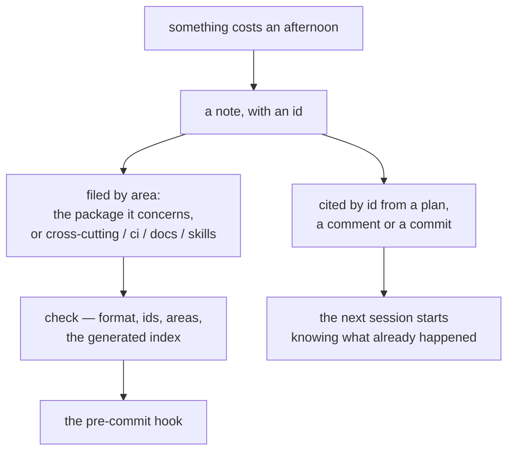

Every team discovers the same thing about its own bug tracker: the useful knowledge is not in the
ticket, it is in the comment where somebody says what they tried, why it did not work, and what they
did instead. That comment is usually the last thing written and the first thing lost, and the next
person pays for the same afternoon all over again.

This repository keeps that kind of note in the repository, in markdown, under three headings —
**frictions**, **todos** and **decisions** — written through a command that owns their format. It is
deliberately not a tracker. It is the smallest thing that makes a note citable, greppable and
verifiable, and it exists because a coding agent's session starts with no memory at all.

<!-- truncate -->

## Three kinds, three statuses

| Kind     | Statuses               | Holds                                                                     |
| -------- | ---------------------- | ------------------------------------------------------------------------- |
| Friction | `open`, `resolved`     | something that took unexpected effort, and the lesson that came out of it |
| Todo     | `open`, `done`         | work that is deferred, unfinished or spotted and not done                 |
| Decision | `active`, `superseded` | a choice that was made, with the reasoning the code does not show         |

The status is the whole lifecycle, and each kind has exactly two of them. A friction is open while
it is costing people time and resolved once the lesson is written down where it will be met; a todo
is work that someone decided not to do now; a decision stays active until another one replaces it,
in which case the old entry points at the new one rather than disappearing.

The three kinds exist because they need different treatment. A friction is _evidence_ — it loses its
value if it is edited into a tidy rule, which is why it keeps the account of what actually happened.
A todo is a _commitment_ that should be closed or abandoned loudly. A decision is _reasoning the
code cannot show_, and the only useful question about it is whether it still holds.

## A note has an id, and the id is the point

```markdown
### F-014 — A nested `tap` run ignores `--reporter=json`

> _2026-09-15 · ci · resolved_

The nested tap inherited `TAP_CHILD_ID`, concluded it was a child job and reported zero tests. Unset
the `TAP_*` variables before spawning the inner run.
```

That blockquote line — date, area, status — is generated, not written. It is what `list --area` and
`list --status` filter on, which is why the files can be queried without a parser. And the id,
`F-014`, is what makes the note usable from somewhere else: a comment in a handler, a paragraph in a
plan, a commit message can all say `see T-136` and the reference keeps working when the file is
reordered, split or moved. A line number in a note rots the first time anybody adds a paragraph
above it; an id does not.

Ids are allocated by the command, never reused, and shared across the whole workspace, so `F-292` is
one specific afternoon wherever it is filed. The files themselves are filed by **area**: a package
folder from `rush.json` (`core/blong-browser`), or one of the reserved labels `cross-cutting`, `ci`,
`docs` and `skills`. A package's notes live in that package, next to the code they are about, and
the root file keeps only what concerns the workspace as a whole.

## The command owns the format

```bash
blong-dev memory add friction --area core/blong-gogo --title "…" --body "…"
blong-dev memory list --kind friction --area core/blong-browser --status open
blong-dev memory list --search "connection pool" --json
blong-dev memory show F-014
blong-dev memory close F-014 --note "fixed in b1f3c9a"
blong-dev memory close D-018 --by D-042 --reason "the union is no longer debounced"
blong-dev memory check
```

Nobody hand-edits these files, and the reason is not tidiness. The command owns the id allocation,
the meta line, the 100-column wrapping and the **generated index** that opens each file, and it
refuses what it cannot render: a title over eighty characters is rejected with the length it got —
`blong-dev: title is 85 characters; keep it under 80` — as is an area that is neither a package
folder nor a reserved label. The index is derived from the entries, so a drifted index is a `check`
failure rather than a stale file, and the same command is wired into the pre-commit hook: staged
changes under `.github/memory/` are checked before the commit is recorded.

Two consequences are worth naming. The index is how the files stay cheap to read: an agent opens the
first forty lines and sees every entry in the file, one line each, grouped by status. And a batch
import validates _before_ writing anything, so it lands whole or not at all.

## What it does not do, said plainly

The memory files are not a tracker, and the failure mode would be pretending otherwise: no
assignment, no priority, no due date, nothing that reminds anybody. `audit` finds dangling
references, duplicate titles and entries that have gone stale, but it cannot tell you which of them
matter. The one section that is not indexed at all is `## Manual` in the root todo file — the user's
own list, which the tooling never rewrites and an agent never touches.

And the honest limit is visible in this file. One of the entries records that a scripted edit had
deleted three sections of a plan document, with the lesson to anchor edits on a unique string
instead of an index. The lesson was written down, and the same mistake happened again the same day:
the same sections, the same cause. It cost less the second time and it produced a better artifact —
a rule in the file being edited, and a second entry that cites the first — but it is the clearest
possible evidence that a note is not a mechanism. What a note buys is that the _third_ occurrence is
avoidable; what it cannot buy is that the second one does not happen.

That is the case for the practice, and it is strongest for knowledge no test can hold. A unit test
can pin a function's behaviour; it cannot pin "this diagnostic is accepted noise, do not try to fix
it", or "the scaffolded folder intentionally keeps a generic name", or "the config key is validated
and then ignored, so the documented knob does nothing". Those are the notes that save an afternoon —
and the reason the next session should start by reading the index rather than by discovering the
same thing again.



How it works, with the commands and the entry shape, is in
[the memory pattern guide](/docs/patterns/memory); [the concept page](/docs/concepts/memory) covers
the three kinds, and [the rationale](/docs/rationale/memory) explains why this is markdown with ids
rather than a database or a tracker.
