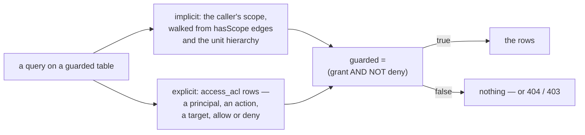

RBAC answers "may this caller call this method". It has one blind spot, and everybody meets it the
first time a customer service user opens a list and sees every customer in the company: the method
is allowed, and the _records_ are all of them.

An access-control list closes that gap without touching the method check. It is opt-in per table,
evaluated in SQL as part of the query, and it can only ever take permission away — which is the
property that makes it safe to add to a running system.

<!-- truncate -->

## Two halves, one verdict



The **implicit** half is the hierarchy, and it lives in the same resource graph as everything else:
a `hasScope` edge says a caller acts within a scope, and a unit tree says which scopes contain
which. Because it rides the existing hierarchy, moving a person between units needs no ACL change —
which is the whole reason it is not a table of grants.

The **explicit** half is `access_acl`: one row per rule, with a principal (a user, a role or a
unit), an action, a target (`record`, `scope`, or `all`), and an effect. The two are combined as
`(grant) AND NOT (deny)`, so an explicit refusal beats an inherited grant.

Two details of that table are worth knowing because they are easy to get wrong from the outside. A
**capability is not a valid principal**: the filter resolves the caller, their effective roles and
their units (plus those units' ancestors) — nothing resolves a capability — so a rule naming one
sits inert. And a `deny` has exactly one hole, which is the same property that makes the guard safe
to adopt: the combined filter is `(unscoped OR guarded)`, and the `unscoped` term short-circuits for
a record that participates in no scope. An explicit deny on such a record is therefore not applied.
A deny on a record _inside_ a scope is honoured, which is the case rules are written for.

## Opting in changes nothing — in the default mode

Declaring the guard on a table is a two-line change in the schema, and it is deliberately a no-op on
existing data:

```typescript
acl: {mode: 'scoped', scopes: ['belongsTo'], addScope: {predicate: 'belongsTo'}},
```

`mode: 'scoped'` means a record that participates in no scope is not narrowed: it falls back to
RBAC. So guarding a table with ten thousand rows does not hide any of them until a grant mentions
them, which is what makes the change reviewable. `mode: 'explicit'` is the opposite and deserves a
decision rather than a default: there the unscoped fallback is not built, and every record is
deny-by-default — per-record grants only.

The two shapes of scope exist because a hierarchy can point either way. Usually a record points _at_
its scope (`scopes: ['belongsTo']` — a person belongs to a unit). When the record _is_ the scope —
an organization level whose children are the records — it declares itself (`selfScope`), which is
how the top of a hierarchy is enforced without inventing a scope for it.

## Enforced by the runtime, not by each handler

The guard is a property of the generic CRUD, which is the difference between an ACL that is real and
one that is remembered in some handlers. Concretely, for a guarded table:

| Operation        | A denied record is…                                                          |
| ---------------- | ---------------------------------------------------------------------------- |
| `get`            | **not found** (404) — the row is not there as far as the caller is concerned |
| `edit`, `remove` | **forbidden** (403)                                                          |
| `find`           | filtered **before** paging, so a page of ten is ten visible rows             |
| dropdowns        | filtered too — a dropdown is a read, and leaks names otherwise               |
| `add`            | checked against the scope the new record names                               |

The `get`-as-404 choice is the deliberate one: telling a caller "this exists but you may not see it"
is itself a disclosure. And `find` filtering before paging matters more than it sounds — filtering
after a `LIMIT` is how an ACL produces pages of three rows and an afternoon of confusion.

One asymmetry is worth recording rather than discovering: the scope check on `add` only fires when
the payload names a scope. An `add` that names none is allowed on the generic path, so a table that
requires every new record to be scoped should say so in its `addScope` declaration and keep the
guard's own check as the backstop it is — the stricter refusal is on the check path used by
`access.session.verify`.

## Deleting a guarded record releases its rules

A guarded record that is deleted takes its rules with it, in the same operation and before the
entity row goes: rules are removed by principal, target and action, so a delete cannot fail half-way
and leave a rule pointing at a row that no longer exists. The reverse also holds — a rule for a
record that was never created cannot accumulate, because the guard answers "not found" for it
anyway.

The cost of the design is that the verdict is computed as SQL on every query rather than cached in a
table, so it is a join away from being free rather than free. That is the trade chosen here: a
materialized effective table would need invalidating on every hierarchy change, while a filter on
the query is always current. The one thing that must still be refreshed is the graph itself — the
verdict reads `access.effectiveScope` for a record's ancestors and `access.effectiveRole` for a role
or unit principal, so a hierarchy change needs `CALL access_pathRefresh()` before the narrowing
reflects it.

The mechanism is in [the ACL concept](/docs/concepts/acl), the declarations and rule fields are in
[the pattern](/docs/patterns/acl), and [the rationale](/docs/rationale/acl) argues why the narrowing
sits beside RBAC instead of inside it.
