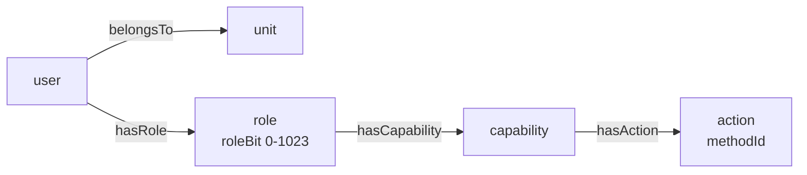

Start with a number, because the number is the idea. A role in Blong is a **bit**, numbered 0
to 1023. A caller holds a set of them, the signed token carries that set as a base64 bitmask under
the `per` claim, and the gateway answers "may this caller invoke this method?" without asking a
database anything.

Six roles in a development database look like this — the bit beside the name, and the mask the login
hands out:

```text
access_role:        0 Admin · 1 Manager · 2 Customer Service · 3 Customer · 4 Guest · 5 NoLogin
access.user → per:  testAdmin [0] AQ==   testViewer [3] CA==   testGuest [4] EA==   testNoLogin [5] IA==
```

`AQ==` is one byte with bit 0 set. `CA==` is bit 3. The claim is the whole authorization payload a
request carries, and it travels in a header rather than in a session lookup — which is what makes
the check cheap, and what makes revocation a separate problem that sessions exist to solve.

<!-- truncate -->

## The four-node graph



Roles are reached directly (`hasRole`) or through the unit the user belongs to, and they bundle
**capabilities**, which group **actions**, and an action _is_ a method name. So a role is a named
bundle of methods, a caller's roles are a bitmask, and the question at the gateway is whether the
requested method appears in the expansion of that mask.

Allocation is `MAX(roleBit) + 1`, starting at 0, and the bit is immutable: an edit that tries to
change one is refused with a typed error. Two properties follow, and they are worth stating
precisely because the loose version is wrong. Bits are unique and are not recycled — **except for
the highest one in use**: allocation is `MAX + 1`, so deleting the role that owns the current
maximum hands that same bit to the next role created. And exhausting the range throws, at 1024
roles, with a message that names the limit; it is not a typed `role.*` error, which is a gap in an
otherwise tidy error model.

## The materialized paths, and where they are actually read

The graph is not walked per request. `CALL access_pathRefresh()` rebuilds `core_path` for three path
types — `access.effectiveRole`, `access.effectiveAction` and `access.effectiveScope` — from two SQL
views plus a recursive `isPartOf` walk for the scope one.

Here the obvious description is the wrong one, and it took a verification pass to catch: **the
gateway's authorization hook does not read `core_path`**. It queries `core_triple` directly, joining
`hasCapability` and `hasAction`. The materialized paths are read at **login** — where the `per`
bitmask is built from `access.effectiveRole` — and by `access.session.verify`, which re-checks login
eligibility from `access.effectiveAction`. So "one indexed lookup instead of a recursive walk" is a
true statement about login and session verification, and a false one about the per-request check,
which is a single query against the graph's edge table either way.

What the per-request check _is_ free of, while warm, is the database. `access.authorization.list`
expands the bits into allowed method ids and caches the answer per caller for thirty seconds — a
value a caller may override per call — beside a token-to-credentials cache. On a miss it queries.
The honest phrasing is "no database round-trip on the hot path **while the cache is warm**", and the
TTL is the knob that trades authorization freshness for that.

## One hook, two failure modes

The gateway has exactly one authorization point, which is why the failure modes are consistent. A
request whose method is not in the caller's expansion is refused with **403**; a request with no
token at all, or an invalid one, is refused with **401**. That distinction is the useful one: 401
means "you are not authenticated", 403 means "you are, and this is not yours".

And logging in is itself a permission. `accessLogin` has to be among the caller's effective actions,
or `login.token.create` and `login.token.restore` refuse — so deactivating a user or withdrawing
that one action ends both the ability to get a new session and the ability to resume one from the
restore cookie. `access.session.verify` re-checks it on renewal for the same reason: a revoked grant
that could still be restored would not have been revoked.

## What this design buys, and what it costs

The buy is the reason all of it exists: no realm needs to know another realm's method names. A
method is guarded by naming it in an action; the actions are grouped by capabilities, the
capabilities by roles, and none of those names appears in a handler's code. Adding a permission is a
row, not a branch in an `if`.

The cost is paid in three places, and all three are visible in the schema rather than hidden. The
bitmask bounds you to 1024 roles — comfortable, and a hard ceiling. Permissions are evaluated from
the token, so they are as fresh as the token is: the 30-second cache is a deliberate staleness
window, and anything that must take effect _immediately_ needs the session gate rather than the
bitmask. And since the graph is materialized, a hierarchy change needs `access_pathRefresh()` before
it is reflected in a login's expansion — the paths do not maintain themselves.

Read next: [the RBAC concept](/docs/concepts/rbac) for the graph and the gate,
[the pattern](/docs/patterns/rbac) for seeding and granting, and
[the resource graph](/docs/concepts/resource-graph) for the tables the roles are stored in.
