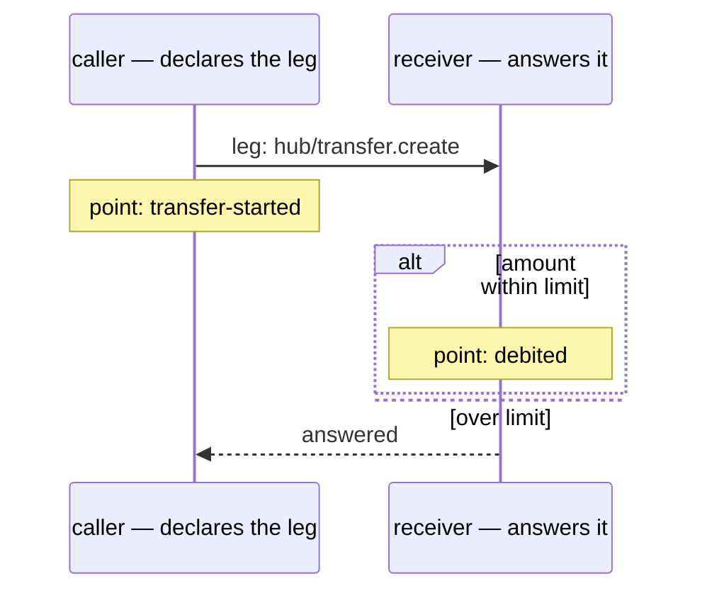

Every architecture diagram in a wiki is wrong. Not because anybody was careless, but because a
diagram is a claim about what the code does, written by hand, and the code moves. The picture that
survives is the one that is generated from a run — and generating it needs records that carry more
than a message.

Semantic logging carries exactly enough: the leg each call belongs to, the checkpoints a handler
passed, and the branches its decisions took. From those, a sequence diagram of a real execution
falls out — and the interesting part is not that it can be drawn, it is what a reader can tell from
it.

<!-- truncate -->

## An arrow needs both ends

A call becomes an arrow because the **caller** declares the leg and the receiver answers it. That
asymmetry is what the generator keys on: an observation carrying both an origin and a destination
makes an arrow, and one carrying only its own side does not:

```typescript
if (observation.to === undefined || observation.from === undefined) continue;
```

So the receiver's records do not draw anything by themselves — they fill in the `answered` side of a
leg somebody else declared, and when the pairing is attributable, a dashed response. The practical
consequence is that a diagram of a real execution shows you the calls that were _observed from the
caller's side_, which is the same set the framework actually made, rather than a set of participants
guessing about each other.

Each arrow's label is a literals-in-code string — a leg id, a method name — which is what makes the
picture greppable: the test that guards the committed diagram asserts that every label is declared
in a particular file and line.

## Checkpoints are notes; decisions are branches

```text
    Note over db: point: merge-started
    alt role-bit = declared
    else allocated
    Note over db: point: role-bit-allocated
    Note over db: point: bundles-merged
    end
```

The fragment above is the middle of a generated block rather than a diagram on its own — it is the
part that carries the decision — and the same parts compose into a whole one:



That is a real excerpt from a committed artefact, and the shape is the whole idea. The handler's
checkpoints become `Note over` lines — `point: <name>` — and its `decide` call becomes an `alt`
block whose arms are the candidates the code declared. Two details make the branch honest rather
than decorative:

- **Every candidate is drawn, including the ones that were never evaluated.** Evaluation stops at
  the branch the code takes, so an unchosen alternative is a real possibility that a reader wants to
  see. A candidate the run never reached gets `— not weighed` in its arm, and an arm with nothing to
  draw is drawn empty (mermaid refuses an empty section in the last position, so the arms are
  reordered: the empty ones first, the one carrying calls last). The labels are the candidates'
  names, so the order is a rendering concern rather than a claim about evaluation order.
- **The decision record is written before the branch runs**, so any checkpoint announced inside the
  taken branch lands inside that arm of the block rather than before it. That is why the excerpt
  above reads the way the code reads: the decision, then the work it chose.

Phases are the third decoration, and they come from something else entirely: the step a call
declared when it started, which the framework turns into the participant's band.

## What keeps a drawing honest

A generated diagram is only worth trusting if it is compared against a real run, so the mechanism
has three parts:

1. **A fixture that runs a flow and produces the records.** The semantic-log observed-flow test runs
   the fixture in-process and asserts the diagram it generates.
2. **A committed artefact** — the mermaid source, in the repository, registered in the
   documentation's artefact list with the command that regenerates it.
3. **A comparison.** The test asserts that the committed artefact still equals what a run produces,
   so a change to a handler that moves a checkpoint, adds a branch or drops a call turns into a diff
   on the picture rather than an unnoticed drift. Alongside it, a Playwright capture writes the
   rendered image, so the screenshot is regenerated by the same run that draws the diagram.

The evidence that this works is unglamorous and worth stating: the observed-flow test passes with
every arrow's label checked against its source line, the diagram generator's own tests cover the
rendering of points, empty arms and the `alt` blocks, and the checkpoint tests cover the degradation
— a checkpoint is absent in production, while a `decide` is always attached, because a branch that
went missing would not lose a note, it would skip the work.

## What a reader gets that a log cannot

Read the excerpt again and consider what it answers. Which participant did the work — the band and
the participant. What the handler was doing when it did it — the notes. What it considered and
rejected — the arm that says `not weighed`, and the arm it took. In the full diagram, the same
information exists for every leg of the flow, which is what makes it a diagram of _that run_ rather
than of the design: the difference between the two is exactly the information an incident needs.

The concession worth making: this is not a free lunch. The diagram is only as complete as the
declared legs, and a call the framework makes without a declared leg is, correctly if unhelpfully,
absent — the picture is honest about its own coverage in the same way the report is. And the
decorations are more than the two the concept page names: phases and withheld-payload notes are
drawn as well, so "checkpoints and decisions" is the shape of the progress points rather than the
whole vocabulary of the drawing.

[The flow patterns](/docs/patterns/semantic-log-flows) walk a diagram leg by leg;
[the checkpoint concept](/docs/concepts/checkpoint) is the mechanism behind the notes and branches,
and [the rationale](/docs/rationale/semantic-log) states the rules the drawing follows.
