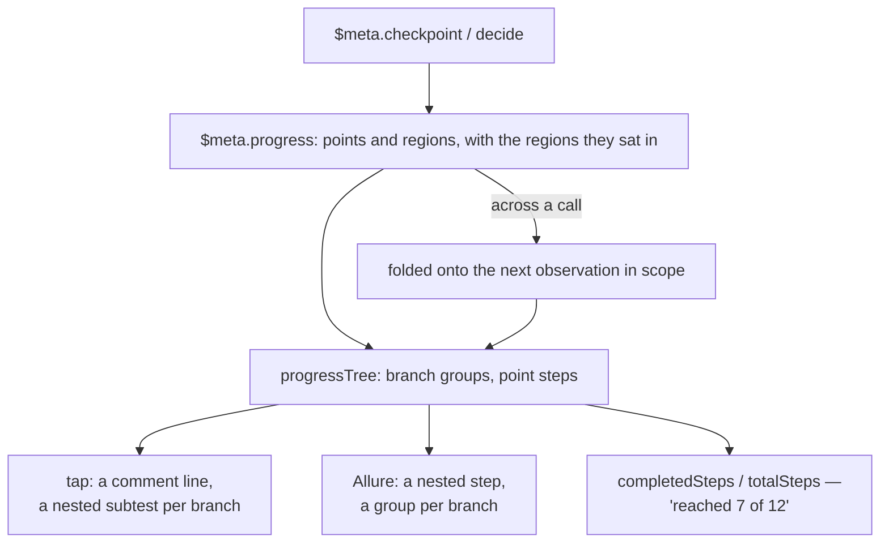

A failing test that says `expected true, got false` is a puzzle. It tells you the assertion, not the
journey: which step of twelve ran, which branch was taken, what the values were when the decision
was made. So the first thing anybody does with a red build is re-run it locally with print
statements — paying for the same information twice.

Blong's handlers can announce where they are. A **checkpoint** is a named moment with data; a
**decision** is a branch with its candidates. Both travel with the work, both reach the report, and
both are free in production — which is what makes them worth writing into the code rather than into
a test.

<!-- truncate -->

## A named moment, and a branch

```typescript
export default handler(() => ({
    async transferExecute(params: {accountId: string; amount: number}, $meta: IMeta) {
        const account = await accountGet({id: params.accountId}, $meta);
        $meta.checkpoint?.('account-loaded', {accountId: account.id, balance: account.balance});

        const fee = $meta.decide('fee-tier', {total: params.amount}, [
            {name: 'standard', when: () => params.amount < 1000, run: () => 0.01},
            {name: 'premium', when: () => params.amount >= 1000, run: () => 0.005},
        ]);

        $meta.checkpoint?.('fee-applied', {fee});
        return {fee};
    },
}));
```

Two APIs, and the difference between them is the point. A checkpoint records a moment and its data:
it may be dropped, because nothing else depends on it. A decision records the discriminator, the
values it saw, and **every candidate the code declared** — because the branch _is_ the control flow,
and an alternative that was weighed and refused is exactly what a reader of a failure needs to see.

The data is printed while it stays small enough to read: the shortest properties, values longer than
a line left out, and the count of what was left out — so a line never reads as the whole story when
it is not.

## Free in production, asserted in a test

The registry attaches the two handles per mode:

| Environment | `$meta.checkpoint` | `$meta.decide` | Recorded                                           |
| ----------- | ------------------ | -------------- | -------------------------------------------------- |
| Production  | `undefined`        | always         | the branch rationale only — worth tracing anywhere |
| Debug       | recording function | always         | points and branches, kept in `$meta` and logged    |
| Test        | recording function | always         | the same, and `assert` is attached as well         |

`checkpoint` is **absent** rather than a no-op, which is what makes the `?.` in handler code free:
no call, no allocation, no branch in a hot path. `decide` cannot be treated the same way, because a
missing helper would not lose a note — it would skip the work the branch was doing.

The optional assertion is a separate handle, and this is the part that is routinely misread: **a
checkpoint does not take an assertion.** The registry attaches `assert` on the same mode, so a
handler written `assert?.ok(result.transferId, 'Transfer created')` is a no-op in production and an
assertion in a test. One handler, one expression, two jobs — which is the whole reason a check can
live in production code without a conditional around it.

## How a point reaches the report

The mechanism is the same one the log uses, and it has three hops:

1. **In the process**, a point or a region is pushed onto `$meta.progress` with its timestamp and
   the regions it sat in.
2. **Across processes**, the service folds progress onto the next observation in scope by union of
   names, which is what "travels with the next record" means in practice: an entry that arrived from
   another process still says which branches it sat in, even though that process numbered them.
3. **In the report**, the progress tree turns the flat list back into a hierarchy — a point becomes
   a step or a comment line, and a branch becomes a **group** of the points taken inside it, keyed
   by the discriminator and the chosen branch.



That last box is the sentence the plan wanted: a test that can say how far it got. It is derived,
not counted by hand — the points a test announced against the points it declared — so it cannot
drift from the code that announces them.

The two report ends are worth naming because they demonstrate the same tree serving different
consumers: tap renders a point as a comment line and a branch as a nested subtest; Allure renders
the point as a nested step and the branch as a group. Neither report needed a feature for this — the
hierarchy was already there, and the progress tree simply fills it.

[The checkpoint concept](/docs/concepts/checkpoint) has the full API and the mode table;
[the unified handler test rationale](/docs/rationale/unified-handler-test) is the contract behind
the optional assertion, and [the test pattern](/docs/patterns/test) covers the step-level `assert`.
