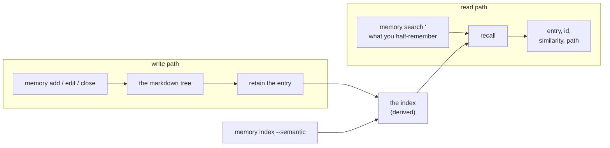

A friction entry is written in the words of the problem, and it is read months later by somebody
recalling a situation rather than a phrase. The two rarely match. `F-325` is titled _A cached stats
read made a finished ingest look stuck_; the question that should find it sounds more like "the
summary endpoint kept reporting work as outstanding after the log said it was done". What the entry
and the question share is the situation, and a text search cannot see it.

[The previous post](/blog/the-repo-remembers-what-cost-effort) was about the notes themselves —
markdown, ids, one command that owns their format. This one is about what now sits beside them: an
index the same command feeds as it writes, and a search that takes a question in your own words.

<!-- truncate -->

## The query is a situation, not a phrase

Grepping the tree works when you remember a phrase. You rarely do: what you remember about the
afternoon is what it felt like, and the entry was written by whoever stopped to describe the cause.
`memory search` closes that gap by embedding the question and comparing it against an embedding of
every entry, so the match is on meaning rather than on the words that happened to get typed:

```bash
blong-dev memory search "A summary endpoint kept reporting work as outstanding for half a minute after the log said it had finished"
blong-dev memory search "two realms answer the same config call" --area cross-cutting
blong-dev memory search "the schema is created from what" --kind decision --limit 3 --json
```

That first question returns `F-325` first, at 0.676 similarity — an entry whose title is _A cached
stats read made a finished ingest look stuck_. Trimmed, its answer looks like this: the id, the kind
and status, the similarity, the file, and then the entry as written.

```text
--- 1/8 ----------------------------------------------------------------------
F-325 · friction · open · similarity 0.676
tools/blong-dev/.github/memory/friction.md

### F-325 — A cached stats read made a finished ingest look stuck
...
```

The header line is the whole point: `F-325` is what you cite afterwards, in a plan, a comment or a
commit message, exactly as if you had grepped it.

## Two paths, one derived index

The feature is small on purpose. The files are the source of truth and the index is downstream of
them, in both directions:



The **write path** is a hook, not a second thing to remember to run: `add`, `edit`, `close`, `move`
and `prune` push the entry they touched into the index after the file is written. The markdown is
unchanged by it, and a hook that cannot reach the server costs a warning rather than a failure.

The **read path** is one command with filters for kind, area and status, so "find the decision about
this" is one keystroke away from "find anything about this".

The **backfill** exists because the index is derived and therefore disposable:
`memory index --semantic` walks the whole tree and re-ingests every entry, which is the recovery for
a wiped bank, a new machine, or a question about whether the index still matches the files. Today it
rebuilds all 596 entries in about half a minute.

## The files stay the source of truth

Three properties keep the index from becoming a second, quietly diverging record:

- **Nothing is rewritten.** The bank retains entries verbatim — no model summarises them on the way
  in — so what search prints is what the file says, and a bad entry is fixed by editing the file,
  not by re-teaching a model.
- **The index can be deleted.** Losing it costs a rebuild, not information, which is what makes it
  safe to treat as a cache rather than a database.
- **An unreachable server degrades asymmetrically.** A write still lands, with a warning, because
  losing a decision to a network problem would be the worse failure. A search that cannot reach the
  server exits non-zero and says which URL it tried, because an empty answer would be mistaken for
  "no such note". One environment variable switches the whole feature off for anyone who wants none
  of it.

| Setting              | Default                 | Turns                                              |
| -------------------- | ----------------------- | -------------------------------------------------- |
| `HINDSIGHT_API_URL`  | `http://localhost:8888` | which server the index lives on                    |
| `HINDSIGHT_BANK`     | `blong`                 | which collection of entries to read and write      |
| `HINDSIGHT_DISABLED` | unset                   | the write hook off, for a machine without a server |

## One choice that could not be undone

Almost everything about the index is reversible by deleting it — except the width of the vectors it
stores, which the schema fixes the first time a document is written. So the embedding model was
measured rather than guessed: the built-in 384-wide model against two Ollama models of 768 and 1024
dimensions, over 36 questions derived from entry bodies, ranking the whole tree.

All three returned every question in the **same order**. A wider model changes which documents reach
the reranker's shortlist, and then the reranker reorders them regardless — so the model hides
beneath the stage that dominates both quality and cost. With reranking off the models do diverge, by
two questions out of 36, in no consistent direction. The built-in model therefore stayed: it needs
no second host, no API key and no network round trip, and it stores a vector less than half the
width of the largest candidate. The numbers live with the plan that produced them.

## What a search costs

| Reranker | hit@1 |  MRR |  latency |
| -------- | ----: | ---: | -------: |
| on       |   92% | .929 | 7 637 ms |
| off      |   42% | .554 |    66 ms |

Two stages run behind `memory search`: a cheap first pass that embeds the question and takes the
nearest entries, and a cross-encoder that then scores each candidate against the question properly.
The second stage is the fifty points of accuracy and the seven seconds, and it is a per-bank
setting, which is why flipping it is a decision about the whole tool rather than about one query.

Two limits are worth stating. 36 questions resolve differences of about ten points at best, so the
model result is "no large benefit found" rather than "no difference exists". And a corpus of notes
all written in one house style is a friendly one — everything shares vocabulary with everything
else, which flatters any index that reads words. A second corpus would be the honest way to re-check
both claims.

The commands, the entry shape and the settings are in
[the memory pattern guide](/docs/patterns/memory); [the concept page](/docs/concepts/memory) covers
what the notes are, and [the rationale](/docs/rationale/memory) explains why the files are markdown
with ids rather than a database — which is also why the index beside them is allowed to be
disposable.
