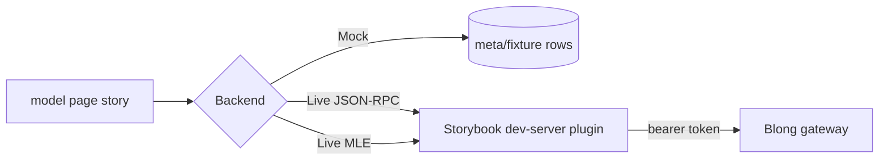

A Storybook story is the cheapest place to look at a screen and the most expensive place to trust
one. The model page renders perfectly in the story, and in the application it fails — because the
story's rows came from a fixture file and the gateway method the page calls does not exist. The
toolbar that used to solve this in the previous, webpack-based setup has been rebuilt for Blong's
Vite Storybook, and a realm now gets it in one line:

```tsx
export default defineBlongStorybookPreview(browser, {backend: true});
```

That line brings five toolbar items — Backend, Role, Theme, Language, Direction — and the machinery
behind them. This post is about the two interesting ones.

<!-- truncate -->

## A story needs to be allowed to be wrong

The mock in Blong is a good mock: it replaces each model's handler group with an in-memory
implementation over `meta/fixture` rows, so `page('coral.coral.browse')` renders a real table with
real paging, sorting and filtering, and no server anywhere. That is what makes a story a five-second
review of a UI change.

It is also what makes a story a claim nobody checked. The mock answers for a method the gateway may
never have been told about, with rows no database holds, under permissions the page never had to
enforce. The gap opens in the _wiring_, which is exactly the part a mocked story removes.

So the toolbar's Backend item has three values, and two of them take the mock out of the path
without changing anything above it:



## The switch belongs in the adapter

Nothing in the page knows which mode it is in. The mock is a backend-adapter behaviour, so switching
means activating a different adapter block — `storybookJsonrpc` or `storybookMle` instead of
`storybook` — and everything above the adapter (the model system, the generated pages, the
permission-driven hiding of buttons) is the code the application runs. That is the whole point: the
story is not a simulation of the app, it _is_ the app pointed somewhere else.

The two live values trade fidelity for simplicity:

| Value           | On the wire                                                                 |
| --------------- | --------------------------------------------------------------------------- |
| Live (JSON-RPC) | The page speaks plain JSON-RPC; the plugin adds the token and decrypts.     |
| Live (MLE)      | The page keeps its own key pair and encrypts end to end; the plugin tokens. |

The plugin is a Storybook dev-server middleware (`src/storybookBackend.ts`, mounted by
`defineBlongStorybookMain`), which is also where authentication lives — because a story has no
business holding credentials.

## Logging in without a login screen

The JSON-RPC mode was easy to authenticate: the plugin holds a session and injects the bearer token,
so nothing in the page ever sees one.

The MLE mode was not, and finding that out was the most useful hour of this work. The plan was for
the plugin to mint a token the page could use — one whose signing and encryption keys travel in each
request's JWE header rather than being baked into the JWT. The gateway supports that shape, and the
plugin sent just such a login: plain JSON, no caller keys, so there was nothing to bind the token
to.

It does not work, and the reason is worth writing down: a login response is encrypted no matter
what, so the plugin could never read its own token back out. A token the page cannot be given is not
a token at all.

So the MLE mode logs in from the page, through the platform's own codec — a real session whose key
pair is the one the browser generated, renewing itself exactly as it would in the application. The
dev server's part is to hand the story's own origin the role's credentials, on loopback, and to get
out of the way of the encryption. The reviewer still never sees a login screen: the login belongs to
the decorator, and the story waits for it before it renders — rendered first, it would fetch without
a session, take a 401 and stay empty even after the session arrived.

Which users the roles mean comes from the `.blong_devrc` the developer's other tooling already
reads, with the seeded test users as the default:

```yaml
storybook:
    target: http://localhost:8080
    roles:
        Admin: testAdmin
        Manager: testManager
```

## The presentation items write state, not props

Theme, Language and Direction exist for a reason that is easy to miss: no story renders the portal
menubar, so the switchers the application ships — the ones that live in that menubar — are invisible
in a story, and a review of a right-to-left layout or a glass skin had nowhere to happen. Those
items have no prop to write to, because the platform built the container the story is rendered
inside; they write the app store instead, which is the same place the portal's own switcher writes.

One consequence is worth stating, because it was a bug before it was a rule: a store write is
global, so the toolbar's _defaults_ must never be written. A story that sets its own `lang` arg —
the editor's validation story renders in Bulgarian that way — keeps it until a reviewer actually
reaches for the toolbar.

## What a realm gets

A realm that adds `{backend: true}` to its preview needs two things to make the Role item
meaningful, and the template now ships both: a fixture whose record ids mirror the test seed's (so
the Open story loads from either source) and a test-seed grant for each role — full access for
Admin, read and edit for Manager, read-only for Guest.

All three grants have to include `subject.object.schema`, which sounds like a detail and is not: a
model page loads its own schema before it loads rows, so the first version of the read-only role got
a 403 for the schema and rendered a blank screen instead of a smaller one. A Guest who can browse
and is then refused a save is the story worth showing; an empty page shows nothing at all.

A state is a URL, which makes the whole thing scriptable — this is how the documentation's own
screenshots and any Playwright run over Storybook reach a state without clicking:

```text
http://localhost:6007/?path=/story/coral-coral--browse&globals=backend:jsonrpc;role=Guest
```

## Try it

```bash
# a gateway to point at (a static port must be given: a server-only entry
# otherwise picks a free one, and it is not logged)
cd core/blong-kopi && node --run blong -- microservice integration dev playwright \
    --gateway.port=8080 --resolution.portGateway=8080

# the realm's stories
cd core/blong-kopi && npm run storybook
```

Then switch Backend to Live (JSON-RPC), leave Role on Admin, and watch the browse page fill with
rows from the database instead of the fixture — the ids and the `(fixture)` marker in the name say
which one you are looking at. Switching to Live (MLE) shows the same rows through the page's own
encryption, and switching Role to Guest leaves the list readable until you try to save.

The full picture is in the [story toolbar pattern](/docs/patterns/blong-browser#the-story-toolbar),
the reasoning in [the story toolbar rationale](/docs/rationale/storybook-toolbar), and the previous
generation of the idea — where the backend choice was the name of a configuration file — lives on in
`ut-storybook`.
