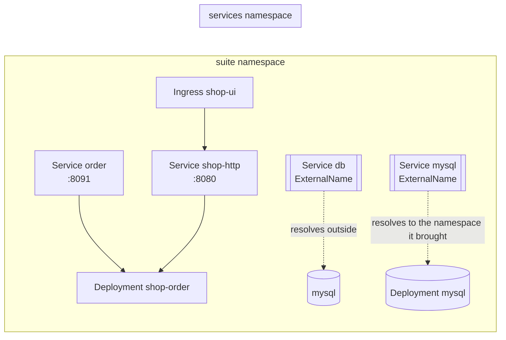

A Blong suite already knows what it is: which realms loaded, which layers registered, which
orchestrator namespaces were claimed. So we stopped writing that down a second time and made the
deployment read it.

```bash
blong ./suite/blong-suite/index.ts k8s
```

That writes `system/kustomize/` — Deployments, Services, volumes, RBAC — and exits. Nothing was
configured to say which layer belongs to which process, because the answer was already in the
registry.

<!-- truncate -->

## The same code, twelve shapes

The framework's promise is that a suite runs as a monolith in development and as independent
services in production without changing a line. That promise needs a mechanism, and the mechanism is
now a profile:

| Profile     | Processes                      |
| ----------- | ------------------------------ |
| `monolith`  | one                            |
| `realm`     | one per realm (the default)    |
| `namespace` | one per orchestrator namespace |
| `group`     | the groups the config names    |

Same sources, different clustering. The interesting part is not that it works — it is that the plan
_derives_ the split, so adding an orchestrator to a realm extends the deployment without anyone
updating a map.

## Namespaces are addresses

An orchestrator namespace becomes a Service with the same name. When one process calls another, it
names the namespace; the cluster resolves it. The same idea covers third-party systems: a suite
names `db`, and an `ExternalName` decides what `db` means in this cluster — and when the service is
one an adapter implies, the deployment _brings_ it: the workload lands in a namespace of its own and
the alias keeps the suite naming `mysql` rather than a host.



That last pair of arrows is the point: the suite never learns the address, whether the database was
already there or arrived with the deployment.

## The part that surprised us

A per-version volume sounded simple. It is not, because a `ReadWriteMany` volume shared across nodes
needs a storage class a bare cluster does not have — and an installer that only installs on clusters
with the right storage is not an installer.

So the default is a per-node cache: a DaemonSet unpacks the artifact into a version directory and
the deployments mount it read-only. No storage class, and the shared volume stays available where it
exists.

That DaemonSet then taught us something a dry run could not. Its only container fetched the
artifact, succeeded, exited 0 — and was restarted forever, because a DaemonSet restarts anything
that exits. `CrashLoopBackOff`, with no logs at all, which reads like a broken command rather than a
completed one. The fetch is an init container now. Applying the generated tree to a real two-node
cluster found it in a minute; every validation before that had been happy.

## What we deliberately left out

The blong-kustomize realm has no database of its own. It therefore has no user table, so the
deployment UI's authentication is the cluster's — ingress annotations for basic auth or an oauth2
proxy — and the operator's identity is its ServiceAccount. A realm that needed a database in order
to deploy a framework would be the wrong shape, and the services a deployment brings are generated
as manifests rather than depended on: nothing here connects to anything.

The GitOps handoff is a seam, not an implementation: a handler that reports it pushed nothing is
more useful than one that pretends it did.

_Read the [concept](/docs/concepts/kustomize), the [pattern](/docs/patterns/kustomize) or the
[rationale](/docs/rationale/kustomize)._
