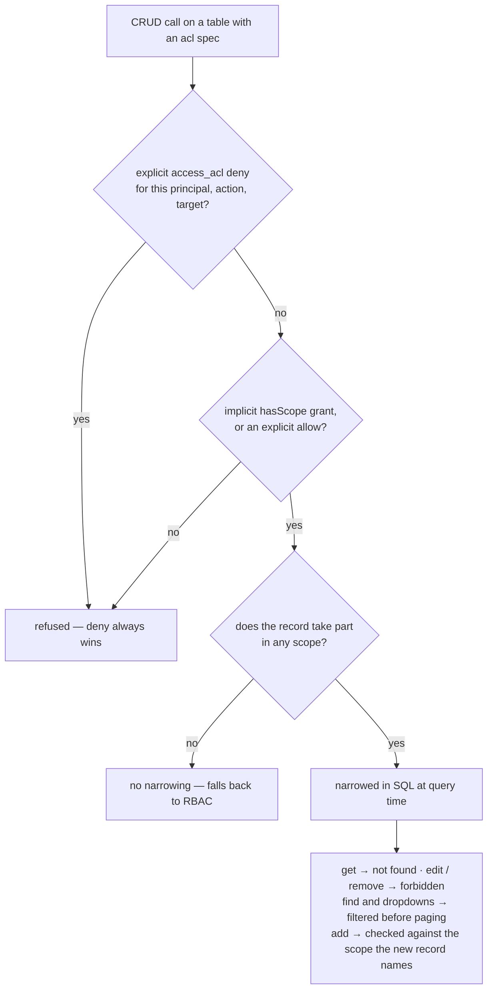

# Record-level ACL

Role-based access control decides **which methods** a caller may invoke. The record-level ACL
narrows **which records** those methods may act on. It is opt-in per table, evaluated in SQL at
query time, and it never widens RBAC — it can only take away.

## Key behaviours

- **Two halves, one verdict.** _Implicit_ grants are `hasScope` edges in the resource graph: the
  organizational grant, covering every record reachable from that scope (descendants included).
  _Explicit_ rules are `access_acl` rows — principal, action, target, effect. A **deny always
  wins**.
- **Enforcement is declarative.** The runtime's generic CRUD refuses a denied `get` as _not found_,
  a denied `edit` or `remove` as _forbidden_, filters `find` and dropdowns **before** paging, and
  checks `add` against the scope the new record names. A handler that writes its own SQL asks the
  adapter for the same verdict instead.
- **Opting in is safe.** A record that participates in no scope is not narrowed at all — it falls
  back to RBAC — so guarding a table with existing rows changes nothing until a grant mentions it.
- **Two scope shapes.** Usually a record points _at_ its scope (`scopes`); when the hierarchy points
  the other way the record is its own scope (`selfScope`), which is how the organization level of
  the hierarchy is enforced.
- **A removed record releases its rules.** Deleting a guarded record deletes the rules that name it,
  so the delete cannot fail half-way and leave an unusable row.

See the [ACL pattern](../patterns/acl.md) to put the guard on a table and write rules, and the
[ACL rationale](../rationale/acl.md) for why the narrowing sits next to RBAC instead of inside it.
The `blong-access` README has the full rule and field reference.
