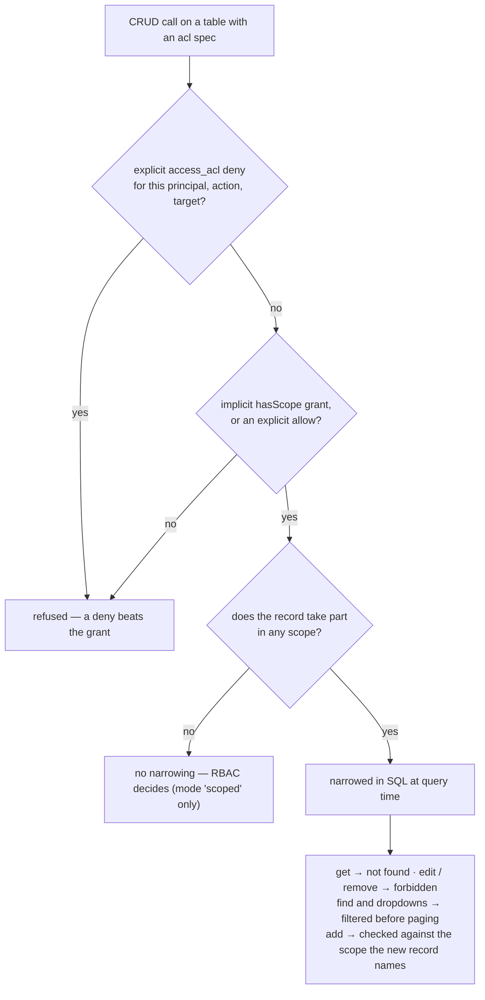

# Record-level ACL

Role-based access control decides **which methods** a caller may invoke. The record-level ACL
narrows **which records** those methods may act on. It is opt-in per table, evaluated in SQL at
query time, and it never widens RBAC — it can only take away.


```mermaid
flowchart TD
    call["CRUD call on a table with an acl spec"] --> deny{"explicit access_acl deny<br/>for this principal, action, target?"}
    deny -->|"yes"| refused["refused — a deny beats the grant"]
    deny -->|"no"| grant{"implicit hasScope grant,<br/>or an explicit allow?"}
    grant -->|"no"| refused
    grant -->|"yes"| scope{"does the record take part<br/>in any scope?"}
    scope -->|"no"| passThrough["no narrowing — RBAC decides (mode 'scoped' only)"]
    scope -->|"yes"| sql["narrowed in SQL at query time"]
    sql --> effect["get → not found · edit / remove → forbidden<br/>find and dropdowns → filtered before paging<br/>add → checked against the scope the new record names"]
```

## Key behaviours

- **Two halves, one verdict.** _Implicit_ grants are `hasScope` edges in the resource graph: the
  organizational grant, covering every record reachable from that scope (descendants included).
  _Explicit_ rules are `access_acl` rows — principal, action, target, effect. A **deny beats the
  grant** for a record inside a scope; the hole below is the one place it does not.
- **Enforcement is declarative.** The runtime's generic CRUD refuses a denied `get` as _not found_,
  a denied `edit` or `remove` as _forbidden_, filters `find` and dropdowns **before** paging, and
  checks `add` against the scope the new record names. A handler that writes its own SQL asks the
  adapter for the same verdict instead.
- **Opting in is safe — in the default mode.** With `mode: 'scoped'` a record that participates in
  no scope is not narrowed: it falls back to RBAC, so guarding a table with existing rows changes
  nothing until a grant mentions it. `mode: 'explicit'` is the opposite and worth choosing
  deliberately — there the unscoped fallback is not built at all and every record is deny-by-default
  until a rule allows it.
- **A deny wins, with one hole.** The guard is `(unscoped OR guarded)`, and the unscoped term
  short-circuits for a record that participates in no scope. An explicit `record`-targeted deny on
  such a record is therefore ignored — the same property that makes opting in safe. A deny on a
  record _inside_ a scope is honoured, which is the case the rules are written for.
- **Two scope shapes.** Usually a record points _at_ its scope (`scopes`); when the hierarchy points
  the other way the record is its own scope (`selfScope`), which is how the organization level of
  the hierarchy is enforced.
- **A removed record releases its rules.** Deleting a guarded record deletes the rules that name it,
  so the delete cannot fail half-way and leave an unusable row.

## The decision matrix

The verdict is one expression:

```text
guarded = ((implicit ∨ explicit-allow) ∧ ¬explicit-deny)
verdict = unscoped ? ALLOW : guarded
```

### What the code declares

Three of the four shapes are declared in `realm/blong-party/meta/db/db.ts`:

```ts
// The record points at its scope: a person is acted on within its unit.
'party.person': {
    order: 300,
    resource: {nameColumn: 'lastName'},
    acl: {mode: 'scoped', scopes: ['belongsTo'], addScope: {predicate: 'belongsTo'}},
},

// The record is its own scope: the hierarchy points the other way
// (`unit --belongsTo--> organization`), so there is no scope edge to follow.
'party.organization': {
    order: 301,
    resource: {nameColumn: 'legalName'},
    acl: {mode: 'scoped', selfScope: true},
},

// A unit is scoped at its organization, like a person is scoped at its unit.
'party.unit': {
    order: 302,
    resource: {nameColumn: 'unitName'},
    acl: {mode: 'scoped', scopes: ['belongsTo'], addScope: {predicate: 'belongsTo'}},
},

// A table with no scope edges at all: a rule is the only way in, and there is no
// scope set for a `scope` target to match, so only `record` and `all` rules can
// admit a row.
'party.consent': {
    order: 306,
    resource: {nameColumn: 'consentName'},
    edges: [{predicate: 'belongsTo', table: 'party_person', object: 'person'}],
    acl: {mode: 'explicit'},
},

// Nothing in the repository declares this shape either: `mode: 'scoped'` with no
// `scopes` list, which is scoped in name only — no implicit grant and no scope set.
'party.invoice': {acl: {mode: 'scoped'}},
```

### The records the ACL flow seeds

`meta/dbTest/9-partyHierarchyMerge.yaml` describes one hierarchy, and every row below refers to it:

```text
Global Bank Corp (organization) ── Head Office (unit) ──┬── Retail Branch    (John Doe)
                                                        └── Corporate Branch (Jane Smith)
                                  (Carlos Garcia sits in Head Office)
FinServe Solutions Ltd ── FinServe Branch                (Alice Brown)
```

`party.hierarchy.merge` and `meta/dbTest/accessAuthorizationMerge.yaml` turn that into `core_triple`
rows:

| Row in `core_triple`                            | Written from                                 |
| ----------------------------------------------- | -------------------------------------------- |
| `John Doe --belongsTo--> Retail Branch`         | `persons[].unit`                             |
| `Retail Branch --belongsTo--> Global Bank Corp` | `units[].organization`                       |
| `Retail Branch --isPartOf--> Head Office`       | `units[].parentUnit`                         |
| `Carlos Garcia --belongsTo--> Head Office`      | `persons[].unit`                             |
| `Admin --hasScope--> Head Office`               | `scope: [{role: Admin, scope: Head Office}]` |
| `Admin --hasScope--> Global Bank Corp`          | the same list, `scopeType: organization`     |

The three predicates are not interchangeable, and this is where the model is easiest to misread:

| Predicate   | Who reads it                                                              | What it contributes                                                                                                                                            |
| ----------- | ------------------------------------------------------------------------- | -------------------------------------------------------------------------------------------------------------------------------------------------------------- |
| `belongsTo` | `recordScopesSql`, for a table declaring `scopes: ['belongsTo']`          | the record's **own** scope objects — a person's unit, a unit's organization                                                                                    |
| `isPartOf`  | `access_pathRefresh`, into `core_path.pathType = 'access.effectiveScope'` | the **ancestors** added to those objects. Only this predicate: a unit's `belongsTo` its organization does **not** put the organization in a person's scope set |
| `hasScope`  | the `implicit` half, and only in `mode: 'scoped'`                         | the organizational grant                                                                                                                                       |

So each record answers to this scope set:

| Record                         | Own scope objects | + `access.effectiveScope` | = scope set                       |
| ------------------------------ | ----------------- | ------------------------- | --------------------------------- |
| John Doe (person)              | Retail Branch     | Head Office               | `{Retail Branch, Head Office}`    |
| Jane Smith (person)            | Corporate Branch  | Head Office               | `{Corporate Branch, Head Office}` |
| Carlos Garcia (person)         | Head Office       | —                         | `{Head Office}`                   |
| Alice Brown (person)           | FinServe Branch   | —                         | `{FinServe Branch}`               |
| Head Office (unit)             | Global Bank Corp  | —                         | `{Global Bank Corp}`              |
| Global Bank Corp (`selfScope`) | itself            | —                         | `{Global Bank Corp}`              |

### `party.person` — the caller is the `Admin` role

| Record                               | Recorded for that record                                      | Verdict            | Decided by                                                                     |
| ------------------------------------ | ------------------------------------------------------------- | ------------------ | ------------------------------------------------------------------------------ |
| Carlos Garcia                        | `Admin --hasScope--> Head Office`                             | allowed            | `implicit`: Head Office is his own unit                                        |
| John Doe                             | the same grant                                                | allowed            | `implicit`: Head Office is an ancestor of Retail Branch                        |
| Jane Smith                           | the same grant **+** `deny` on the record, `party.person.get` | **denied**         | the deny beats the grant (three seeded deny rows)                              |
| Alice Brown                          | nothing: the grants name Head Office and Global Bank Corp     | **denied**         | in a scope but no rule names it — she has a scope edge, so `unscoped` is false |
| _(a person with no `belongsTo` row)_ | `deny` on the record                                          | allowed ← the hole | `unscoped` short-circuits before the deny                                      |
| _(a person with no `belongsTo` row)_ | `deny all`                                                    | allowed ← the hole | the same, and the reason a wildcard deny does not close it                     |
| _(a person with no `belongsTo` row)_ | `Admin --hasScope--> Head Office`                             | allowed            | `unscoped` — RBAC alone; the grant is irrelevant                               |

### The same grants against the other tables

| Table (declaration)                    | Record                 | Recorded for that record                        | Verdict                 | Why                                                                                                  |
| -------------------------------------- | ---------------------- | ----------------------------------------------- | ----------------------- | ---------------------------------------------------------------------------------------------------- |
| `party.organization` (`selfScope`)     | Global Bank Corp       | `Admin --hasScope--> Global Bank Corp`          | allowed                 | the record is its own scope                                                                          |
| `party.organization` (`selfScope`)     | FinServe Solutions Ltd | nothing                                         | **denied**              | no `unscoped` term and no fallback: an organization no grant names is invisible                      |
| `party.unit` (`scopes: ['belongsTo']`) | Head Office            | `Admin --hasScope--> Global Bank Corp`          | allowed                 | a unit's scope set is its organization                                                               |
| `party.unit` (`scopes: ['belongsTo']`) | FinServe Branch        | nothing                                         | **denied**              | its organization is not granted                                                                      |
| `party.unit` (`scopes: ['belongsTo']`) | Head Office            | `Admin --hasScope--> Head Office` **only**      | **denied**              | the grant on a unit covers the _persons_ in it, not the unit record, whose scope is its organization |
| `party.consent` (`mode: 'explicit'`)   | `Amy marketing`        | `allow` on the record, or `all`                 | allowed                 | deny-by-default: only a record-targeted or wildcard rule admits it                                   |
| `party.consent` (`mode: 'explicit'`)   | `Amy marketing`        | `allow` on the `North` _scope_                  | **denied**              | the table declares no `scopes`, so no scope set is built and a `scope` target cannot match           |
| any table (`mode: 'none'`)             | any                    | anything                                        | allowed                 | the guard is not built; RBAC decides alone                                                           |
| `party.person`, `add`                  | _(new person)_         | `addScope` reads the submitted `belongsTo` unit | allow/deny on that unit | the scope ids come from the payload, and there is no `unscoped` term                                 |

Two rows repay reading twice: a `record`-targeted deny on a record that participates in no scope is
ignored — and it is reachable, because the ACL Rules page offers `targetKind: record` with a target
list (`access.aclTarget`) that knows nothing about the table's `scopes` — and a `scope`-targeted
rule matches nothing at all on a table that declares no `scopes`, because the record test then has
no scope set to resolve (`aclCheckSql` falls back to the `record` and `all` shapes).

### The same cases, as a matrix

[The ACL pattern](../patterns/acl.md) carries the matrix form of this section — a row per viewer, a
column per record, a verdict per cell — and two of the records in `realm/blong-party` exist only to
show the hole above: `Hal`, who is in no unit at all, and `Ivy`, whose role carries a wildcard deny.
Between them they make the three "no `belongsTo` row" rows visible in one table: every viewer that
holds the read sees `Hal`, the record deny that names him is ignored, and `Ivy`'s `deny all` refuses
every record _except_ his. That is what a matrix is for — the cells show what the rule-level
expression means, in the place a reader looks for it.

Three more matrices take the same viewers to the shapes that have no matrix of their own: the
service-account and application principals, and then the two tables that bracket the whole section.
`access.acl` — the rules table itself — declares no `acl` at all, so a matrix over it shows every
viewer reading the rule that hides the row above; `party.consent` declares `mode: 'explicit'` with
no `scopes`, so a matrix over it shows a table where one record rule admits one row and a scope rule
admits nothing.

See the [ACL pattern](../patterns/acl.md) to put the guard on a table and write rules, and the
[ACL rationale](../rationale/acl.md) for why the narrowing sits next to RBAC instead of inside it.
The principals, targets and scopes it resolves are described in
[the resource graph](resource-graph.md). The `blong-access` README has the full rule and field
reference.
