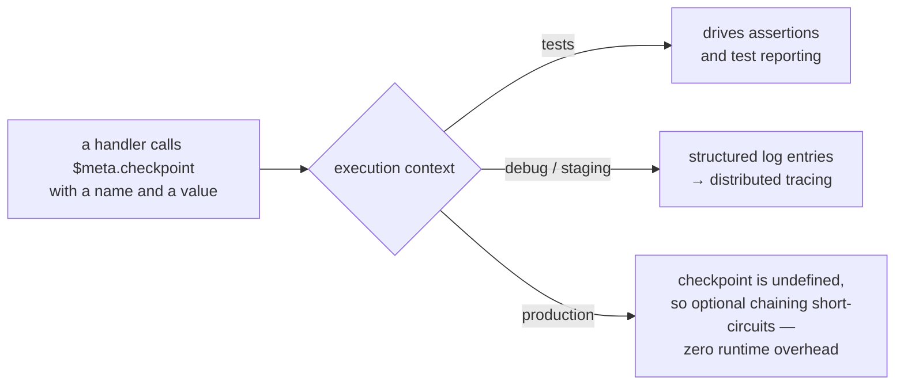

# Checkpoint

A checkpoint is a framework-provided function that records progress through multi-step operations.
Checkpoints serve different purposes depending on the execution context:

- **In tests:** Checkpoints drive assertions and test reporting, capturing intermediate states for
  verification.
- **In debug/staging:** Checkpoints emit structured log entries that feed distributed tracing and
  observability systems.
- **In production:** Checkpoints are disabled via optional chaining (`?.`), resulting in zero
  runtime overhead.

One call, three behaviours — the context decides which:



## Motivation

Long-running handlers and test chains share a common need: visibility into what happened at each
stage of a multi-step operation. Without checkpoints, debugging a failed handler requires sifting
through logs, and debugging a failed test requires adding temporary assertions.

Checkpoints provide a single mechanism that serves both needs — tracing for production and
assertions for tests — without duplicating logic.

## Usage

### In Handlers

Handlers access `checkpoint` through the `$meta` parameter. Since `checkpoint` may be `undefined` in
production, always use optional chaining:

```typescript
import {handler, type IMeta} from '@feasibleone/blong';

export default handler(
    ({handler: {accountGet, transferCreate}}) =>
        async function paymentTransferExecute(
            {accountId, amount}: {accountId: string; amount: number},
            $meta: IMeta,
        ) {
            const account = await accountGet({id: accountId}, $meta);
            $meta.checkpoint?.('account-loaded', {accountId: account.id, balance: account.balance});

            if (account.balance < amount) throw new Error('Insufficient funds');
            $meta.checkpoint?.('balance-verified', {available: account.balance, requested: amount});

            const transfer = await transferCreate({amount, from: account.id}, $meta);
            $meta.checkpoint?.('transfer-created', {transferId: transfer.id});

            return {transferId: transfer.id, state: transfer.state};
        },
);
```

### In Tests

Tests can assert on checkpoints captured during handler execution:

```typescript
import {handler, type IAssert, type IMeta} from '@feasibleone/blong';

export default handler(({handler: {paymentTransferExecute}}) => ({
    // No 'name' parameter — context name is injected into $meta by the framework proxy
    testPaymentCheckpoints: (params: Record<string, unknown>, $meta: IMeta) => [
        async function executeAndVerify(assert: IAssert, {$meta}: {$meta: IMeta}) {
            const result = await paymentTransferExecute({accountId: 'acc-1', amount: 100}, $meta);
            assert.ok(result.transferId, 'Transfer created');

            // Verify checkpoints recorded during execution
            const checkpoints = $meta.checkpoints;
            assert.equal(checkpoints.length, 3);
            assert.equal(checkpoints[0].name, 'account-loaded');
            assert.equal(checkpoints[1].name, 'balance-verified');
            assert.equal(checkpoints[2].name, 'transfer-created');
        },
    ],
}));
```

### Checkpoint Data

Each checkpoint records:

- **`name`** — A descriptive string identifying the checkpoint (e.g., `'account-loaded'`,
  `'transfer-created'`).
- **`data`** — An optional object with relevant state at that point.
- **`timestamp`** — Automatically added by the framework.

## Modes

The mode is `checkpointMode` in the registry config — no handler code changes.

| Environment | `$meta.checkpoint` | `$meta.decide` | What is recorded                                              |
| ----------- | ------------------ | -------------- | ------------------------------------------------------------- |
| Production  | `undefined`        | always         | the branch rationale only — worth tracing even in production  |
| Debug       | recording function | always         | points and branches, kept in `$meta` and emitted with the log |
| Test        | recording function | always         | the same, plus `assert`, so a test can assert on the sequence |

`checkpoint` is **absent** in production rather than a no-op function, which is what makes the `?.`
call free; `lib.checkpoint` follows the same rule for code that has no `$meta`. A branch is the one
thing that cannot be optional: it selects, so a missing helper would skip the work rather than cost
a note.

## Points and Branches

A checkpoint is one shape of a **progress point**; a `decide` branch is the other. Both are moments
in the logic that explain the shape a run took, both are recorded in one place, and both are drawn
on the sequence diagram the log builds — a point as a note beside the participant that reported it,
a branch as an `alt` block around the calls made inside it
([R11, R26, R27](../rationale/semantic-log.md)).

What separates them is what each may cost: a point may be dropped, because nothing else depends on
it; a branch may not, because it _is_ the control flow.

The block names **every** candidate the code declared, in that order: a candidate the decision never
reached — evaluation stops at the branch it takes — is drawn and labelled, so a reader sees both the
alternative that was weighed and refused and the one that was never tried. The record's own
rationale keeps the same list, in evaluation order, so it can be replayed without reading source
(R11). A block is also _ordered_ so that it renders: mermaid refuses a section with nothing in it
when it is the last before `end`, and the whole block stops drawing. So the arms with nothing to
draw come first and the one carrying the calls last — the arm that ran, drawn under the alternatives
it weighed. Only the order changes, and the labels are what name the candidates; a block whose arms
are all empty says "nothing observed yet" on its last one. Both belong to the handler that announces
them, which the diagram has to show, and a handler's work crosses process boundaries as naturally as
its call does. A call's records are written by the framework around the handler — before it starts
and after it returns — so nothing is recorded at the moment a handler speaks: what it announced is
collected once it is done and written on its answer. The participant a note is drawn over is
therefore the participant that answered, and the collection is installed **before** the handler is
run, so that what it announces after its first wait is collected too
([semantic-log](semantic-log.md) has the whole of that rule).

```typescript
$meta.checkpoint?.('total-calculated', {total, itemCount});
const fee = $meta.decide?.('fee-tier', {total}, [
    {name: 'waived', when: values => (values.total as number) > 100, run: () => 0},
    {name: 'standard', when: () => true, run: () => total * 0.01},
]); // the chosen branch's result, or `undefined` when none matched
```

## Relationship to Handlers and Tests

Checkpoints are a key element of the
[unified handler-test concept](../rationale/unified-handler-test). They blur the line between
handlers and tests:

- A handler with checkpoints **is already instrumented for testing** — tests can call it and verify
  the checkpoint sequence.
- A test with checkpoints **is already instrumented for production** — when the test graduates to a
  handler, the checkpoints become observability points.

See the
[handler-test POC suite](https://github.com/feasibleone/blong/tree/main/demo/handler-test-poc) for
working examples.

## Related Concepts

- [Handler](../patterns/handler) — Checkpoint usage in handlers
- [Test](../patterns/test) — Checkpoint usage in tests
- [Unified Handler-Test](../rationale/unified-handler-test) — Design rationale
