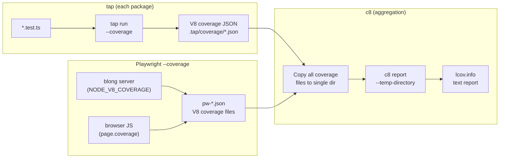

# Code Coverage

Code coverage measures which lines, branches, and functions of the source code are exercised
during test execution. Blong uses V8's built-in coverage mechanism (via `c8`) to collect
coverage data from several packages across the monorepo and produce a single unified report.

## How Coverage Is Collected

Blong collects coverage at two levels:

1. **Server-side (tap tests)** — unit and integration tests that exercise the backend
   (handlers, orchestrators, adapters) directly through the JSON-RPC layer.
2. **Full-stack (Playwright tests)** — browser tests that exercise both the server backend
   and the client-side React UI through a real browser.

Both mechanisms produce coverage data in V8's native coverage format, which is then aggregated
by `c8` into a single `lcov.info` file and text report.

## Server-Side Coverage (tap)

The server-side coverage pipeline works as follows:



Each package that contributes to coverage runs `blong-dev test`, which wraps `tap` with:

```bash
--allow-incomplete-coverage --coverage-report=none
```

This tells tap to collect V8 coverage (which it does by default via `@tapjs/processinfo`)
but skip generating its own report. The raw V8 coverage JSON files land in
`.tap/coverage/` within each package's directory.

### Coverage Aggregation Script

The aggregation is orchestrated by `core/blong-gogo/run-coverage.sh`:

```bash
#!/bin/bash
set -e

SCRIPT_DIR="$(cd "$(dirname "${BASH_SOURCE[0]}")" && pwd)"
CORE_DIR="$(dirname "$SCRIPT_DIR")"
C8="$CORE_DIR/../common/temp/node_modules/.pnpm/node_modules/.bin/c8"

cd "$(dirname "$CORE_DIR")"

# Merge coverage from all tap-based test packages
for pkg in blong-int-adapter test; do
    src="core/$pkg/.tap/coverage"
    if [ -d "$src" ]; then
        cp "$src"/*.json core/blong-gogo/.tap/coverage/ 2>/dev/null || true
    fi
done

# Playwright coverage data is staged by blong-dev playwright --coverage
# directly into core/blong-gogo/.tap/coverage/ (with pw- prefix).
pw_count=$(ls core/blong-gogo/.tap/coverage/pw-*.json 2>/dev/null | wc -l)
if [ "$pw_count" -gt 0 ]; then
    echo "run-coverage.sh: Including $pw_count Playwright coverage file(s)"
fi

"$C8" report \
    --all \
    --temp-directory core/blong-gogo/.tap/coverage \
    --include "core/blong-gogo/src/**/*.ts" \
    --include "core/test/**/*.ts" \
    --include "core/blong-int-adapter/**/*.ts" \
    --include "core/blong-suite/**/*.ts" \
    --include "core/blong-marine/**/*.ts" \
    --include "core/blong-browser/src/**/*.ts" \
    --include "core/blong-browser/src/**/*.tsx" \
    --reporter text \
    --reporter lcov \
    -o coverage
```

**How it works:**

1. **Copy coverage data**: Coverage JSON files from tap-based packages (`blong-int-adapter`,
   `test`) are copied into `blong-gogo`'s own `.tap/coverage/` directory. Playwright coverage
   files (with `pw-` prefix) are also written here by `blong-dev playwright --coverage`.
   This collects all coverage data in one place.
2. **Run `c8 report`**: `c8` reads all V8 coverage JSON files from the temp directory and
   generates coverage reports. The `--include` flags restrict the report to source files from
   the relevant packages: `blong-gogo`, `test`, `blong-int-adapter`, `blong-suite`,
   `blong-marine`, and `blong-browser`.
3. **Output**: An `lcov.info` file and a text report are written to the repository root's
   `coverage/` directory. The `lcov.info` is consumed by GitHub Actions (via
   `romeovs/lcov-reporter-action`) to post coverage summaries on pull requests.

### Why Not `--coverage-map`

Passing `--coverage-map` with TypeScript paths causes tap to exit 1 with "No coverage generated"
because `tsx` compiles files in-memory and the V8 coverage data does not match the original `.ts`
file paths. The separate c8 step handles this correctly.

### Rush Integration

The `ci-coverage` bulk command is defined in `common/config/rush/command-line.json`:

```json
{
    "commandKind": "bulk",
    "name": "ci-coverage",
    "summary": "Run code coverage reports",
    "ignoreMissingScript": true,
    ...
}
```

Only `@feasibleone/blong-gogo` implements this script in its `package.json`:

```json
"ci-coverage": "./run-coverage.sh"
```

In CI, `rush ci-coverage` runs after `rush ci-test` completes, so all test coverage data
is available before aggregation.

## Full-Stack Coverage (Playwright)

Playwright tests collect coverage from both the server and browser simultaneously:

- **Server-side**: The `blong-dev playwright --coverage` command sets `NODE_V8_COVERAGE` so
  the blong server process writes V8 coverage on exit. Coverage files are written to
  `.playwright/coverage/v8/` within the suite directory.
- **Browser-side**: The `@feasibleone/blong-browser/playwright` test object includes an
  automatic coverage fixture that uses Playwright's `page.coverage.startJSCoverage()` API.
  Browser scripts served by Vite are mapped back to filesystem paths and written as V8
  coverage JSON files.
- **Aggregation**: After tests complete, both sets of coverage files are copied with a `pw-`
  prefix into `core/blong-gogo/.tap/coverage/`, where they are included in the unified
  `c8 report` aggregation.

See the [Playwright code coverage pattern](../patterns/playwright.md#code-coverage) for the full
pattern reference including setup instructions, the URL-to-file mapping mechanism, and
CI integration details.

## Key Constraints

- `c8` must run from the repository root so path mappings in `lcov.info` are correct for
  subsequent GitHub Actions steps.
- Use `-o <path>` (not `--reports-directory`) for the output directory.
- Coverage data must be on disk **before** `c8 report` runs — the tap-produced `.tap/coverage/`
  files must exist and be merged into a single temp directory.
