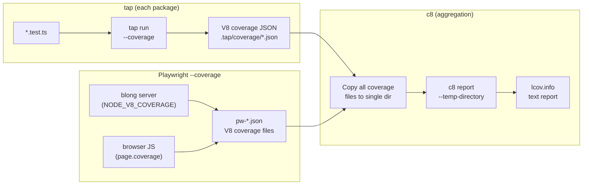

# Code Coverage

Code coverage measures which lines, branches, and functions of the source code are exercised during
test execution. Blong uses V8's built-in coverage mechanism (via `c8`) to collect coverage data from
several packages across the monorepo and produce a single unified report.

## How Coverage Is Collected

Blong collects coverage at two levels:

1. **Server-side (tap tests)** — unit and integration tests that exercise the backend (handlers,
   orchestrators, adapters) directly through the JSON-RPC layer.
2. **Full-stack (Playwright tests)** — browser tests that exercise both the server backend and the
   client-side React UI through a real browser.

Both mechanisms produce coverage data in V8's native coverage format, which is then aggregated by
`c8` into a single `lcov.info` file and text report.

## Server-Side Coverage (tap)

The server-side coverage pipeline works as follows:



Each package that contributes to coverage runs `blong-dev test`, which wraps `tap` with:

```bash
--allow-incomplete-coverage --coverage-report=none
```

This tells tap to collect V8 coverage (which it does by default via `@tapjs/processinfo`) but skip
generating its own report. The raw V8 coverage JSON files land in `.tap/coverage/` within each
package's directory.

### Coverage Aggregation Script

The aggregation is orchestrated by `core/blong-gogo/run-coverage.sh`, invoked through the
`ci-coverage` Rush command. It:

1. **Stages a clean merge dir** — `core/blong-gogo/.tap/coverage-merge` is wiped and rebuilt on
   every run, so stale coverage can never distort the aggregated report.
2. **Merges raw V8 coverage JSON** — copies every `*.json` from each configured package's
   `.tap/coverage/` (prefixed by package name) and always adds blong-browser's vitest
   `coverage/coverage-final.json` (Istanbul format).
3. **Chooses which packages contribute** — the default set is `blong-gogo test blong-int-adapter`:
   gogo's own unit tests plus the two harnesses that boot the full framework. Set
   `COVERAGE_PACKAGES` (space-separated names) to add E2E/demo suites, e.g.
   `COVERAGE_PACKAGES="blong-gogo test blong-int-adapter blong-suite blong-marine"`.
4. **Runs `c8 report`** from the repository root, restricted by `--include` to the
   framework/integration/demo/browser source trees, writing `coverage/lcov.info` and the
   `coverage/lcov-report/` HTML report.
5. **Guards the output** — fails loudly when no coverage JSON is found, or when the report would
   contain no `core/blong-gogo` coverage (override with `COVERAGE_ALLOW_NO_GOGO=1`), so a misleading
   browser-only report can never be produced silently.

The resulting `coverage/lcov.info` is consumed by GitHub Actions to post coverage summaries on pull
requests. `c8` must run from the repository root so the `lcov.info` paths are correct.

### Why Not `--coverage-map`

Passing `--coverage-map` with TypeScript paths causes tap to exit 1 with "No coverage generated"
because `tsx` compiles files in-memory and the V8 coverage data does not match the original `.ts`
file paths. The separate c8 step handles this correctly.

### Rush Integration

The `ci-coverage` bulk command is defined in `common/config/rush/command-line.json`:

```json
{
    "commandKind": "bulk",
    "name": "ci-coverage",
    "summary": "Run code coverage reports",
    "ignoreMissingScript": true,
    ...
}
```

Only `@feasibleone/blong-gogo` implements this script in its `package.json`:

```json
"ci-coverage": "./run-coverage.sh"
```

In CI, `rush ci-coverage` runs after `rush ci-test` completes, so all test coverage data is
available before aggregation.

## Full-Stack Coverage (Playwright)

Playwright tests collect coverage from both the server and browser simultaneously:

- **Server-side**: The `blong-dev playwright --coverage` command sets `NODE_V8_COVERAGE` so the
  blong server process writes V8 coverage on exit. Coverage files are written to
  `.playwright/coverage/v8/` within the suite directory.
- **Browser-side**: The `@feasibleone/blong-browser/playwright` test object includes an automatic
  coverage fixture that uses Playwright's `page.coverage.startJSCoverage()` API. Browser scripts
  served by Vite are mapped back to filesystem paths and written as V8 coverage JSON files.
- **Aggregation**: After tests complete, both sets of coverage files are copied with a `pw-` prefix
  into `core/blong-gogo/.tap/coverage/`, where they are included in the unified `c8 report`
  aggregation.

See the [Playwright code coverage pattern](../patterns/playwright.md#code-coverage) for the full
pattern reference including setup instructions, the URL-to-file mapping mechanism, and CI
integration details.

## Key Constraints

- `c8` must run from the repository root so path mappings in `lcov.info` are correct for subsequent
  GitHub Actions steps.
- Use `-o <path>` (not `--reports-directory`) for the output directory.
- Coverage data must be on disk **before** `c8 report` runs — the tap-produced `.tap/coverage/`
  files must exist and be merged into a single temp directory.
